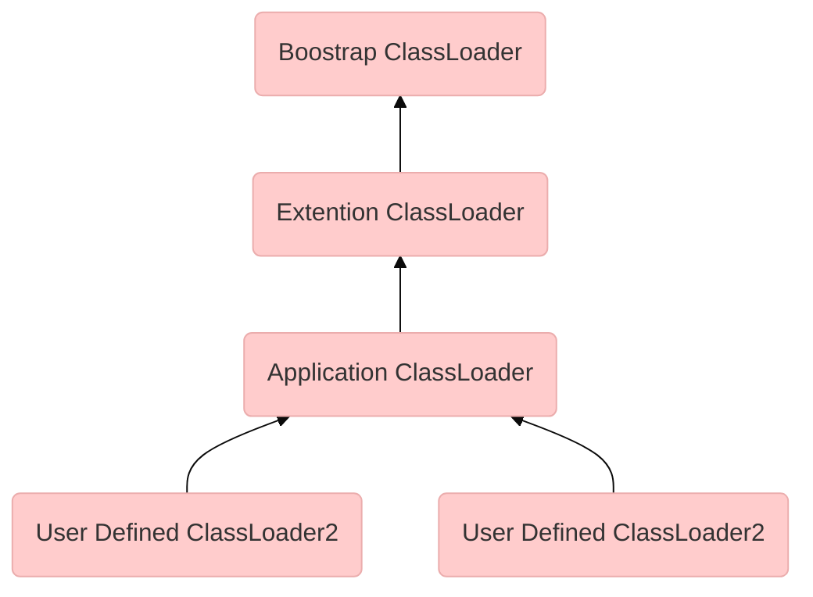

# 类加载时机
// TODO 周志明《深入理解 Java 虚拟机》 7.2 类加载的时机 Page 359
一个类型在 JVM 中的生命周期包括加载、验证、准备、解析、初始化、使用、卸载 7 个阶段。其中的验证、准备、解析三个阶段通常被叫做“链接”。

加载、验证、准备、初始化和卸载这五个阶段的顺序是确定的，类型的加载过程必须按照这种顺序按部就班地开始，而解析阶段则不一定：它在某些情况下可以在初始化阶段之后再开始，这是为了支持 Java 语言的运行时绑定特性（也称为动态绑定或晚期绑定）。

关于什么情况下开始类加载过程中的第一阶段“加载”，《Java 虚拟机规范》并没有强制规定。但是对初始化阶段则严格规定了只有六种情况下必须立即对类进行“初始化”（而加载、验证、准备自然需要在此之前开始）。这六种场景中的行为称为对一个类型进行**主动引用**。除此之外，所有引用类型的方式都不会触发初始化，称为**被动引用**。

接口的加载过程与类加载过程稍有不同，针对接口需要做一些特殊说明：接口也有初始化过程，这点与类是一致的。区别在于类定义中可以使用 static 语句块，而接口中不能使用“static{}”语句块，但编译器仍然会为接口生成 `<clinit>()` 类构造器[2]，用于初始化接口中所定义的成员变量。接口与类真正有所区别的是前面讲述的六种主动引用触发初始化场景中的第三种： 当一个类在初始化时，要求其父类全部都已经初始化过了，但是一个接口在初始化时，并不要求其父接口全部都完成了初始化，只有在真正使用到父接口的时候（如引用接口中定义的常量）才会初始化。


# 类加载过程
## 加载 (Loading)

“加载”是整个类加载过程中的一个阶段。加载阶段完成三件事情：

1. 通过一个类的全限定名来获取定义此类的二进制字节流。 
2. 将这个字节流所代表的静态存储结构转化为方法区的运行时数据结构。 
3. 在内存中生成一个代表这个类的 `java.lang.Class` 对象，作为方法区这个类的各种数据的访问入口。

### 非数组类型的类加载 - noarray
相对于类加载过程的其他阶段，非数组类型的加载阶段（准确地说，是加载阶段中获取类的二进制字节流的动作）是开发人员可控性最强的阶段。加载阶段既可以使用 `Java` 虚拟机里内置的引导类加载器来完成，也可以由用户自定义的类加载器去完成，开发人员通过定义自己的类加载器去控制字节流的获取方式（重写一个类加载器的 `findClass()` 或 `loadClass()` 方法），实现根据自己的想法来赋予应用程序获取运行代码的动态性。

《Java 虚拟机规范》对加载过程的三个动作要求其实并不是特别具体，给具体虚拟机实现和 Java 应用程序留下相当大的灵活度。JVM 在加载阶段的第一个动作，只要求从类的全限定名称获取到类文件的二进制字节流，而并没有指明从哪里获取类文件、如何获取。仅仅这一点空隙，Java 虚拟机的使用者们就可以在加载阶段搭构建出一个相当开放广阔的舞台，Java 发展历程中，充满创造力的开发人员则在这个舞台上玩出了各种花样，许多举足轻重的 Java 技术都建立在这一基础之上。例如：

- 从 ZIP 压缩包中读取，这很常见，最终成为日后 JAR、EAR、WAR 格式的基础。 
- 从网络中获取，这种场景最典型的应用就是 Web Applet。 
- 运行时计算生成，这种场景使用得最多的就是动态代理技术，在 `java.lang.reflect.Proxy` 中，就是用了 `ProxyGenerator.generateProxyClass()` 来为特定接口生成形式为“*$Proxy”的代理类的二进制字节流。 
- 由其他文件生成，典型场景是 `JSP` 应用，由 `JSP` 文件生成对应的 Class 文件。 
- 从数据库中读取，这种场景相对少见些，例如有些中间件服务器（如 SAP Netweaver）可以选择把程序安装到数据库中来完成程序代码在集群间的分发。 
- 可以从加密文件中获取，这是典型的防 Class 文件被反编译的保护措施，通过加载时解密 Class 文件来保障程序运行逻辑不被窥探。

### 数组类型的类加载
数组类型的加载和非数组类型的加载稍有不同。它的元素类型（也就是数组中容纳的对象的类型）要靠类加载器加载，再由虚拟机在内存中分配数组空间。

数组类型的类加载过程遵守下面三条规则：

- 如果数组的组件类型（Component Type，指的是数组去掉第一个维度的类型，注意和前面的元素类型区分开来）是引用类型，那就递归加载这个组件类型。数组类型和它的组件类型处于同一个类加载器的命名空间。这点很重要，在 7.4 节会介绍，因为一个类型必须靠类加载器一起确定唯一性。
- 如果数组的组件类型不是引用类型（例如 `int[]` 数组的组件类型为 `int` ），Java 虚拟机将会把数组类型标记为与引导类加载器关联。
- 数组类的可访问性与它的组件类型的可访问性一致，如果组件类型不是引用类型，它的数组类的可访问性将默认为public，可被所有的类和接口访问到。

## 验证（Verification）

### 文件格式

验证文件格式这个阶段是为了保证输入的字节流能正确地解析并存储于方法区之内，格式上符合描述一个 Java 类型信息的要求。这阶段的验证是基于二进制字节流进行的，只有通过了这个阶段的验证之后，这段字节流才被允许进入 Java 虚拟机内存的方法区中进行存储，所以后面的三个验证阶段全部是验证方法区的存储结构，不会再直接读取、操作字节流了。
### 元数据
第二阶段验证类的元数据是否满足 Java 类型系统的要求。比如：
**
- 这个类是否有父类（除了java.lang.Object之外，所有的类都应当有父类）。 
- 这个类的父类是否继承了不允许被继承的类（被final修饰的类）。 
- 如果这个类不是抽象类，是否实现了其父类或接口之中要求实现的所有方法。 
- 类中的字段、方法是否与父类产生矛盾（例如覆盖了父类的final字段，或者出现不符合规则的方 法重载，例如方法参数都一致，但返回值类型却不同等）。

### 字节码
字节码验证是最复杂的一个阶段，验证的对象是类的方法体（Class 文件中的 Code 属性），主要目的是通过数据流分析和控制流分析，确定程序语义合法。例如：
- 保证任意时刻操作数栈的数据类型与指令代码序列都能配合工作，例如不会出现类似于“在操作 栈放置了一个int类型的数据，使用时却按long类型来加载入本地变量表中”这样的情况。
- 保证任何跳转指令都不会跳转到方法体以外的字节码指令上。
- 保证方法体中的类型转换总是有效的，例如可以把一个子类对象赋值给父类数据类型，这是安全 的，但是把父类对象赋值给子类数据类型，甚至把对象赋值给与它毫无继承关系、完全不相干的一个 数据类型，则是危险和不合法的。
由于数据流分析和控制流分析的高度复杂性，Java 虚拟机的设计团队为了避免过多的执行时间消耗在字节码验证阶段中，在 JDK 6 之后的 Javac 编译器和 Java 虚拟机里进行了一项联合优化，把尽可能多的校验辅助措施挪到 Javac 编译器里进行。具体做法是给方法体 Code 属性的属性表中新增加了一项名为 `StackMapTable` 的新属性，这项属性描述了方法体所有的基本块（Basic Block，指按照控制流拆分的代码块）开始时本地变量表和操作栈应有的状态，在字节码验证期间，Java 虚拟机就不需要根据程序推导这些状态的合法性，只需要检查 `StackMapTable` 属性中的记录是否合法即可。这样就将字节码验证的类型推导转变为**类型检查**，从而节省了大量校验时间。理论上 `StackMapTable` 属性也存在错误或被篡改的可能，所以是否有可能在恶意篡改了 Code 属性的同时，也生成相应的 `StackMapTable` 属性来骗过虚拟机的类型校验，则是虚拟机设计者们需要仔细思考的问题。

JDK 6 的 HotSpot 虚拟机中提供了 `-XX:-UseSplitVerifier` 选项来关闭掉这项优化，或者使用参数 `XX:+FailOverToOldVerifier` 要求在类型检查失败的时候退回到旧的类型推导方式进行校验。而到了 JDK 7 之后，尽管虚拟机中仍然保留着类型推导验证器的代码，但是对于主版本号大于 50（对应 JDK 6）的 Class 文件，使用类型检查来完成数据流分析校验则是唯一的选择，不允许再退回到原来的类型推导的校验方式。

### 符号引用验证
最后一个阶段的校验行为发生在虚拟机将符号引用转化为直接引用[3]的时候，这个转化动作将在链接的第三阶段——解析阶段中发生。符号引用验证可以看作是对类自身以外（常量池中的各种符号引用）的各类信息进行匹配性校验，通俗来说就是，该类是否缺少或者被禁止访问它依赖的某些外部类、方法、字段等资源。
## 准备（Preparation）
准备阶段是正式为类中定义的变量（即静态变量，被 static 修饰的变量）分配内存并设置类变量初始值的阶段。从概念上讲，这些变量所使用的内存都应当在方法区中进行分配，但必须注意到方法区本身是一个逻辑上的区域，在 JDK 7 及之前，HotSpot 使用永久代来实现方法区时，实现是完全符合这种逻辑概念的；而在 JDK 8 及之后，类变量则会随着 Class 对象一起存放在 Java 堆中，这时候“类变量在方法区”就完全是一种对逻辑概念的表述了。

注意：
- 准备阶段参与内存分配和设置初始值的仅包括类变量，不包括实例变量。
- 设置的初始值是数据类型相应的零值，而不是程序代码中设置的值。因为准备阶段还没有执行该类的任何方法，而初始化类变量的过程是发生在初始化阶段的 `<cinit>()` 类构造器方法中。
- 有某些“特殊情况”：如果类字段的字段属性表中存在 `ConstantValue` 属性，那在准备阶段变量值就会被初始化为 `ConstantValue` 属性所指定的初始值。比如类常量 `public static final int value = 123;`。


## 解析（Resolution）
// TODO 周志明《深入理解 Java 虚拟机》 7.3.4 解析 Page 371
解析阶段是Java虚拟机将常量池内的符号引用替换为直接引用的过程。

- 符号引用（Symbolic References）：符号引用以一组符号来描述所引用的目标，符号可以是任何 形式的字面量，只要使用时能无歧义地定位到目标即可。符号引用与虚拟机实现的内存布局无关，引 用的目标并不一定是已经加载到虚拟机内存当中的内容。各种虚拟机实现的内存布局可以各不相同， 但是它们能接受的符号引用必须都是一致的，因为符号引用的字面量形式明确定义在《Java虚拟机规 范》的Class文件格式中。 
- 直接引用（Direct References）：直接引用是可以直接指向目标的指针、相对偏移量或者是一个能 间接定位到目标的句柄。直接引用是和虚拟机实现的内存布局直接相关的，同一个符号引用在不同虚 拟机实例上翻译出来的直接引用一般不会相同。如果有了直接引用，那引用的目标必定已经在虚拟机 的内存中存在。

## 初始化（Initialization）

# Java 类加载器和双亲委派机制

类加载器可以说是 Java 语言的一项创新，它是早期 Java 语言能够快速流行的重要原因之一。类加载器最初是为了满足 Java Applet 的需求而设计出来的，在今天用在浏览器上的 Java Applet 技术基本上已经被淘汰，但类加载器却在类层次划分、OSGi、程序热部署、代码加密等领域大放异彩，成为 Java 技术体系中一块重要的基石，可谓是失之桑榆，收之东隅。

## 类与类加载器

类加载器虽然只用于实现类的加载动作，但它在 Java 程序中起到的作用却远超类加载阶段。对于任意一个类，都必须由加载它的类加载器和这个类本身一起共同确立其在 Java 虚拟机中的唯一性，每一个类加载器，都拥有一个独立的类名称空间。即使两个类来自同一个类文件，被同一个 Java 虚拟机加载，只要其类加载器不同，这两个类就必定不相等。

这里的类相等关系包括代表类的 Class 对象的 `equals` 、 `isAssignableFrom` 、 `isInstance` 方法的返回值，也包括了 `instanceof` 运算符判断对象和类所属关系等情况。如果没有注意到类加载器的影响，某些情况下就有可能产生迷惑性的结果。

## 双亲委派机制

从 Java 虚拟机的角度看，只存在两种类加载器：引导类加载器（使用 *C* 语言实现，属于虚拟机自身的一部分）和其他所有类加载器。其他类加载器都是用 Java 语言实现，存在于虚拟机之外，并且全部继承自抽象类 `java.lang.ClassLoader` 。

而站在 Java 开发人员的角度，类加载器从 *JDK 1.2* 以来一直保持相对稳定的三层类加载器、双亲委派的类加载架构。在 *JDK 8* 及以前的 Java 应用中绝大多数 Java 程序都使用以下 3 个系统提供的类加载器来加载类。

- **引导类加载器**（ Bootstrap Class Loader ）：负责加载存放在 `<JAVA_HOME>/lib` 目录、或者被 `-Xbootclasspath` 参数所指定的目录下，并且能被 Java 虚拟机通过文件名识别的类（例如 `rt.jar` 、 `tools.jar` ，文件名不符合的类即使被放入 `lib` 目录也不会被夹在）。引导类加载器无法被 Java 程序直接引用，用户编写自定义类加载器时，如果需要把类加载请求委派给引导类加载器，直接使用 null 即可。

- **扩展类加载器**（ Extension Class Loader ）：这个类加载器在 `sun.misc.Launcher$ExtClassLoader` 中以 Java 代码实现。扩展类加载器负责加载 `<JAVA_HOME>/lib/ext` 目录中、或者被 `java.ext.dirs` 系统变量所指定的目录中的所有类库。*JDK* 开发团队允许用户将具有通用性的类库放在 `ext` 目录下来拓展 *Java SE* 的功能。由于扩展类加载器是 Java 实现，开发者可以直接在程序中使用扩展类加载器加载类文件。

- **应用类加载器**（ Application Class Loader ）：由 `sun.misc.Launcher$AppClassLoader` 实现。由于应用类加载器是 `ClassLoader` 类 `getSystemClassLoader` 方法的返回值，所以也被叫做**系统类加载器**。负责加载用户 *ClassPath* 上的所有类库，开发者同样可以直接在代码中使用应用类加载器。如果程序中没有定义自己的类加载器，一般就作为默认的类加载器。

*JDK 9* 之前的类加载都是通过以上三类类加载器相互配合实现的，被称为**双亲委派机制**。如果用户觉得有必要可以定义自己的类加载器来进行扩展，典型的包括增加磁盘位置之外的类文件来源，或者通过类加载器实现类的隔离、重载等功能。以下是三层类加载器双亲委派机制的示意图：



双亲委派要求除顶层的引导类加载器之外，其他所有类加载器都应该有自己的父加载器。但这里的父子关系并不以继承来体现，而通常是使用组合关系（ Composition ）来复用父加载器的代码。需要强调的是，双亲委派机制从 *JDK 1.2* 引入之后广泛应用于几乎所有 Java 程序中，但并不是一个有强制约束力的模型。它仅仅是建议开发者采用的一种类加载器的最佳实现。

双亲委派的工作流程是：类加载器收到类加载请求时，首先把类加载请求委派给父级类加载器处理，父级类加载器同样遵守这个规则。最终所有类加载请求都会到达引导类加载器，只有在父级类加载器反馈自己无法完成类加载请求时（父级加载器搜索范围内找不到相应的类），子类加载器才会自己尝试加载相应的类。

双亲委派机制带来的好处是 Java 类随着相应的类加载器一起具有了带有优先级的层次关系。例如类 `java.lang.Object` ，它存放在 `rt.jar` 之中，无论哪一个类加载器要加载这个类，最终都是委派给处于模型最顶端的启动类加载器进行加载，因此 `Object` 类在程序的各种类加载器环境中都能够保证是同一个类。反之，如果没有使用双亲委派模型，都由各个类加载器自行去加载的话，如果用户自己也编写了一个名为 `java.lang.Object` 的类，并放在程序的 `ClassPath` 中，那系统中就会出现多个不同的 `Object` 类，Java 类型体系中最基础的行为也就无从保证，应用程序将会变得一片混乱。

如果写一个与 `rt.jar` 类库中已有类重名的 Java 类，将会发现它可以正常编译，但永远无法被加载运行。即使定义了自己的类加载器，强行使用 `defineClass` 方法加载一个以 `java.lang` 开头的类也无法成功，将会出现 Java 虚拟机内部抛出的 `java.lang.SecurityException Prohibited package name: java.lang` 异常。 

----------------------

需要注意引导类加载器只有在 HotSpot 虚拟机中才是 C++ 实现的。像 MRP、Maxine 这些完全由 Java 实现的虚拟机，引导类加载器就是 Java 语言实现。退一步说，除 HotSpot 之外 JRockit 和 J9 两个高性能虚拟机都有一个代表 Bootstrap ClassLoader 的 Java 类存在，但是关键方法的实现依然是使用 Java 本地方法 （JNI）回调到 C 语言的实现，这个引导类加载器也无法被用户获取到。JDK 9 之后，HotSpot 也采用了虚拟机和 Java 类相互配合实现引导类加载器的方式，所以 JDK 9 之后也有了一个代表引导类加载器却无法获取到示例的 Java 类存在。

## 突破双亲委派机制

### 1. `loadClass` 与 `findClass` 方法

双亲委派模型的第一次“被破坏”其实发生在双亲委派模型出现之前——即 JDK 1.2 面世以前的“远古”时代。由于双亲委派模型在 JDK 1.2 之后才被引入，但是类加载器的概念和抽象类 `java.lang.ClassLoader` 则在 Java 的第一个版本中就已经存在，面对已经存在的用户自定义类加载器的代码，Java 设计者们引入双亲委派模型时不得不做出一些妥协，为了兼容这些已有代码，无法再以技术手段避免 `loadClass()` 被子类覆盖的可能性，只能在 JDK 1.2 之后的 `java. Lang. ClassLoader` 中添加一个新的 `protected` 方法 `findClass()` ，并引导用户编写的类加载逻辑时尽可能去重写这个方法，而不是在 `loadClass()` 中编写代码。上节我们已经分析过 `loadClass()` 方法，双亲委派的具体逻辑就实现在这里面，按照 `loadClass()` 方法的逻辑，如果父类加载失败，会自动调用自己的 `findClass()` 方法来完成加载，这样既不影响用户按照自己的意愿去加载类，又可以保证新写出来的类加载器是符合双亲委派规则的。

### 2. `SPI` 服务类加载器

双亲委派模型的第二次“被破坏”是由这个模型自身的缺陷导致的，双亲委派很好地解决了各个类加载器协作时基础类型的一致性问题（越基础的类由越上层的加载器进行加载），基础类型之所以被称为“基础”，是因为它们总是作为被用户代码继承、调用的 API 存在，但程序设计往往没有绝对不变的完美规则，如果有基础类型又要调用回用户的代码，那该怎么办呢？

这并非是不可能出现的事情，一个典型的例子便是 JNDI 服务，JNDI 现在已经是 Java 的标准服务，它的代码由启动类加载器来完成加载（在 JDK 1.3 时加入到 rt. Jar 的），肯定属于 Java 中很基础的类型了。但 JNDI 存在的目的就是对资源进行查找和集中管理，它需要调用由其他厂商实现并部署在应用程序的 ClassPath 下的 JNDI 服务提供者接口（Service Provider Interface，SPI）的代码，现在问题来了，启动类加载器是绝不可能认识、加载这些代码的，那该怎么办？

为了解决这个困境，Java 的设计团队只好引入了一个不太优雅的设计：线程上下文类加载器 （Thread Context ClassLoader）。这个类加载器可以通过 java. Lang. Thread 类的 setContext-ClassLoader () 方法进行设置，如果创建线程时还未设置，它将会从父线程中继承一个，如果在应用程序的全局范围内都没有设置过的话，那这个类加载器默认就是应用程序类加载器。

有了线程上下文类加载器，程序就可以做一些“舞弊”的事情了。JNDI 服务使用这个线程上下文类加载器去加载所需的 SPI 服务代码，这是一种父类加载器去请求子类加载器完成类加载的行为，这种行为实际上是打通了双亲委派模型的层次结构来逆向使用类加载器，已经违背了双亲委派模型的一般性原则，但也是无可奈何的事情。Java 中涉及 SPI 的加载基本上都采用这种方式来完成，例如 JNDI、 JDBC、JCE、JAXB 和 JBI 等。不过，当 SPI 的服务提供者多于一个的时候，代码就只能根据具体提供者的类型来硬编码判断，为了消除这种极不优雅的实现方式，在 JDK 6 时，JDK 提供了 `java.Util.ServiceLoader` 类，以 `META-INF/services` 中的配置信息，辅以责任链模式，这才算是给 SPI 的加载提供了一种相对合理的解决方案。

### 3. `OSGi` 模块类加载器
双亲委派模型的第三次“被破坏”是由于用户对程序动态性的追求而导致的，这里所说的“动态性”指的是一些非常“热”门的名词：代码热替换（Hot Swap）、模块热部署（Hot Deployment）等。说白了就是希望 Java 应用程序能像我们的电脑外设那样，接上鼠标、U 盘，不用重启机器就能立即使用，鼠标有问题或要升级就换个鼠标，不用关机也不用重启。对于个人电脑来说，重启一次其实没有什么大不了的，但对于一些生产系统来说，关机重启一次可能就要被列为生产事故，这种情况下热部署就对软件开发者，尤其是大型系统或企业级软件开发者具有很大的吸引力。

早在 2008 年，在 Java 社区关于模块化规范的第一场战役里，由 Sun/Oracle 公司所提出的 JSR 294 [1]、JSR-277 [2]规范提案就曾败给以 IBM 公司主导的 JSR-291（即 OSGi R4.
2. 提案。尽管 Sun/Oracle 并不甘心就此失去 Java 模块化的主导权，随即又再拿出 Jigsaw 项目迎战，但此时 OSGi 已经站稳脚跟，成为业界“事实上”的 Java 模块化标准[3]。曾经在很长一段时间内，IBM 凭借着 OSGi 广泛应用基础让 Jigsaw 吃尽苦头，其影响一直持续到 Jigsaw 随 JDK 9 面世才算告一段落。而且即使 Jigsaw 现在已经是 Java 的标准功能了，它仍需小心翼翼地避开 OSGi 运行期动态热部署上的优势，仅局限于静态地解决模块间封装隔离和访问控制的问题，这部分内容笔者在 7.5 节中会继续讲解，现在我们先来简单看一看 OSGi 是如何通过类加载器实现热部署的。

OSGi 实现模块化热部署的关键是它自定义的类加载器机制的实现，每一个程序模块（OSGi 中称为 Bundle）都有一个自己的类加载器，当需要更换一个 Bundle 时，就把 Bundle 连同类加载器一起换掉以实现代码的热替换。在 OSGi 环境下，类加载器不再双亲委派模型推荐的树状结构，而是进一步发展为更加复杂的网状结构，当收到类加载请求时，OSGi 将按照下面的顺序进行类搜索： 
- 
1. 将以 java.*开头的类，委派给父类加载器加载。 
- 
2. 否则，将委派列表名单内的类，委派给父类加载器加载。 
- 
3. 否则，将 Import 列表中的类，委派给 Export 这个类的 Bundle 的类加载器加载。 
- 
4. 否则，查找当前 Bundle 的 ClassPath，使用自己的类加载器加载。 
- 
5. 否则，查找类是否在自己的 Fragment Bundle 中，如果在，则委派给 Fragment Bundle 的类加载器加载。 
- 
6. 否则，查找 Dynamic Import 列表的 Bundle，委派给对应 Bundle 的类加载器加载。 
- 
7. 否则，类查找失败。 
上面的查找顺序中只有开头两点仍然符合双亲委派模型的原则，其余的类查找都是在平级的类加载器中进行的，关于 OSGi 的其他内容，笔者就不再展开了。

本节中笔者虽然使用了“被破坏”这个词来形容上述不符合双亲委派模型原则的行为，但这里“被破坏”并不一定是带有贬义的。只要有明确的目的和充分的理由，突破旧有原则无疑是一种创新。正如 OSGi 中的类加载器的设计不符合传统的双亲委派的类加载器架构，且业界对其为了实现热部署而带来的额外的高复杂度还存在不少争议，但对这方面有了解的技术人员基本还是能达成一个共识，认为 OSGi 中对类加载器的运用是值得学习的，完全弄懂了 OSGi 的实现，就算是掌握了类加载器的精粹。

[1]: JSR-294：Improved Modularity Support in the Java Programming Language（Java 编程语言中的改进模块性支持）。
[2]: JSR-277：Java Module System（Java 模块系统）。
[3]: 如果读者对 Java 模块化之争或者 OSGi 本身感兴趣，欢迎阅读笔者的另一本书《深入理解 OSGi： Equinox 原理、应用与最佳实践》。

# 示例代码
## 加解密类加载

简单的加解密过程：
```Java
  public class SimpleEncrypt {

    final static String str = "hello word";

    // 加密因子
    private static final byte ENCRYPT_FACTOR = (byte) 0xff;

    public static void main(String[] args) {
      byte[] bytes = str.getBytes();
      System.out.println(Arrays.toString(bytes));
      byte[] encrypt = new byte[bytes.length];
      for (int i = 0; i < encrypt.length; i++) {
        encrypt[i] = (byte) (bytes[i] ^ ENCRYPT_FACTOR);
      }
      System.out.println("加密后:" + new String(encrypt));

      byte[] decrypt = new byte[bytes.length];
      for (int i = 0; i < encrypt.length; i++) {
        decrypt[i] = (byte) (encrypt[i] ^ ENCRYPT_FACTOR);
      }
      System.out.println("解密后:" + new String(decrypt));
    }
  }
```

加解密工具类
```Java
  public final class EncryptUtils {

    public static final byte ENCRYPT_FACTOR = (byte) 0xff;

    private EncryptUtils() {
      // empty
    }

    public static void doEncrypt(String source, String des) {
      try (
          FileInputStream in = new FileInputStream(source);
          FileOutputStream out = new FileOutputStream(des)
      ) {
        int data;
        while ((data = in.read()) != -1) {
          out.write(data ^ ENCRYPT_FACTOR);
        }
      }
      catch (IOException e) {
        e.printStackTrace();
        return;
      }
    }

    // 解码就是再次编码，对称加密
    public static void doDecrypt(String source, String des) {
      doEncrypt(source, des);
    }

    public static void main(String[] args) {
        // 加密之后再手动把TestObj1改名为TestObj
        EncryptUtils.doEncrypt(
          "F:\\IDEA\\IDEA\\workspace\\multi-threaded-concurrency" +
          "\\myclassloader3\\xdu\\lz\\stage3_classloader\\chapter3\\TestObj.class",
          "F:\\IDEA\\IDEA\\workspace\\multi-threaded-concurrency" +
          "\\myclassloader3\\xdu\\lz\\stage3_classloader\\chapter3\\TestObj1.class"
      );
    }
  }


```
解密类加载器
```Java
  /**
   * 如果采用自定义的类加载器去加载，会报 Magic Number (0xcafebabe) 不匹配。就是说不是真正的class文件。
   * 所以自定义一个解密类加载器。
   */

  public class DecryptClassLoader extends ClassLoader {

    private static final String DEFAULT_DIR
        = "F:\\IDEA\\IDEA\\workspace\\multi-threaded-concurrency\\myclassloader3";

    private String dir = DEFAULT_DIR;

    private String classLoaderName;

    public DecryptClassLoader() {

    }

    public DecryptClassLoader(String classLoaderName) {
      this.classLoaderName = classLoaderName;
    }

    // 指定加载器的父加载器
    public DecryptClassLoader(String classLoaderName, ClassLoader parent) {
      super(parent);
      this.classLoaderName = classLoaderName;
    }

    public String getDir() {
      return dir;
    }

    public void setDir(String dir) {
      this.dir = dir;
    }

    public String getClassLoaderName() {
      return classLoaderName;
    }

    /**
     * @param name package1.package2.AAA  ---> package1/package2/AAA.class
     * @return
     * @throws ClassNotFoundException
     */
    @Override
    protected Class<?> findClass(String name) throws ClassNotFoundException {
      String classPath = name.replace(".", "/");

      File classFile = new File(dir, classPath + ".class");

      if (!classFile.exists()) {
        throw new ClassNotFoundException("The class [" + name + "] not find under+ [" + dir + " ]");
      }
      byte[] classBytes = loadClassBytes(classFile);
      if (classBytes == null) {
        throw new ClassNotFoundException("load the class [" + name + "] failed");
      }
      System.out.println("name = " + name);
      return this.defineClass(name, classBytes, 0, classBytes.length);
    }

    private byte[] loadClassBytes(File classFile) {
      try (
          ByteArrayOutputStream out = new ByteArrayOutputStream();
          FileInputStream in = new FileInputStream(classFile)
      ) {
        int data;
        while ((data = in.read()) != -1) {
          out.write(data ^ EncryptUtils.ENCRYPT_FACTOR);
        }
        out.flush();
        return out.toByteArray();
      }
      catch (IOException e) {
        e.printStackTrace();
        return null;
      }

    }
  }


import java.lang.reflect.Method;

  public class DecryptClassLoaderTest {
    public static void main(String[] args) throws Exception {

      DecryptClassLoader classLoader = new DecryptClassLoader("myclassLoader");

      /**
       * 注意：被类加载器加载的时候不会初始化【在连接阶段才初始化】，所以不执行静态代码块的代码
       */
      Class<?> clazz = classLoader.
          findClass("xdu.lz.stage3_classloader.chapter3.TestObj");

      System.out.println(clazz);
      System.out.println(clazz.getClassLoader());


      System.out.println("=================");
      Object instance = clazz.newInstance();
      Method method = clazz.getMethod("say", new Class<?>[]{});
      Object res = method.invoke(instance, new Object[]{});
      System.out.println(res);
    }
  }

  /**
   *
   * name = xdu.lz.stage3_classloader.chapter3.TestObj
   * class xdu.lz.stage3_classloader.chapter3.TestObj
   * xdu.lz.stage3_classloader.chapter3.DecryptClassLoader@330bedb4
   * =================
   * testObj被初始化了
   * hello!
   */
```

## 类加载器展示

```Java
public class JvmTest {

  public static final URL[] bootstrapLoadUrls = Launcher.getBootstrapClassPath().getURLs();
  public static final String extDirs = System.getProperty("java.ext.dirs");
  public static final String pathSeparator = System.getProperty("path.separator");

  public static void main(String[] args) throws URISyntaxException {
    ClassLoader intClassLoader = int.class.getClassLoader();
    ClassLoader integerClassLoader = Integer.class.getClassLoader();
    ClassLoader klassClassLoader = Class.class.getClassLoader();

    ClassLoader objectClassLoader = Object.class.getClassLoader();
    ClassLoader applicationClassLoader = DataFlowApplication.class.getClassLoader();
    ClassLoader thizClassLoader = JvmTest.class.getClassLoader();

    // Integer class loader: null
    // int class loader: null
    // Class class loader: null
    // This class loader: java.net.URLClassLoader@6bc7c054
    // Object class loader: null
    // User class loader: java.net.URLClassLoader@6bc7c054
    System.out.println("Integer class loader: " + integerClassLoader);
    System.out.println("int class loader: " + intClassLoader);
    System.out.println("Class class loader: " + klassClassLoader);
    System.out.println("This class loader: " + thizClassLoader);
    System.out.println("Object class loader: " + objectClassLoader);
    System.out.println("User class loader: " + applicationClassLoader);


    // System class loader: sun.misc.Launcher$AppClassLoader@18b4aac2
    // Ext class loader: sun.misc.Launcher$ExtClassLoader@490d6c15
    // Bootstrap class loader: null
    ClassLoader systemClassLoader = ClassLoader.getSystemClassLoader();
    System.out.println("System class loader: " + systemClassLoader);
    ClassLoader extClassLoader = systemClassLoader.getParent();
    System.out.println("Ext class loader: " + extClassLoader);
    ClassLoader bootstrapClassLoader = extClassLoader.getParent();
    System.out.println("Bootstrap class loader: " + bootstrapClassLoader);

    // 获取引导类加载器可加载的类路径
    // ${JAVA_HOME}/jre/lib/resources.jar
    // ${JAVA_HOME}/jre/lib/rt.jar
    // ${JAVA_HOME}/jre/lib/sunrsasign.jar
    // ${JAVA_HOME}/jre/lib/jsse.jar
    // ${JAVA_HOME}/jre/lib/jce.jar
    // ${JAVA_HOME}/jre/lib/charsets.jar
    // ${JAVA_HOME}/jre/lib/jfr.jar
    // ${JAVA_HOME}/jre/classes
    for (URL bootstrapLoadUrl : bootstrapLoadUrls) {
      System.out.println(bootstrapLoadUrl.toExternalForm());
    }

    // 获取扩展类加载器可加载的类路径
    // ${JAVA_HOME}\jre\lib\ext
    // C:\Windows\Sun\Java\lib\ext
    for (String dir : extDirs.split(pathSeparator)) {
      System.out.println(dir);
    }
  }
```
## JVM 系统属性与环境变量

**环境变量：**

```
USERPROFILE        ：用户目录
USERDNSDOMAIN      ：用户域
PATHEXT            ：可执行后缀
JAVA_HOME          ：Java安装目录
TEMP               ：用户临时文件目录
SystemDrive        ：系统盘符
ProgramFiles       ：默认程序目录
USERDOMAIN         ：帐户的域的名称
ALLUSERSPROFILE    ：用户公共目录
SESSIONNAME        ：Session名称
TMP                ：临时目录
Path               ：path环境变量
CLASSPATH          ：classpath环境变量
PROCESSOR_ARCHITECTURE ：处理器体系结构
OS                     ：操作系统类型
PROCESSOR_LEVEL    ：处理级别
COMPUTERNAME       ：计算机名
Windir             ：系统安装目录
SystemRoot         ：系统启动目录
USERNAME           ：用户名
ComSpec            ：命令行解释器可执行程序的准确路径
APPDATA            ：应用程序数据目录
```

**系统属性：**

```
java.version ：Java 运行时环境版本
java.vendor ：Java 运行时环境供应商
java.vendor.url ：Java供应商的 URL
java.home ：Java安装目录
java.vm.specification.version ：Java虚拟机规范版本
java.vm.specification.vendor ：Java虚拟机规范供应商
java.vm.specification.name ：Java虚拟机规范名称
java.vm.version ：Java虚拟机实现版本
java.vm.vendor ：Java虚拟机实现供应商
java.vm.name ：Java虚拟机实现名称
java.specification.version ：Java运行时环境规范版本
java.specification.vendor ：Java运行时环境规范供应商
java.specification.name ：Java运行时环境规范名称
java.class.version ：Java类格式版本号
java.class.path ：Java类路径
java.library.path  ：加载库时搜索的路径列表
java.io.tmpdir  ：默认的临时文件路径
java.compiler  ：要使用的 JIT编译器的名称
java.ext.dirs ：一个或多个扩展目录的路径
os.name ：操作系统的名称
os.arch  ：操作系统的架构
os.version  ：操作系统的版本
file.separator ：文件分隔符
path.separator ：路径分隔符
line.separator ：行分隔符
user.name ：用户的账户名称
user.home ：用户的主目录
user.dir：用户的当前工作目录
```

# 类加载问题案例

- [关于 `ClassDefNotFound`](问题案例.md#关于%20`ClassDefNotFound`)
