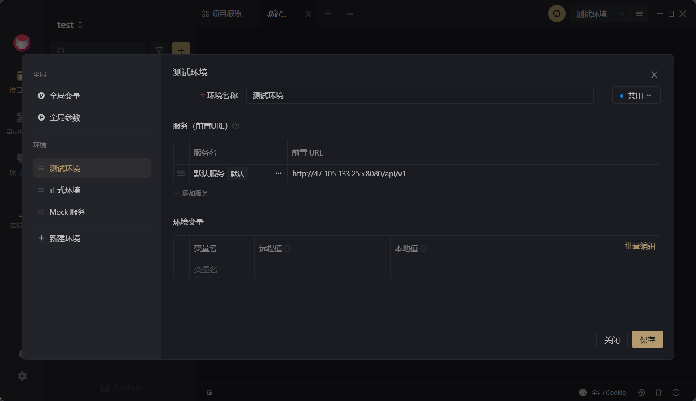
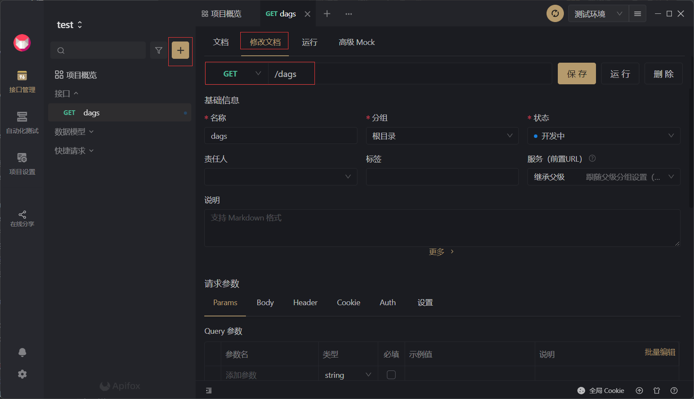
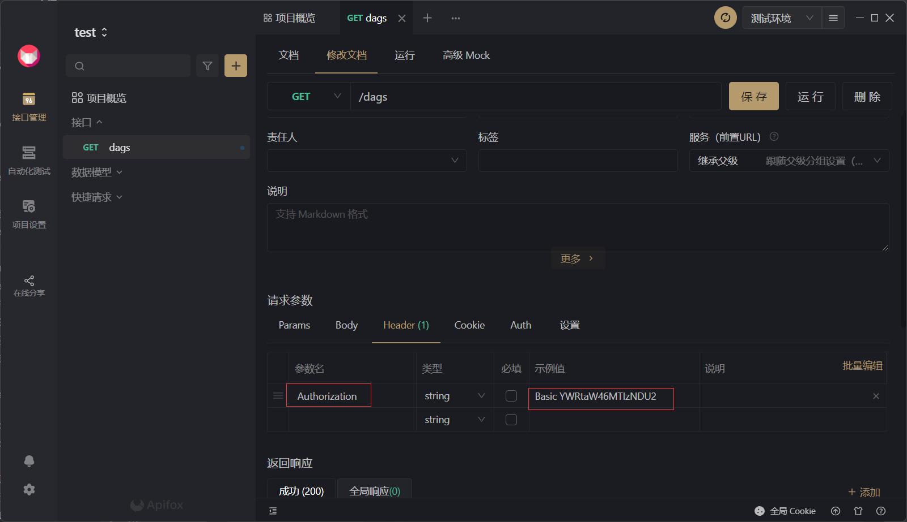
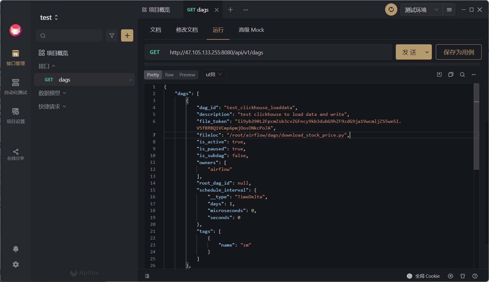
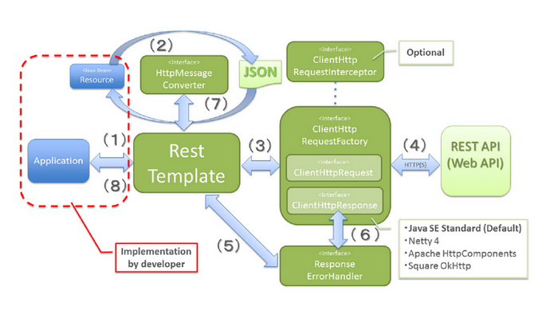

# Java调用Airflow API

本文档的目的是，根据，通过Java调用Airflow API，实现类似Java-Airflow-Client的效果。
可能用到的文件以及本文下载：
[v1.yaml](https://gng9vp.yuque.com/attachments/yuque/0/2022/yaml/395437/1655137667435-d53dc4eb-151d-43b4-9891-d37ed1efded5.yaml?_lake_card=%7B%22src%22%3A%22https%3A%2F%2Fgng9vp.yuque.com%2Fattachments%2Fyuque%2F0%2F2022%2Fyaml%2F395437%2F1655137667435-d53dc4eb-151d-43b4-9891-d37ed1efded5.yaml%22%2C%22name%22%3A%22v1.yaml%22%2C%22size%22%3A113532%2C%22type%22%3A%22%22%2C%22ext%22%3A%22yaml%22%2C%22source%22%3A%22%22%2C%22status%22%3A%22done%22%2C%22mode%22%3A%22title%22%2C%22download%22%3Atrue%2C%22taskId%22%3A%22u031a39fa-df23-48a0-80ec-519ce210374%22%2C%22taskType%22%3A%22upload%22%2C%22__spacing%22%3A%22both%22%2C%22id%22%3A%22a0e7I%22%2C%22margin%22%3A%7B%22top%22%3Atrue%2C%22bottom%22%3Atrue%7D%2C%22card%22%3A%22file%22%7D)
[常用命令.log](https://gng9vp.yuque.com/attachments/yuque/0/2022/log/395437/1655137678071-cdc082bb-1d4c-4d91-a57e-f558d2d9134c.log?_lake_card=%7B%22src%22%3A%22https%3A%2F%2Fgng9vp.yuque.com%2Fattachments%2Fyuque%2F0%2F2022%2Flog%2F395437%2F1655137678071-cdc082bb-1d4c-4d91-a57e-f558d2d9134c.log%22%2C%22name%22%3A%22%E5%B8%B8%E7%94%A8%E5%91%BD%E4%BB%A4.log%22%2C%22size%22%3A2233%2C%22type%22%3A%22%22%2C%22ext%22%3A%22log%22%2C%22source%22%3A%22%22%2C%22status%22%3A%22done%22%2C%22mode%22%3A%22title%22%2C%22download%22%3Atrue%2C%22taskId%22%3A%22u94392106-e497-4ae3-a755-790c75103ae%22%2C%22taskType%22%3A%22upload%22%2C%22__spacing%22%3A%22both%22%2C%22id%22%3A%22aQO6T%22%2C%22margin%22%3A%7B%22top%22%3Atrue%2C%22bottom%22%3Atrue%7D%2C%22card%22%3A%22file%22%7D)
[Java调用AirflowAPI.md](https://gng9vp.yuque.com/attachments/yuque/0/2022/md/395437/1655137684898-f0b59904-ba0b-48b1-a345-a02e041203e3.md?_lake_card=%7B%22src%22%3A%22https%3A%2F%2Fgng9vp.yuque.com%2Fattachments%2Fyuque%2F0%2F2022%2Fmd%2F395437%2F1655137684898-f0b59904-ba0b-48b1-a345-a02e041203e3.md%22%2C%22name%22%3A%22Java%E8%B0%83%E7%94%A8AirflowAPI.md%22%2C%22size%22%3A169510%2C%22type%22%3A%22%22%2C%22ext%22%3A%22md%22%2C%22source%22%3A%22%22%2C%22status%22%3A%22done%22%2C%22mode%22%3A%22title%22%2C%22download%22%3Atrue%2C%22taskId%22%3A%22u0b9ee866-b463-4be3-9398-1c8955886b7%22%2C%22taskType%22%3A%22upload%22%2C%22__spacing%22%3A%22both%22%2C%22id%22%3A%22qkkAC%22%2C%22margin%22%3A%7B%22top%22%3Atrue%2C%22bottom%22%3Atrue%7D%2C%22card%22%3A%22file%22%7D)
[apifox设置环境.png](https://gng9vp.yuque.com/attachments/yuque/0/2022/png/395437/1655138295677-b75cdf50-a079-4af0-9b64-7dd6bba76edb.png?_lake_card=%7B%22src%22%3A%22https%3A%2F%2Fgng9vp.yuque.com%2Fattachments%2Fyuque%2F0%2F2022%2Fpng%2F395437%2F1655138295677-b75cdf50-a079-4af0-9b64-7dd6bba76edb.png%22%2C%22name%22%3A%22apifox%E8%AE%BE%E7%BD%AE%E7%8E%AF%E5%A2%83.png%22%2C%22size%22%3A71960%2C%22type%22%3A%22image%2Fpng%22%2C%22ext%22%3A%22png%22%2C%22source%22%3A%22%22%2C%22status%22%3A%22done%22%2C%22download%22%3Atrue%2C%22taskId%22%3A%22ud1f1a65d-caaf-46fa-b881-64f25da24fa%22%2C%22taskType%22%3A%22upload%22%2C%22__spacing%22%3A%22both%22%2C%22id%22%3A%22u36dec92a%22%2C%22margin%22%3A%7B%22top%22%3Atrue%2C%22bottom%22%3Atrue%7D%2C%22card%22%3A%22file%22%7D)
[restTemplate组成.png](https://gng9vp.yuque.com/attachments/yuque/0/2022/png/395437/1655138295743-6e5676c0-1432-4349-b89b-cd30cf628b4b.png?_lake_card=%7B%22src%22%3A%22https%3A%2F%2Fgng9vp.yuque.com%2Fattachments%2Fyuque%2F0%2F2022%2Fpng%2F395437%2F1655138295743-6e5676c0-1432-4349-b89b-cd30cf628b4b.png%22%2C%22name%22%3A%22restTemplate%E7%BB%84%E6%88%90.png%22%2C%22size%22%3A155759%2C%22type%22%3A%22image%2Fpng%22%2C%22ext%22%3A%22png%22%2C%22source%22%3A%22%22%2C%22status%22%3A%22done%22%2C%22download%22%3Atrue%2C%22taskId%22%3A%22u490a3865-36a2-497d-836a-66333fc5e17%22%2C%22taskType%22%3A%22upload%22%2C%22__spacing%22%3A%22both%22%2C%22id%22%3A%22ub2eb4beb%22%2C%22margin%22%3A%7B%22top%22%3Atrue%2C%22bottom%22%3Atrue%7D%2C%22card%22%3A%22file%22%7D)
[回传.jpg](https://gng9vp.yuque.com/attachments/yuque/0/2022/jpeg/395437/1655138295773-ad5adca0-4d94-47e8-9c93-bfe3cbc7cd15.jpeg?_lake_card=%7B%22src%22%3A%22https%3A%2F%2Fgng9vp.yuque.com%2Fattachments%2Fyuque%2F0%2F2022%2Fjpeg%2F395437%2F1655138295773-ad5adca0-4d94-47e8-9c93-bfe3cbc7cd15.jpeg%22%2C%22name%22%3A%22%E5%9B%9E%E4%BC%A0.jpg%22%2C%22size%22%3A81484%2C%22type%22%3A%22image%2Fjpeg%22%2C%22ext%22%3A%22jpeg%22%2C%22source%22%3A%22%22%2C%22status%22%3A%22done%22%2C%22download%22%3Atrue%2C%22taskId%22%3A%22u5bf8895d-986d-4bb9-b2a2-89901ad12d5%22%2C%22taskType%22%3A%22upload%22%2C%22__spacing%22%3A%22both%22%2C%22id%22%3A%22u2bacb0ae%22%2C%22margin%22%3A%7B%22top%22%3Atrue%2C%22bottom%22%3Atrue%7D%2C%22card%22%3A%22file%22%7D)
[配置请求头的Authorization.jpg](https://gng9vp.yuque.com/attachments/yuque/0/2022/jpeg/395437/1655138295725-c5dd9ede-402f-45c5-af07-24d152f0f4e0.jpeg?_lake_card=%7B%22src%22%3A%22https%3A%2F%2Fgng9vp.yuque.com%2Fattachments%2Fyuque%2F0%2F2022%2Fjpeg%2F395437%2F1655138295725-c5dd9ede-402f-45c5-af07-24d152f0f4e0.jpeg%22%2C%22name%22%3A%22%E9%85%8D%E7%BD%AE%E8%AF%B7%E6%B1%82%E5%A4%B4%E7%9A%84Authorization.jpg%22%2C%22size%22%3A72191%2C%22type%22%3A%22image%2Fjpeg%22%2C%22ext%22%3A%22jpeg%22%2C%22source%22%3A%22%22%2C%22status%22%3A%22done%22%2C%22download%22%3Atrue%2C%22taskId%22%3A%22ud663ac3c-05b2-460a-ae25-6c991cb77e5%22%2C%22taskType%22%3A%22upload%22%2C%22__spacing%22%3A%22both%22%2C%22id%22%3A%22ufb18fd4a%22%2C%22margin%22%3A%7B%22top%22%3Atrue%2C%22bottom%22%3Atrue%7D%2C%22card%22%3A%22file%22%7D)
[新建dags接口.jpg](https://gng9vp.yuque.com/attachments/yuque/0/2022/jpeg/395437/1655138295681-fb1095a0-87fd-420e-a714-0007069d8b0b.jpeg?_lake_card=%7B%22src%22%3A%22https%3A%2F%2Fgng9vp.yuque.com%2Fattachments%2Fyuque%2F0%2F2022%2Fjpeg%2F395437%2F1655138295681-fb1095a0-87fd-420e-a714-0007069d8b0b.jpeg%22%2C%22name%22%3A%22%E6%96%B0%E5%BB%BAdags%E6%8E%A5%E5%8F%A3.jpg%22%2C%22size%22%3A70421%2C%22type%22%3A%22image%2Fjpeg%22%2C%22ext%22%3A%22jpeg%22%2C%22source%22%3A%22%22%2C%22status%22%3A%22done%22%2C%22download%22%3Atrue%2C%22taskId%22%3A%22uac2563a1-c23f-4019-a9cb-62655d5594b%22%2C%22taskType%22%3A%22upload%22%2C%22__spacing%22%3A%22both%22%2C%22id%22%3A%22u8e7e5885%22%2C%22margin%22%3A%7B%22top%22%3Atrue%2C%22bottom%22%3Atrue%7D%2C%22card%22%3A%22file%22%7D)

## 系统配置

```bash
#服务器
ip: 47.105.133.255
用户名: root
密码: WZ()(ssczLaHzgCkj)ycZwp<lDV6[P

# airflow
用户名: admin
密码: 123456
```

## 常用命令(每次修改cfg配置后都要执行)

停止airflow

```shell
# 稍微解释一下
# ps 查看进程信息，-e等价于-A 表示全部，-f显示所有列信息
# | 是进程间通信的 “管道”，将上一个进程(此处为 ps -ef的所有输出) 传输给下一个进程 (此处为grep)
# grep是一个文本分析工具 其从接受的输入中匹配后面的模式，此处为匹配所有带"airflow-webserver" 的行
# grep 的-v 意为反向，不带-v即输出匹配到模式内容的行， 带-v即输出没有匹配到模式内容的行，此处为输出不带"grep"的行
# awk awk是一个文本分析工具，他可以把文件逐行的读入，以空格为默认分隔符将每行切片，切开的部分再进行各种分析处理，$2 是指第二个切片。print $2是打印第二个切片的值。
# xargs 命令的作用，是将标准输入转为命令行参数，-i表示将标准输入一行一行传入{}指定的位置，每行执行一次 
ps -ef | grep airflow-webserver | grep -v grep | awk '{print $2}' |xargs -i kill -9 {}

ps -ef | grep airflow | grep scheduler | awk '{print $2}' |xargs -i kill -9 {}
```

删除已有pid文件

```bash
# 仔细检查路径，别删除错了
rm -rf /root/airflow/*.pid
```

启动airflow

```shell
airflow scheduler -D

airflow webserver -D
```

## 注意！

每次进行服务的重启，必须删除文件夹中的`.pid`文件，因为启动服务时，会优先检查pid是否匹配以执行服务，如果不删除就会报这个错

```
The scheduler does not appear to be running. Last heartbeat was received 5 days ago.

The DAGs list may not update, and new tasks will not be scheduled.
```

# Airflow 支持的API

[https://airflow.apache.org/docs/apache-airflow/stable/stable-rest-api-ref.html](https://airflow.apache.org/docs/apache-airflow/stable/stable-rest-api-ref.html)

# Overview概述

为了便于管理，Apache Airflow 在其对象中支持一系列 REST API 端点(endpoint，后续如果没有特殊说明，端点都为endpoint)。本节概述了 API 设计、方法和支持的用例。

大多数端点接受 JSON 作为输入并返回 JSON 响应。这意味着您通常必须将以下标头添加到您的请求头协议中：

```http
Content-type: application/json
Accept: application/json
```

## Resources 资源

`Resources` 是指 Airflow 元数据中的单一类型的对象。 API 由其端点的相应资源分解。资源的名称通常是复数形式并以驼峰形式表示。示例：`dagRuns`。

资源名称是 端点 URL 以及 API 参数和响应的一部分。

## CRUD Operations

该平台支持对大多数资源的创建、读取、更新和删除操作。您可以在下面查看这些操作的标准及其标准参数。

### Create 创建

要创建资源，需要在请求正文中提交包含资源所需元数据的 HTTP`POST`请求。在响应正文中包含资源的元数据（包括其内部 ID）成功后，响应将返回 `201 Created` 响应代码。

### Read 读

HTTP `GET`请求可用于读取资源或列出许多资源。

可以在请求参数中提交资源的 `id` 以读取特定资源。响应通常在成功时返回 `200 OK` 响应代码，响应正文中包含资源的元数据。

.如果 `GET` 请求不包含特定资源 id，则将其视为列表请求。响应通常会在成功时返回 `200 OK` 响应代码，其中包含响应正文中资源元数据列表的对象。

:读取资源时，通常会用到一些常用的查询参数。例如。：

```json
v1/connections?limit=25&offset=25
```
| Query Parameter查询参数 | Type类型 | Description描述 |
| --- | --- | --- |
| limit | integer | 要获取的最大对象数。通常默认为 25 |
| offset | integer | 开始返回对象的偏移量。与限制查询参数一起使用。 |


### Update 更新

更新资源需要资源 `id`，通常使用 HTTP `PATCH` 请求完成，请求正文中包含要修改的字段。响应通常会在成功时返回 `200 OK` 响应代码，并在响应正文中包含有关已修改资源的信息。

### Delete 删除

.删除资源需要资源 `id`，通常通过 HTTP `DELETE` 请求执行。该响应通常在成功时返回 `204 No Content` 响应代码。

## Conventions 约定

-  资源名称是复数形式并以驼峰形式表示。 
-  URL 参数名称和字段名称之间的名称是一致的。 
-  字段名称在snake_case 中。 
```json
{
  "name": "string",
  "slots": 0,
  "occupied_slots": 0,
  "used_slots": 0,
  "queued_slots": 0,
  "open_slots": 0
}
```
 

### Update Mask 更新掩码

更新掩码可通过`PATCH` 端点作为查询参数。它用于通知 API 您要更新哪些字段。使用 `update_mask` 通过帮助服务器知道要更新对象中的哪些字段而不是更新所有字段，可以更轻松地更新对象。更新请求会忽略字段掩码中未指定的任何字段，而将它们保留为当前值。

Example:

```python
  resource = request.get('/resource/my-id').json()
  resource['my_field'] = 'new-value'
  # 通过patch 指定更新字段为 my_field，内容为'new-value'
  request.patch('/resource/my-id?update_mask=my_field', data=json.dumps(resource))
```

# 使用第三方客户端使用airflow API

可以使用第三方客户端，例如 [curl](https://curl.haxx.se/), [HTTPie](https://httpie.org/), [Postman](https://www.postman.com/) or [the Insomnia rest client](https://insomnia.rest/) 来测试 Apache Airflow API。

注意，在线测试时需要传递凭据`credentials`数据。

例如，当使用基本授权(basic authorization)时，如何使用 curl 暂停 DAG：

```bash
curl -X PATCH 'https://example.com/api/v1/dags/{dag_id}?update_mask=is_paused' \
-H 'Content-Type: application/json' \
--user "username:password" \
-d '{
    "is_paused": true
}'
```

使用 [Postman](https://www.postman.com/) 或 [Insomnia](https://insomnia.rest/) 等图形工具，可以直接导入 API 规范：

1. 下载 API 规范  [API规范](.%5Cv1.yaml)
2. 导入 JSON 规范。 
   - 在 Postman 中，您可以单击顶部的导入按钮
   - 使用 Insomnia，您只需在 UI 上拖放文件

请注意，使用 Postman，您还可以通过选择请求并单击“代码”按钮来生成代码片段。

## 启用 CORS

[跨域资源共享 Cross-origin resource sharing (CORS)](https://developer.mozilla.org/en-US/docs/Web/HTTP/CORS) 跨域资源共享 (CORS) 是一种浏览器安全功能，可限制从浏览器中运行的脚本发起的 HTTP 请求。

For details on enabling/configuring CORS, see [Enabling CORS](https://airflow.apache.org/docs/apache-airflow/stable/security/api.html).有关启用/配置 CORS 的详细信息，请参阅启用 CORS。

# Authentication 验证

为了能够满足很多组织的要求，Airflow 支持多种认证方式，甚至可以添加自己的方式。

如果要检查当前设置了哪个身份验证后端，可以使用气流配置 `airflow config get-value api auth_backend` 命令，如下例所示。

```bash
$ airflow config get-value api auth_backend
airflow.api.auth.backend.basic_auth
```

默认是拒绝所有请求。

有关配置认证的详细信息，请参阅[ API 授权 Authorization](https://airflow.apache.org/docs/apache-airflow/stable/security/api.html)。

# 在本地Airflow使用API驱动

## 参考内容

[https://blog.csdn.net/ooyyaa6561/article/details/116935526](https://blog.csdn.net/ooyyaa6561/article/details/116935526)

[https://brocktibert.com/post/trigger-airflow-dags-via-the-rest-api/](https://brocktibert.com/post/trigger-airflow-dags-via-the-rest-api/)

备注：Airflow2.0自带RestAPI

### Basic authentication 基本认证

API 目前支持[Basic username password authentication](https://tools.ietf.org/html/rfc7617https://en.wikipedia.org/wiki/Basic_access_authentication)，使用用户名和密码认证。这适用于通过 LDAP 登录或使用密码在 Airflow 元数据数据库中创建的用户。

要启用Basic authentication，请在配置中设置以下内容：

```bash
[api]
auth_backend = airflow.api.auth.backend.basic_auth
```

用户名和密码需要经过 base64 编码，并通过 Authorization HTTP 标头发送，格式如下：

```json
Authorization: Basic Base64(username:password)
```

这是一个示例 curl 命令，可用于验证设置：

```bash
ENDPOINT_URL="http://localhost:8080/"
curl -X GET  \
    --user "username:password" \
    "${ENDPOINT_URL}/api/v1/pools"
```

请注意，即使 Airflow 网络服务器可能使用其他身份验证方法，您仍然可以启用此设置以允许通过用户名密码凭据访问 API。在此设置下，只有通过 LDAP 或workflow用户创建命令创建的用户才能通过 API 身份验证

## 设置RestApi启动

首先检查本地安装的Airflow，默认的RestApi方式

```shell
airflow config get-value api auth_backend
airflow.api.auth.backend.deny_all
# 默认是拒绝所有API访问，需要打开
```

修改airflow.cfg文件第395行，将授权改为允许所有

```shell
# 第395行
auth_backend = airflow.api.auth.backend.basic_auth
```

## 新建RestApi的使用用户

为了使用前述的基本认证，通过用户名和密码使用airflow Api，需要首先创建一个用户

```bash
# 注意邮箱填自己的
airflow users create --username admin --firstname admin --lastname admin --role Admin --email xxx@163.com --password 123456
# 备注 建议使用复杂度更高的密码，如 Bdilab@1308
```

## api测试

### CURL测试

创建好用户后，使用`curl`进行最简单的测试

这个方式相当于在命令行预先输入用户名和密码，不需要手动加密

使用这个账号编写一个curl指令

```bash
ENDPOINT_URL="http://localhost:8080/"
curl -X GET  \
    --user "admin:123456" \
    "${ENDPOINT_URL}/api/v1/dags"
    

# 返回结果如下
{
  "dags": [
    {
      "dag_id": "test_clickhouse_loaddata",
      "description": "test clickhouse to load data and write",
      "file_token": "Ii9yb290L2FpcmZsb3cvZGFncy9kb3dubG9hZF9zdG9ja19wcmljZS5weSI.V5fBRBQ1VCmp6pmjOosONkcPoJA",
      "fileloc": "/root/airflow/dags/download_stock_price.py",
      "is_active": true,
      "is_paused": true,
      "is_subdag": false,
      "owners": [
        "airflow"
      ],
      "root_dag_id": null,
      "schedule_interval": {
        "__type": "TimeDelta",
        "days": 1,
        "microseconds": 0,
        "seconds": 0
      },
      "tags": [
        {
          "name": "zm"
        }
      ]
    },
    {
      "dag_id": "tutorial",
      "description": "A simple tutorial DAG",
      "file_token": "Ii9yb290L2FpcmZsb3cvZGFncy90dXRvcmlhbC5weSI.ZNQm6JuP7siuFvGUXbPMtQQdcdU",
      "fileloc": "/root/airflow/dags/tutorial.py",
      "is_active": true,
      "is_paused": true,
      "is_subdag": false,
      "owners": [
        "airflow"
      ],
      "root_dag_id": null,
      "schedule_interval": {
        "__type": "TimeDelta",
        "days": 1,
        "microseconds": 0,
        "seconds": 0
      },
      "tags": [
        {
          "name": "example"
        }
      ]
    }
  ],
  "total_entries": 2
}
```

备注：如果希望用HTTP方式进行CURL访问(用CURL把信息发送到指定HTTP代理，实现HTTP请求)，则需要使用`CURL -X`，注意是大写X。此时还可以使用`--verbose`以显示更多信息，`-H`指定请求头的header

```bash
curl -X GET --verbose 'http://localhost:8080/api/v1/dags' -H 'content-type: application/json' --user "admin:123456"

[root@master ~]# curl -X GET --verbose 'http://localhost:8080/api/v1/dags' -H 'content-type: application/json' --user "admin:123456"
* About to connect() to localhost port 8080 (#0)
*   Trying 127.0.0.1...
* Connected to localhost (127.0.0.1) port 8080 (#0)
* Server auth using Basic with user 'admin'
> GET /api/v1/dags HTTP/1.1
> Authorization: Basic YWRtaW46MTIzNDU2
> User-Agent: curl/7.29.0
> Host: localhost:8080
> Accept: */*
> content-type: application/json
> 
< HTTP/1.1 200 OK
< Server: gunicorn
< Date: Sat, 16 Apr 2022 12:06:06 GMT
< Connection: close
< Content-Type: application/json
< Content-Length: 1275
< Access-Control-Allow-Headers: 
< Access-Control-Allow-Methods: 
< Access-Control-Allow-Origin: 
< X-Frame-Options: DENY
< X-Robots-Tag: noindex, nofollow
< 
{
  "dags": [
    {
      "dag_id": "test_clickhouse_loaddata",
      "description": "test clickhouse to load data and write",
      "file_token": "Ii9yb290L2FpcmZsb3cvZGFncy9kb3dubG9hZF9zdG9ja19wcmljZS5weSI.V5fBRBQ1VCmp6pmjOosONkcPoJA",
      "fileloc": "/root/airflow/dags/download_stock_price.py",
      "is_active": true,
      "is_paused": true,
      "is_subdag": false,
      "owners": [
        "airflow"
      ],
      "root_dag_id": null,
      "schedule_interval": {
        "__type": "TimeDelta",
        "days": 1,
        "microseconds": 0,
        "seconds": 0
      },
      "tags": [
        {
          "name": "zm"
        }
      ]
    },
    {
      "dag_id": "tutorial",
      "description": "A simple tutorial DAG",
      "file_token": "Ii9yb290L2FpcmZsb3cvZGFncy90dXRvcmlhbC5weSI.ZNQm6JuP7siuFvGUXbPMtQQdcdU",
      "fileloc": "/root/airflow/dags/tutorial.py",
      "is_active": true,
      "is_paused": true,
      "is_subdag": false,
      "owners": [
        "airflow"
      ],
      "root_dag_id": null,
      "schedule_interval": {
        "__type": "TimeDelta",
        "days": 1,
        "microseconds": 0,
        "seconds": 0
      },
      "tags": [
        {
          "name": "example"
        }
      ]
    }
  ],
  "total_entries": 2
}
* Closing connection 0
```

注意，在前文说过，用户名和密码需要经过Base64加密才可以使用

[base64加密网站](https://base64.us/)，这个网站可以手动加密

`admin:123456`，注意此处不是分开加密，是一起加密 加密后为：

```
admin:123456
YWRtaW46MTIzNDU2
```

### Apifox测试
使用Apifox，首先配置"环境"(就是请求发送到哪)，

服务器地址是 47.105.133.255，因此设置环境为

```
http://47.105.133.255:8080/api/v1
```



新建一个接口，"修改文档"，将接口地址写为dags



在请求头(header)中加入要求的参数：`Authorization: Basic Base64(username:password)`

此处为

```
Authorization
Basic YWRtaW46MTIzNDU2
```



运行，得到回传值



# Springboot 集成 RestTemplate

## RestTemplate简介

常见的http客户端请求工具包括：

- JDK HttpURLConnection
- Apache HttpClient
- OkHttp

RestTemplate 这个类是Spring框架基于以上客户端做的抽象，成为一个Http客户端请求模板工具。实际使用时还是需要选择底层使用哪个工具执行请求，本身不具备客户端。

官网介绍https://docs.spring.io/spring-framework/docs/current/reference/html/integration.html#rest-client-accrssRestTemplate

其中写到

Spring Framework 提供了两种调用 REST 端点的选择：

- [RestTemplate](https://docs.spring.io/spring-framework/docs/current/reference/html/integration.html#rest-resttemplate): 具有同步(synchronous)模板方法 API 的原始 Spring REST 客户端。
- [WebClient](https://docs.spring.io/spring-framework/docs/current/reference/html/web-reactive.html#webflux-client): 一种非阻塞(non-blocking)、反应式(reactive)的替代方案，支持同步(synchronous)和异步(asynchronous)以及流式(streaming)场景。

注意：从 5.0 开始，RestTemplate 处于维护模式，只有较小的更改请求和错误被接受。请考虑使用提供更现代 API 并支持同步、异步和流式传输方案的 WebClient。(意思就是趋于成熟，除了修bug和增强功能，RestTemplate基本不会再开发了)

### 组成

RestTemplate包含以下几个部分：

- HttpMessageConverter 对象转换器
- ClientHttpRequestFactory 默认是JDK的HttpURLConnection
- ResponseErrorHandler 异常处理
- ClientHttpRequestInterceptor 请求拦截器

用一张图可以很直观的理解：



```java
//postForEntity() 
ResponseEntity<User> responseEntity1 = this.restTemplate.postForEntity(uri, user, User.class); 
// 3-exchange() 
RequestEntity<User> requestEntity = RequestEntity.post(new URI(uri)).body(user); 
ResponseEntity<User> responseEntity2 = this.restTemplate.exchange(requestEntity, User.class);
        

RequestEntity<User> requestEntity = RequestEntity
        .post(new URI(uri))
 .contentType(MediaType.APPLICATION_JSON)  .body(user);  // 2-Accept RequestEntity<User> requestEntity = RequestEntity  .post(new URI(uri))  .accept(MediaType.APPLICATION_JSON)  .body(user);  // 3-Other RequestEntity<User> requestEntity = RequestEntity  .post(new URI(uri))  .header("Authorization", "Basic " + base64Credentials)  .body(user);
```

## 支持的方法

RestTemplate 通过 HTTP 客户端库提供更高级别的 API。它能够使在单行语句中调用 REST  endpoint更加容易。

它公开了以下重载方法组：

表 1. RestTemplate 方法

| Method group方法组 | Description描述 |
| --- | --- |
| `getForObject` | Retrieves a representation via GET.<br />通过 GET 检索表示。 |
| `getForEntity` | Retrieves a `ResponseEntity`<br /> (that is, status, headers, and body) by using GET.<br />使用 GET 检索 ResponseEntity（即状态、标头和正文）。 |
| `headForHeaders` | Retrieves all headers for a resource by using HEAD.<br />使用 HEAD 检索资源的所有标头。 |
| `postForLocation` | Creates a new resource by using POST and returns the `Location`<br /> header from the response.<br />使用 POST 创建新资源并从响应中返回 Location 标头。 |
| `postForObject` | Creates a new resource by using POST and returns the representation from the response.<br />使用 POST 创建新资源并从响应中返回表示。 |
| `postForEntity` | Creates a new resource by using POST and returns the representation from the response.<br />使用 POST 创建新资源并从响应中返回表示。 |
| `put` | Creates or updates a resource by using PUT.<br />使用 PUT 创建或更新资源。 |
| `patchForObject` | Updates a resource by using PATCH and returns the representation from the response. Note that the JDK `HttpURLConnection`<br /> does not support `PATCH`<br />, but Apache HttpComponents and others do.<br />使用 PATCH 更新资源并从响应中返回表示。请注意，JDK HttpURLConnection 不支持 PATCH，但 Apache HttpComponents 和其他支持。 |
| `delete` | Deletes the resources at the specified URI by using DELETE.<br />使用 DELETE 删除指定 URI 处的资源。 |
| `optionsForAllow` | Retrieves allowed HTTP methods for a resource by using ALLOW.<br />使用 ALLOW 检索资源的允许 HTTP 方法。 |
| `exchange` | More generalized (and less opinionated) version of the preceding methods that provides extra flexibility when needed. It accepts a `RequestEntity`<br /> (including HTTP method, URL, headers, and body as input) and returns a `ResponseEntity`<br />.<br />上述方法的更通用（且不那么固执）版本，可在需要时提供额外的灵活性。它接受一个 RequestEntity（包括 HTTP 方法、URL、标头和正文作为输入）并返回一个 ResponseEntity。

These methods allow the use of `ParameterizedTypeReference`<br /> instead of `Class`<br /> to specify a response type with generics.<br />这些方法允许使用 ParameterizedTypeReference  (就是泛型，java的泛型是有父类的，就是这个类) 而不是 Class 来指定具有泛型的响应类型。 |
| `execute` | The most generalized way to perform a request, with full control over request preparation and response extraction through callback interfaces.<br />执行请求的最通用方式，通过回调接口完全控制请求准备和响应提取。 |


## 初始化RestTemplate

默认构造函数使用`java.net.HttpURLConnection` 来执行请求(JDK中内置)。

即，默认构造方式如下，是使用`java.net`实现的

```java
RestTemplate template = new RestTemplate();
```

您可以切换到不同的 HTTP 库。有对以下内容的内置支持：

- Apache HttpComponents（就是HttpClient）
- Netty
- OkHttp

其他自定义的也可以，前提是需要实现`ClientHttpRequestFactory` 接口

例如，要切换到 Apache HttpComponents，您可以使用以下命令：

```java
RestTemplate template = new RestTemplate(new HttpComponentsClientHttpRequestFactory());
```

每个 ClientHttpRequestFactory 都公开了特定于底层 HTTP 客户端库的配置选项 — 例如，用于凭据、连接池和其他详细信息。

请注意，默认使用`java.net.HttpURLConnection` 进行访问时，如果接受到了表示错误的响应状态（例如 401）时，可能会引发异常(Exception)。如果这个问题产生了影响，请切换到另一个 HTTP 客户端库。

### 实现方案

```java
@Configuration
public class RestTemplateConfig {
    /**
     * 【版本1】不建议使用这个
     * 1、readTimeout和connectTimeout默认都不超时
     * 2、处理请求的底层类是：java.net.HttpURLConnection
     *
     * @return
     */
    @Primary
    @Bean("restTemplate")
    public RestTemplate restTemplate() {
        RestTemplate restTemplate = new RestTemplate();
        return setStingHttpMessageConverterEncoding(restTemplate);
    }

    /**
     * 【版本2】
     * 1、设置了超时时间（当然也可以设置永不超时，setReadTimeout=0则永不超时）
     * 2、设置了处理请求的底层类（java.net.HttpURLConnection、HTTPComponents、OkHttp）
     *
     * @return
     */
    @Bean("restTemplateWithConfig")
    public RestTemplate restTemplateWithConfig() {
        // 要用哪个具体实现就设置哪个ClientHttpRequestFactory

        // JDK的java.net.HttpURLConnection（直接new RestTemplate() 默认的实现方式）
        SimpleClientHttpRequestFactory factory = new SimpleClientHttpRequestFactory();
        factory.setConnectTimeout(15000);
        factory.setReadTimeout(5000);


        // Http Client（Http Component），必须导入对应GAV
//        HttpComponentsClientHttpRequestFactory factory2 = new HttpComponentsClientHttpRequestFactory();
//        factory2.setConnectTimeout(15000);
//        factory2.setReadTimeout(5000);

        // OKHttp3，必须导入对应GAV
//        OkHttp3ClientHttpRequestFactory factory3 = new OkHttp3ClientHttpRequestFactory();
//        factory3.setConnectTimeout(15000);
//        factory3.setReadTimeout(5000);

        RestTemplate restTemplateWithConfig = new RestTemplate(factory);
        return setStingHttpMessageConverterEncoding(restTemplateWithConfig);
    }


    /**
     * 设置 StringHttpMessageConverter 为 UTF-8编码
     *
     * @param restTemplate
     * @return
     */
    private RestTemplate setStingHttpMessageConverterEncoding(RestTemplate restTemplate) {
        List<HttpMessageConverter<?>> converterList = restTemplate.getMessageConverters();
        if (converterList != null) {
            Iterator<HttpMessageConverter<?>> itr = converterList.iterator();
            while (itr.hasNext()) {
                HttpMessageConverter<?> httpMessageConverter = itr.next();
                if (httpMessageConverter instanceof StringHttpMessageConverter) {
                    ((StringHttpMessageConverter) httpMessageConverter).setDefaultCharset(Charset.forName("UTF-8"));
                }
            }
        }
        return restTemplate;
    }
}
```

## Get方案

实现HTTP.GET

首先说明exchange是一个普适方法，实际上是多种GET POST方法的底层实现，这几个章节说明的是特例方法

两个核心GET方法

| Method group | Description |
| --- | --- |
| `getForObject` | Retrieves a representation via GET. <br />可以获取response对象 |
| `getForEntity` | Retrieves a `ResponseEntity`<br /> (that is, status, headers, and body) by using GET.<br />除不仅可以获取response对象，还可以获取Http状态码、请求头等详细信息 |


```java
/**
 * @nullable表示返回可以为Null
 * String url 表示传入参数为一个String类型的url
 * Class<T> responseType 表示这个GET请求回传的返回类型 
 * Object... uriVariables 指可携带的传入类型，给出了两种传入方式，可变参数形式和Map<String, ?>形式
 */
@Nullable
public <T> T getForObject(String url, Class<T> responseType, Object... uriVariables) throws RestClientException {
    RequestCallback requestCallback = this.acceptHeaderRequestCallback(responseType);
    HttpMessageConverterExtractor<T> responseExtractor = new HttpMessageConverterExtractor(responseType, this.getMessageConverters(), this.logger);
    return this.execute(url, HttpMethod.GET, requestCallback, responseExtractor, (Object[])uriVariables);
}

public <T> ResponseEntity<T> getForEntity(String url, Class<T> responseType, Object... uriVariables) throws RestClientException {
    RequestCallback requestCallback = this.acceptHeaderRequestCallback(responseType);
    ResponseExtractor<ResponseEntity<T>> responseExtractor = this.responseEntityExtractor(responseType);
    return (ResponseEntity)nonNull(this.execute(url, HttpMethod.GET, requestCallback, responseExtractor, uriVariables));
}
```

可以发现，

1. 两种方法都是针对单一url做出行动，
2. 都不支持传入请求头headers参数
3. 最终都调用了execute

### 使用execute实现GET，携带请求头headers

为了实现传入headers，使用execute执行

```java
    /**
     * use HTTP.GET to get response with airflow  default args
     * using   RestTemplate.exchange()
     * because RestTemplate.getForObject() / RestTemplate.getForEntity() doesn't support headers
     * @param endpoint  "/{$endpoint}" like "/dags"
     */
    @Nullable
    public ResponseEntity<String> getForResponse(String endpoint){
        try{
            String url = airflowClient.getPrefix() + endpoint;

            // 封装请求头，为了设置headers
            MultiValueMap<String,String> headers = new LinkedMultiValueMap<String,String>();
            headers.add("Accept","application/json");
            headers.add("Content-Type","application/json");
            headers.add("Authorization", "Basic YWRtaW46MTIzNDU2");

            // 封装请求体，构造方法的另一个位置需要填入Body内容，json格式的String即可
            HttpEntity<String> requestEntity = new HttpEntity(headers);
            //发送请求，返回内容（假设返回的ResponseEntity<String>叫res）在 res.getBody()中
            return airflowClient.getRestTemplate().exchange(url, HttpMethod.GET, requestEntity,String.class);
        }
        catch (HttpServerErrorException e){
            e.printStackTrace();
            log.error(e.getResponseBodyAsString());
            return null;
        }
    }
```

## Patch方案

PATCH主要是为了更新一个资源，和POST的区别在于，PATCH支持部分更新

| Method group | Description |
| --- | --- |
| `patchForObject` | Updates a resource by using PATCH and returns the representation from the response. Note that the JDK `HttpURLConnection`<br /> does not support `PATCH`<br />, but Apache HttpComponents and others do.<br />使用 PATCH 更新资源并从响应中返回表示。请注意，JDK HttpURLConnection 不支持 PATCH，但 Apache HttpComponents 和其他支持。<br />备注：这句话的意思是，默认的 `RestTemplate = new RestTemplate();`<br /> 使用的是JDK自带的JDK HttpURLConnection，这个不能够Patch，需要使用其他的实现，如<br />`RestTemplate restTemplateWithConfig = new RestTemplate(new HttpComponentsClientHttpRequestFactory());` |


### PATCH的Update Mask 更新掩码

查看官网，发现有这么一句，其实在本文一开始就说过了[看看这里: 约定](#Update Mask)

更新掩码可通过`PATCH` 端点作为查询参数。它用于通知 API 您要更新哪些字段。使用 `update_mask` 通过帮助服务器知道要更新对象中的哪些字段而不是更新所有字段，可以更轻松地更新对象。更新请求会忽略字段掩码中未指定的任何字段，而将它们保留为当前值。

Example:

```python
  resource = request.get('/resource/my-id').json()
  resource['my_field'] = 'new-value'
  # 通过patch 指定更新字段为 my_field，内容为'new-value'
  request.patch('/resource/my-id?update_mask=my_field', data=json.dumps(resource))
```

什么意思呢？当显式指定update_mask时，其实传入的URL是这样的

`http://47.105.133.255:8080/api/v1/dags/test_clickhouse_loaddata?update_mask=is_paused`

意思是在告诉服务器，我这次想要更新哪个字段，而is_paused字段就是决定当前DAG是否在执行的标志位

传入其他会怎么样呢？比如传入description

`http://47.105.133.255:8080/api/v1/dags/test_clickhouse_loaddata?update_mask=description`

得到回答：

```json
{
    "detail": "Only `is_paused` field can be updated through the REST API",
    "status": 400,
    "title": "Bad Request",
    "type": "https://airflow.apache.org/docs/apache-airflow/2.2.4/stable-rest-api-ref.html#section/Errors/BadRequest"
}
```

所以，这个接口只能够用来更新DAG是否执行！

### 使用execute实现PATCH，携带请求头headers和请求体body

需要注意的是

```java
    /**
     * use HTTP.PATCH to get response
     * @param endpoint  "/dags/{dag_id}"
     * @param jsonString as PATCH body
     * @return String jsonString
     */
    @Nullable
    public ResponseEntity<String> patchForUpdate(String endpoint,String jsonString){
        try{
            String url = airflowClient.getPrefix() + endpoint;

            // pack all headers, must be MultiValueMap
            MultiValueMap<String,String> headers = new LinkedMultiValueMap<String,String>();
            headers.add("Accept","application/json");
            headers.add("Content-Type","application/json");
            headers.add("Authorization", "Basic YWRtaW46MTIzNDU2");

            // pack requset Body
            HttpEntity<String> requestEntity = new HttpEntity(jsonString,headers);
            return airflowClient.getRestTemplate().exchange(url, HttpMethod.PATCH, requestEntity,String.class);
        }
        catch (HttpServerErrorException e){
            e.printStackTrace();
            log.error(e.getResponseBodyAsString());
            return null;
        }
    }
```

## Delete方案

注意Delete是不可逆的，删掉了DAG就彻底删除了

### 使用execute实现DELeTE，携带请求头headers

```java
    /**
     * use HTTP.DELETE to delete a dag. This action cannot be undone.
     * @param endpoint  "/{$endpoint}" like "/dags"
     */
    public ResponseEntity<String> deleteADag(String endpoint){
        try{
            String url = airflowClient.getPrefix() + endpoint;

            // pack all headers, must be MultiValueMap
            MultiValueMap<String,String> headers = new LinkedMultiValueMap<>();
            headers.add("Accept","application/json");
            headers.add("Content-Type","application/json");
            headers.add("Authorization", "Basic YWRtaW46MTIzNDU2");

            // pack requset Body
            HttpEntity<String> requestEntity = new HttpEntity<>(headers);
            return airflowClient.getRestTemplate().exchange(url, HttpMethod.DELETE, requestEntity,String.class);
        }
        catch (HttpServerErrorException e){
            e.printStackTrace();
            log.error(e.getResponseBodyAsString());
            return null;
        }
    }
```

如果需要删除的DAG不存在，会接受到如下消息

```json
{
    "detail": null,
    "status": 404,
    "title": "Dag with id: 'aaaa' not found",
    "type": "https://airflow.apache.org/docs/apache-airflow/2.2.4/stable-rest-api-ref.html#section/Errors/NotFound"
}
```

# XComs-任务间通信&Context上下文传递

## XComs简介

XComs（“cross-communications”的缩写）是一种让任务相互通信的机制，因为默认情况下任务是完全隔离的，并且可能在完全不同的机器上运行。

XCom 由一个key（本质上是它的名称）以及它来自的 task_id 和 dag_id 标识。它们可以具有任何（可序列化的）值，但它们仅适用于少量数据；不要使用它们来传递大值，例如数据帧。

XCom 使用Task Instances任务实例上的 xcom_push 和 xcom_pull 方法明确地“推送”和“拉取”到/从其存储中。如果 do_xcom_push 参数设置为 True（默认情况下），许多 operators 会将其结果自动推送到名为 return_value 的 XCom 键中，[@task ](/task ) 函数也会这样做。 

如果没有传递任何key， 默认使用xcom_pull作为key，这意味着可以编写如下代码：

```python
# Pulls the return_value XCOM from "pushing_task"
# 此时value得到的就是回传值
value = task_instance.xcom_pull(task_ids='pushing_task')
```

还可以在[templates](https://airflow.apache.org/docs/apache-airflow/stable/concepts/operators.html#concepts-jinja-templating)中使用 XCom：

```sql
SELECT * FROM {{ task_instance.xcom_pull(task_ids='foo', key='table_name') }}
```

XComs 是 Variables 的亲戚，主要区别在于 XComs 是按任务实例设计的，专为 DAG 运行中的通信而设计，而 Variables 是全局的，专为整体配置和价值共享而设计。

注意！

- 注意：如果第一个task运行不成功，那么在每次重试task时 XComs 将被清除以使task运行幂等。

## Context使用方式

在pythonOperatot中，获取kwargs参数，执行xCom的pull和push

```python
#-------------------------------------------------------------------------------
# 任务1，获得数据并保存到文件中，返回文件名
def job_get_datas(**kwargs): 
	filename = get_datas() # 数据获取的函数，返回的是存储数据的文件名 
	return filename
 
operator_get_datas = PythonOperator( 
	task_id='task_get_datas', 
	python_callable=job_get_datas, 
	dag=dag) 
#-------------------------------------------------------------------------------
# 把存储文件的数据导入数据库
def job_data_2_mysql(**kwargs): 
	filename = kwargs['task_instance'].xcom_pull(task_ids='task_get_datas') # 获取task_get_datas任务返回的数据 
	result = data_2_mysql(filename) # 数据入库的函数 
	return result 
	
operator_data_2_mysql = PythonOperator( 
	task_id='task_data_2_mysql', 
	python_callable=job_data_2_mysql, 
	dag=dag)
```

## 通过XCom和Context传递前一个任务的返回值

### 主要思路：

1. SimpleHttpOperatorz转化为pythonOperator，用pythonOperator访问http
2. 返回值通过xcom传递

### 实现方案

```python
def get_job_dts(**kwargs): 

     #Do something to determine the appropriate job_start_dt and job_end_dt

     #Package up as a list as inputs to other PythonCallables using op_args

    job_params = [job_start_dt, job_end_dt]

    # Push job_params into XCom
    kwargs['ti'].xcom_push(key='job_params', value=job_params)
    return job_params


def first_task(ti, **kwargs):
    # Pull job_params into XCom
    job_params = ti.xcom_pull(key='job_params')
    # And then do the rest


t0 = PythonOperator(
    task_id = 'get_dates'
    python_callable = get_job_dts
    dag=dag
)

t1 = PythonOperator(
    task_id = 'task_1',
    provide_context=True,
    python_callable=first_task,
    op_args=job_params,
    dag=dag
)

t0 >> t1
```

# 以下内容均为API接口说明

[https://airflow.apache.org/docs/apache-airflow/stable/stable-rest-api-ref.html#tag/Config](https://airflow.apache.org/docs/apache-airflow/stable/stable-rest-api-ref.html#tag/Config)

使用参考

[https://zhuanlan.zhihu.com/p/433681028](https://zhuanlan.zhihu.com/p/433681028)

# /config:Config配置

## Get current configuration 获取当前配置

需要首先暴漏config，建议仅在测试中使用

```bash
# airflow.cfg 537行
expose_config = True
```

### Responses回应

- **200** Success.成功。
- **401** Request not authenticated due to missing, invalid, authentication info.由于缺少、无效的身份验证信息，请求未通过身份验证。
- **403** Client does not have sufficient permission.客户没有足够的权限。

### 举例

```json

{
  "sections": [
    {
      "name": "core",
      "options": [
        {
          "key": "dags_folder",
          "value": "/home/user/my-dags-folder"
        }
      ]
    },
    {
      "name": "smtp",
      "options": [
        {
          "key": "smtp_host",
          "value": "localhost"
        },
        {
          "key": "smtp_mail_from",
          "value": "airflow@example.com"
        }
      ]
    }
  ]
}
```

# Connection联系

## List connections列出连接

##### QUERY PARAMETERS查询参数
| limit限制 | integer整数Default: 100默认值：100The numbers of items to return.要返回的项目数。 |
| --- | --- |
| offset抵消 | integer >= 0整数 >= 0The number of items to skip before starting to collect the result set.在开始收集结果集之前要跳过的项目数。 |
| order_byorder_by | string细绳The name of the field to order the results by. Prefix a field name with `-`<br /> to reverse the sort order.对结果进行排序的字段的名称。在字段名称前加上 - 以反转排序顺序。_New in version 2.1.02.1.0 版中的新功能_ |


### Responses回应

**200** Success.成功。

**401** Request not authenticated due to missing, invalid, authentication info.由于缺少、无效的身份验证信息，请求未通过身份验证。

**403** Client does not have sufficient permission.客户没有足够的权限。

GET/connections得到 /连接

### Response samples 响应样本

- 200
- 401
- 403

Content type内容类型

application/json应用程序/json

Copy复制Expand all 展开全部Collapse all 全部收缩

```
{{"connections": [“连接”：[{{}}]],,"total_entries": 0“总条目”：0}}
```

## Create a connection创建连接

##### REQUEST BODY SCHEMA: application/json请求正文模式：应用程序/JSON
| connection_id连接ID | string细绳The connection ID.连接标识。 |
| --- | --- |
| conn_typeconn_type | string细绳The connection type.连接类型。 |
| host主持人 | string Nullable可空字符串Host of the connection.连接的主机。 |
| login登录 | string Nullable可空字符串Login of the connection.登录连接。 |
| schema图式 | string Nullable可空字符串Schema of the connection.连接的架构。 |
| port港口 | integer Nullable整数可为空的Port of the connection.连接的端口。 |
| password密码 | string 字符串 <密码>Password of the connection.连接密码。 |
| extra额外的 | string Nullable可空字符串Other values that cannot be put into another field, e.g. RSA keys.其他不能放入其他字段的值，例如RSA 密钥。 |


### Responses回应

**200** Success.成功。

**400** Client specified an invalid argument.客户端指定了无效参数。

**401** Request not authenticated due to missing, invalid, authentication info.由于缺少、无效的身份验证信息，请求未通过身份验证。

**403** Client does not have sufficient permission.客户没有足够的权限。

POST/connections邮政 /连接

### Request samples 索取样品

- Payload有效载荷

Content type内容类型

application/json应用程序/json

Copy复制Expand all 展开全部Collapse all 全部收缩

```
{{"connection_id": "string","connection_id": "字符串","conn_type": "string","conn_type": "字符串","host": "string",“主机”：“字符串”，"login": "string",“登录”：“字符串”，"schema": "string",“模式”：“字符串”，"port": 0,“端口”：0，"password": "pa$$word","密码": "pa$$word","extra": "string"“额外”：“字符串”}}
```

### Response samples 响应样本

- 200
- 400
- 401
- 403

Content type内容类型

application/json应用程序/json

Copy复制Expand all 展开全部Collapse all 全部收缩

```
{{"connection_id": "string","connection_id": "字符串","conn_type": "string","conn_type": "字符串","host": "string",“主机”：“字符串”，"login": "string",“登录”：“字符串”，"schema": "string",“模式”：“字符串”，"port": 0,“端口”：0，"extra": "string"“额外”：“字符串”}}
```

## Get a connection获取连接

##### PATH PARAMETERS路径参数
| connection_id连接IDrequired必需的 | string细绳The connection ID.连接标识。 |
| --- | --- |
|  |  |


### Responses回应

**200** Success.成功。

**401** Request not authenticated due to missing, invalid, authentication info.由于缺少、无效的身份验证信息，请求未通过身份验证。

**403** Client does not have sufficient permission.客户没有足够的权限。

**404** A specified resource is not found.未找到指定的资源。

GET/connections/{connection_id}得到 /connections/{connection_id}

### Response samples 响应样本

- 200
- 401
- 403
- 404

Content type内容类型

application/json应用程序/json

Copy复制Expand all 展开全部Collapse all 全部收缩

```
{{"connection_id": "string","connection_id": "字符串","conn_type": "string","conn_type": "字符串","host": "string",“主机”：“字符串”，"login": "string",“登录”：“字符串”，"schema": "string",“模式”：“字符串”，"port": 0,“端口”：0，"extra": "string"“额外”：“字符串”}
```

## Update a connection更新连接

##### PATH PARAMETERS路径参数
| connection_id连接IDrequired必需的 | string细绳The connection ID.连接标识。 |
| --- | --- |
|  |  |


##### QUERY PARAMETERS查询参数
| update_mask更新掩码 | Array of strings字符串数组The fields to update on the resource. If absent or empty, all modifiable fields are updated. A comma-separated list of fully qualified names of fields.要在资源上更新的字段。如果不存在或为空，则更新所有可修改字段。字段的完全限定名称的逗号分隔列表。 |
| --- | --- |
|  |  |


##### REQUEST BODY SCHEMA: application/json请求正文模式：应用程序/JSON
| connection_id连接ID | string细绳The connection ID.连接标识。 |
| --- | --- |
| conn_typeconn_type | string细绳The connection type.连接类型。 |
| host主持人 | string Nullable可空字符串Host of the connection.连接的主机。 |
| login登录 | string Nullable可空字符串Login of the connection.登录连接。 |
| schema图式 | string Nullable可空字符串Schema of the connection.连接的架构。 |
| port港口 | integer Nullable整数可为空的Port of the connection.连接的端口。 |
| password密码 | string 字符串 <密码>Password of the connection.连接密码。 |
| extra额外的 | string Nullable可空字符串Other values that cannot be put into another field, e.g. RSA keys.其他不能放入其他字段的值，例如RSA 密钥。 |


### Responses回应

**200** Success.成功。

**400** Client specified an invalid argument.客户端指定了无效参数。

**401** Request not authenticated due to missing, invalid, authentication info.由于缺少、无效的身份验证信息，请求未通过身份验证。

**403** Client does not have sufficient permission.客户没有足够的权限。

**404** A specified resource is not found.未找到指定的资源。

PATCH/connections/{connection_id}修补 /connections/{connection_id}

### Request samples 索取样品

- Payload有效载荷

Content type内容类型

application/json应用程序/json

Copy复制Expand all 展开全部Collapse all 全部收缩

```
{{"connection_id": "string","connection_id": "字符串","conn_type": "string","conn_type": "字符串","host": "string",“主机”：“字符串”，"login": "string",“登录”：“字符串”，"schema": "string",“模式”：“字符串”，"port": 0,“端口”：0，"password": "pa$$word","密码": "pa$$word","extra": "string"“额外”：“字符串”}}
```

### Response samples 响应样本

- 200
- 400
- 401
- 403
- 404

Content type内容类型

application/json应用程序/json

Copy复制Expand all 展开全部Collapse all 全部收缩

```
{{"connection_id": "string","connection_id": "字符串","conn_type": "string","conn_type": "字符串","host": "string",“主机”：“字符串”，"login": "string",“登录”：“字符串”，"schema": "string",“模式”：“字符串”，"port": 0,“端口”：0，"extra": "string"“额外”：“字符串”}}
```

## Delete a connection删除连接

##### PATH PARAMETERS路径参数
| connection_id连接IDrequired必需的 | string细绳The connection ID.连接标识。 |
| --- | --- |
|  |  |


### Responses回应

**204** Success. 204 成功。

**400** Client specified an invalid argument.客户端指定了无效参数。

**401** Request not authenticated due to missing, invalid, authentication info.由于缺少、无效的身份验证信息，请求未通过身份验证。

**403** Client does not have sufficient permission.客户没有足够的权限。

**404** A specified resource is not found.未找到指定的资源。

DELETE/connections/{connection_id}删除 /connections/{connection_id}

### Response samples 响应样本

- 400
- 401
- 403
- 404

Content type内容类型

application/json应用程序/json

Copy复制Expand all 展开全部Collapse all 全部收缩

```
{{"type": "string","title": "string","status": 0,“状态”：0，"detail": "string",“细节”：“字符串”，"instance": "string"“实例”：“字符串”}}
```

## Test a connection测试连接

Test a connection.测试连接。

_New in version 2.2.02.2.0 版中的新功能_

##### REQUEST BODY SCHEMA: application/json请求正文模式：应用程序/JSON
| connection_id连接ID | string细绳The connection ID.连接标识。 |
| --- | --- |
| conn_typeconn_type | string细绳The connection type.连接类型。 |
| host主持人 | string Nullable可空字符串Host of the connection.连接的主机。 |
| login登录 | string Nullable可空字符串Login of the connection.登录连接。 |
| schema图式 | string Nullable可空字符串Schema of the connection.连接的架构。 |
| port港口 | integer Nullable整数可为空的Port of the connection.连接的端口。 |
| password密码 | string 字符串 <密码>Password of the connection.连接密码。 |
| extra额外的 | string Nullable可空字符串Other values that cannot be put into another field, e.g. RSA keys.其他不能放入其他字段的值，例如RSA 密钥。 |


### Responses回应

**200** Success.成功。

**400** Client specified an invalid argument.客户端指定了无效参数。

**401** Request not authenticated due to missing, invalid, authentication info.由于缺少、无效的身份验证信息，请求未通过身份验证。

**403** Client does not have sufficient permission.客户没有足够的权限。

**404** A specified resource is not found.未找到指定的资源。

POST/connections/test邮政 /连接/测试

### Request samples 索取样品

- Payload有效载荷

Content type内容类型

application/json应用程序/json

Copy复制Expand all 展开全部Collapse all 全部收缩

```
{{"connection_id": "string","connection_id": "字符串","conn_type": "string","conn_type": "字符串","host": "string",“主机”：“字符串”，"login": "string",“登录”：“字符串”，"schema": "string",“模式”：“字符串”，"port": 0,“端口”：0，"password": "pa$$word","密码": "pa$$word","extra": "string"“额外”：“字符串”}}
```

### Response samples 响应样本

- 200
- 400
- 401
- 403
- 404

Content type内容类型

application/json应用程序/json

Copy复制Expand all 展开全部Collapse all 全部收缩

```
{{"status": true,“状态”：是的，"message": "string"“消息”：“字符串”}}
```

# DAG有向无环图

## /dags: List DAGs列出 DAG

##### QUERY PARAMETERS查询参数
| limit | integer<br />Default: `100`<br />The numbers of items to return. 要返回的项目数。 |
| --- | --- |
| offset | integer `>= 0`<br />The number of items to skip before starting to collect the result set. 在开始收集结果集之前要跳过的项目数。 |
| order_by | string<br />The name of the field to order the results by. Prefix a field name with `-`<br /> to reverse the sort order.<br />对结果进行排序的字段的名称。在字段名称前加上 `-`<br /> 以反转排序顺序。<br />_New in version 2.1.0    2.1.0 版中的新功能_ |
| tags | Array of strings<br />List of tags to filter results.<br />过滤结果的标签列表。<br />_New in version 2.2.0  2.2.0 版中的新功能_ |
| only_activeonly_active | boolean<br />Default: `true`<br />Only return active DAGs.仅返回活动 DAG。<br />_New in version 2.1.12.1.1 版中的新功能_ |


### Responses回应

**200** Success.成功。

**401** Request not authenticated due to missing, invalid, authentication info.由于缺少、无效的身份验证信息，请求未通过身份验证。

GET/dags得到 /dags

### Response samples 响应样本

- 200
- 401

测试返回

```json
{
    "dags": [
        {
            "dag_id": "test_clickhouse_loaddata",
            "description": "test clickhouse to load data and write",
            "file_token": "Ii9yb290L2FpcmZsb3cvZGFncy9kb3dubG9hZF9zdG9ja19wcmljZS5weSI.V5fBRBQ1VCmp6pmjOosONkcPoJA",
            "fileloc": "/root/airflow/dags/download_stock_price.py",
            "is_active": true,
            "is_paused": true,
            "is_subdag": false,
            "owners": [
                "airflow"
            ],
            "root_dag_id": null,
            "schedule_interval": {
                "__type": "TimeDelta",
                "days": 1,
                "microseconds": 0,
                "seconds": 0
            },
            "tags": [
                {
                    "name": "zm"
                }
            ]
        },
        {
            "dag_id": "tutorial",
            "description": "A simple tutorial DAG",
            "file_token": "Ii9yb290L2FpcmZsb3cvZGFncy90dXRvcmlhbC5weSI.ZNQm6JuP7siuFvGUXbPMtQQdcdU",
            "fileloc": "/root/airflow/dags/tutorial.py",
            "is_active": true,
            "is_paused": true,
            "is_subdag": false,
            "owners": [
                "airflow"
            ],
            "root_dag_id": null,
            "schedule_interval": {
                "__type": "TimeDelta",
                "days": 1,
                "microseconds": 0,
                "seconds": 0
            },
            "tags": [
                {
                    "name": "example"
                }
            ]
        }
    ],
    "total_entries": 2
}
```

## /dags/{dag_id} : Get basic information about a DAG获取有关 DAG 的基本信息

仅显示数据库 (DAGModel) 中可用的信息。如果您需要详细信息，请考虑使用 GET /dags/{dag_id}/details。

##### PATH PARAMETERS路径参数
| required 必需传入的参数 |  |
| --- | --- |
| dag_id | string<br />The DAG ID <br />DAG 的Id |


### Responses回应

**200** Success.成功。

**401** Request not authenticated due to missing, invalid, authentication info.由于缺少、无效的身份验证信息，请求未通过身份验证。

**403** Client does not have sufficient permission.客户没有足够的权限。

**404** A specified resource is not found.未找到指定的资源。

GET/dags/{dag_id}得到 /dags/{dag_id}

### Response samples 响应样本

- 200
- 401
- 403
- 404

测试返回

#### /dags/{dag_id}

```json
{
    "dag_id": "test_clickhouse_loaddata",
    "description": "test clickhouse to load data and write",
    "file_token": "Ii9yb290L2FpcmZsb3cvZGFncy9kb3dubG9hZF9zdG9ja19wcmljZS5weSI.V5fBRBQ1VCmp6pmjOosONkcPoJA",
    "fileloc": "/root/airflow/dags/download_stock_price.py",
    "is_active": true,
    "is_paused": true,
    "is_subdag": false,
    "owners": [
        "airflow"
    ],
    "root_dag_id": null,
    "schedule_interval": {
        "__type": "TimeDelta",
        "days": 1,
        "microseconds": 0,
        "seconds": 0
    },
    "tags": [
        {
            "name": "zm"
        }
    ]
}
```

#### /dags/{dag_id}/details

```json
{
    "catchup": false,
    "concurrency": 16,
    "dag_id": "test_clickhouse_loaddata",
    "dag_run_timeout": null,
    "default_view": "tree",
    "description": "test clickhouse to load data and write",
    "doc_md": "\n    This is a documentation placed anywhere\n    ",
    "file_token": "Ii9yb290L2FpcmZsb3cvZGFncy9kb3dubG9hZF9zdG9ja19wcmljZS5weSI.V5fBRBQ1VCmp6pmjOosONkcPoJA",
    "fileloc": "/root/airflow/dags/download_stock_price.py",
    "is_active": true,
    "is_paused": true,
    "is_subdag": false,
    "max_active_tasks": 16,
    "orientation": "LR",
    "owners": [
        "airflow"
    ],
    "params": {},
    "schedule_interval": {
        "__type": "TimeDelta",
        "days": 1,
        "microseconds": 0,
        "seconds": 0
    },
    "start_date": "2022-04-14T00:00:00+00:00",
    "tags": [
        {
            "name": "zm"
        }
    ],
    "timezone": "Timezone('UTC')"
}
```

## Update a DAG更新 DAG

`PATCH`

##### PATH PARAMETERS路径参数
| required 必须参数 |  |
| --- | --- |
| dag_id | string<br />Dag的id |


##### QUERY PARAMETERS 查询参数
|  |  |
| --- | --- |
| update_mask<br />更新掩码 | Array of strings<br />The fields to update on the resource. If absent or empty, all modifiable fields are updated. A comma-separated list of fully qualified names of fields.<br />要在资源上更新的字段。如果不存在或为空，则更新所有可修改字段。字段的完全限定名称的逗号分隔列表。 |


##### REQUEST BODY SCHEMA: application/json
|  |  |
| --- | --- |
| is_paused | boolean Nullable布尔可空Whether the DAG is paused.DAG 是否暂停 |


### Responses回应

**200** Success.成功。

**401** Request not authenticated due to missing, invalid, authentication info.由于缺少、无效的身份验证信息，请求未通过身份验证。

**403** Client does not have sufficient permission.客户没有足够的权限。

**404** A specified resource is not found.未找到指定的资源。

PATCH/dags/{dag_id}修补 /dags/{dag_id}

### Request samples 索取样品

- Payload有效载荷

Content type内容类型

application/json应用程序/json

Copy复制Expand all 展开全部Collapse all 全部收缩

```
{"is_paused": true“is_paused”：真}}
```

### Response samples 响应样本

- 200
- 401
- 403
- 404

Content type内容类型

application/json应用程序/json

Copy复制Expand all 展开全部Collapse all 全部收缩

```
{{"dag_id": "string","dag_id": "字符串","root_dag_id": "string","root_dag_id": "字符串","is_paused": true,“is_paused”：是的，"is_active": true,“is_active”：是的，"is_subdag": true,“is_subdag”：是的，"fileloc": "string","fileloc": "字符串","file_token": "string","file_token": "字符串","owners": [“拥有者”： ["string"“细绳”]],,"description": "string",“描述”：“字符串”，"schedule_interval": {“schedule_interval”：{"__type": "string","__type": "字符串","days": 0,“天”：0，"seconds": 0,"microseconds": 0“微秒”：0}},,"tags": [“标签”：[{{}}]]}}
```

## Delete a DAG删除 DAG

Deletes all metadata related to the DAG, including finished DAG Runs and Tasks. Logs are not deleted. This action cannot be undone.删除与 DAG 相关的所有元数据，包括已完成的 DAG 运行和任务。日志不会被删除。此操作无法撤消。

_New in version 2.2.02.2.0 版中的新功能_

##### PATH PARAMETERS路径参数
| dag_iddag_idrequired必需的 | string细绳The DAG ID.DAG ID。 |
| --- | --- |
|  |  |


### Responses回应

**204** Success. 204 成功。

**400** Client specified an invalid argument.客户端指定了无效参数。

**401** Request not authenticated due to missing, invalid, authentication info.由于缺少、无效的身份验证信息，请求未通过身份验证。

**403** Client does not have sufficient permission.客户没有足够的权限。

**404** A specified resource is not found.未找到指定的资源。

**409** An existing resource conflicts with the request.现有资源与请求冲突。

DELETE/dags/{dag_id}删除 /dags/{dag_id}

### Response samples 响应样本

- 400
- 401
- 403
- 404
- 409

Content type内容类型

application/json应用程序/json

Copy复制Expand all 展开全部Collapse all 全部收缩

```
{{"type": "string",“类型”：“字符串”，"title": "string",“标题”：“字符串”，"status": 0,“状态”：0，"detail": "string",“细节”：“字符串”，"instance": "string"“实例”：“字符串”}}
```

## Clear a set of task instances清除一组任务实例

Clears a set of task instances associated with the DAG for a specified date range.清除指定日期范围内与 DAG 关联的一组任务实例。

##### PATH PARAMETERS路径参数
| dag_iddag_idrequired必需的 | string细绳The DAG ID.DAG ID。 |
| --- | --- |
|  |  |


##### REQUEST BODY SCHEMA: application/json请求正文模式：应用程序/JSON

Parameters of action动作参数

| dry_run干运行 | boolean布尔值Default: true默认值：真If set, don't actually run this operation. The response will contain a list of task instances planned to be cleaned, but not modified in any way.如果设置，则不实际运行此操作。响应将包含计划清理但不以任何方式修改的任务实例列表。 |
| --- | --- |
| task_idstask_ids | Array of strings non-empty非空字符串数组A list of task ids to clear.要清除的任务 ID 列表。_New in version 2.1.02.1.0 版中的新功能_ |
| start_date开始日期 | string 字符串 <日期时间>The minimum execution date to clear.要清除的最短执行日期。 |
| end_date结束日期 | string 字符串 <日期时间>The maximum execution date to clear.要清除的最长执行日期。 |
| only_failedonly_failed | boolean布尔值Default: true默认值：真Only clear failed tasks.只清除失败的任务。 |
| only_runningonly_running | boolean布尔值Default: false默认值：假Only clear running tasks.只清除正在运行的任务。 |
| include_subdagsinclude_subdags | boolean布尔值Clear tasks in subdags and clear external tasks indicated by ExternalTaskMarker.清除 subdags 中的任务并清除 ExternalTaskMarker 指示的外部任务。 |
| include_parentdaginclude_parentdag | boolean布尔值Clear tasks in the parent dag of the subdag.清除 subdag 的父 dag 中的任务。 |
| reset_dag_runsreset_dag_runs | boolean布尔值Set state of DAG runs to RUNNING.将 DAG 运行的状态设置为 RUNNING。 |


### Responses回应

**200** Success.成功。

**401** Request not authenticated due to missing, invalid, authentication info.由于缺少、无效的身份验证信息，请求未通过身份验证。

**403** Client does not have sufficient permission.客户没有足够的权限。

**404** A specified resource is not found.未找到指定的资源。

POST/dags/{dag_id}/clearTaskInstances邮政 /dags/{dag_id}/clearTaskInstances

### Request samples 索取样品

- Payload有效载荷

Content type内容类型

application/json应用程序/json

Copy复制Expand all 展开全部Collapse all 全部收缩

```
{{"dry_run": true,“dry_run”：是的，"task_ids": [“task_ids”：["string"“细绳”]],,"start_date": "string",“开始日期”：“字符串”，"end_date": "string","end_date": "字符串","only_failed": true,“only_failed”：是的，"only_running": false,“only_running”：假，"include_subdags": true,“include_subdags”：是的，"include_parentdag": true,“include_parentdag”：是的，"reset_dag_runs": true“reset_dag_runs”：真}}
```

### Response samples 响应样本

- 200
- 401
- 403
- 404

Content type内容类型

application/json应用程序/json

Copy复制Expand all 展开全部Collapse all 全部收缩

```
{{"task_instances": [“任务实例”：[{{}}]]}}
```

## Set a state of task instances设置任务实例的状态

Updates the state for multiple task instances simultaneously.同时更新多个任务实例的状态。

##### PATH PARAMETERS路径参数
| dag_iddag_idrequired必需的 | string细绳The DAG ID.DAG ID。 |
| --- | --- |
|  |  |


##### REQUEST BODY SCHEMA: application/json请求正文模式：应用程序/JSON

Parameters of action动作参数

| dry_run干运行 | boolean布尔值Default: true默认值：真If set, don't actually run this operation. The response will contain a list of task instances planned to be affected, but won't be modified in any way.如果设置，则不实际运行此操作。响应将包含计划受影响的任务实例列表，但不会以任何方式修改。 |
| --- | --- |
| task_idtask_id | string细绳The task ID.任务标识。 |
| execution_date执行日期 | string 字符串 <日期时间>The execution date.执行日期。 |
| include_upstream包括上游 | boolean布尔值If set to true, upstream tasks are also affected.如果设置为 true，上游任务也会受到影响。 |
| include_downstream包括下游 | boolean布尔值If set to true, downstream tasks are also affected.如果设置为 true，下游任务也会受到影响。 |
| include_future包括未来 | boolean布尔值If set to True, also tasks from future DAG Runs are affected.如果设置为 True，未来 DAG 运行中的任务也会受到影响。 |
| include_past包括过去 | boolean布尔值If set to True, also tasks from past DAG Runs are affected.如果设置为 True，过去 DAG 运行的任务也会受到影响。 |
| new_state新状态 | string细绳Enum: "success" "failed"枚举：“成功”“失败”Expected new state.预期的新状态。 |


### Responses回应

**200** Success.成功。

**401** Request not authenticated due to missing, invalid, authentication info.由于缺少、无效的身份验证信息，请求未通过身份验证。

**403** Client does not have sufficient permission.客户没有足够的权限。

**404** A specified resource is not found.未找到指定的资源。

POST/dags/{dag_id}/updateTaskInstancesState邮政 /dags/{dag_id}/updateTaskInstancesState

### Request samples 索取样品

- Payload有效载荷

Content type内容类型

application/json应用程序/json

Copy复制Expand all 展开全部Collapse all 全部收缩

```
{{"dry_run": true,“dry_run”：是的，"task_id": "string","task_id": "字符串","execution_date": "string",“执行日期”：“字符串”，"include_upstream": true,“include_upstream”：是的，"include_downstream": true,“include_downstream”：是的，"include_future": true,“include_future”：是的，"include_past": true,“include_past”：是的，"new_state": "success"“新状态”：“成功”}}
```

### Response samples 响应样本

- 200
- 401
- 403
- 404

Content type内容类型

application/json应用程序/json

Copy复制Expand all 展开全部Collapse all 全部收缩

```
{{"task_instances": [“任务实例”：[{{}}]]}}
```

## GET /dags/{dag_id}/tasks/{task_id}  Get a simplified representation of DAG 获取 DAG 的简化表示

The response contains many DAG attributes, so the response can be large. If possible, consider using

.响应包含许多 DAG 属性，因此响应可能很大。如果可能，请考虑使用 GET /dags/{dag_id}。

##### PATH PARAMETERS路径参数
| dag_iddag_idrequired必需的 | string细绳The DAG ID.DAG ID。 |
| --- | --- |
|  |  |


### Responses回应

**200** Success.成功。

**401** Request not authenticated due to missing, invalid, authentication info.由于缺少、无效的身份验证信息，请求未通过身份验证。

**403** Client does not have sufficient permission.客户没有足够的权限。

**404** A specified resource is not found.未找到指定的资源。

GET/dags/{dag_id}/details得到 /dags/{dag_id}/details

### Response samples 响应样本

- 200
- 401
- 403
- 404

Content type内容类型

application/json应用程序/json

Copy复制Expand all 展开全部Collapse all 全部收缩

```
{{"dag_id": "string","dag_id": "字符串","root_dag_id": "string","root_dag_id": "字符串","is_paused": true,“is_paused”：是的，"is_active": true,“is_active”：是的，"is_subdag": true,"fileloc": "string","file_token": "string","owners": ["string"“细绳”]],"description": "string",“描述”：“字符串”，"schedule_interval": {“schedule_interval”：{"__type": "string","__type": "字符串","days": 0,“天”：0，"seconds": 0,“秒”：0，"microseconds": 0“微秒”：0}},,"tags": [“标签”：[{{}}]],,"timezone": "string",“时区”：“字符串”，"catchup": true,“追赶”：是的，"orientation": "string",“方向”：“字符串”，"concurrency": 0,“并发”：0，"start_date": "2019-08-24T14:15:22Z","start_date": "2019-08-24T14:15:22Z","dag_run_timeout": {“dag_run_timeout”：{"__type": "string","__type": "字符串","days": 0,“天”：0，"seconds": 0,“秒”：0，"microseconds": 0“微秒”：0}},,"doc_md": "string","doc_md": "字符串","default_view": "string","default_view": "字符串","params": { }“参数”：{}}}
```

## GET /dags/{dag_id}/tasks:   Get tasks for DAG 获取 DAG 中所有的task

参考[官方文档的task部分](https://airflow.apache.org/docs/apache-airflow/stable/concepts/tasks.html?highlight=task)

Task是 Airflow 中的基本执行单元。task被安排到 DAG 中，然后在它们之间设置上游和下游依赖关系，以表达它们应该运行的顺序。

正如：DAG是一个“定义”，DAGRun是这个"定义"的一次"执行"；task其实就是DAG中的任务"定义"，在每次执行DAGRun时，需要为这些任务"定义"创建任务"执行"，即task Instance(任务实例)。

这些task Instance任务实例拥有自己的描述字段，包括id、拥有者、启动时间、停止时间、启动规则等等，这个API实际上就是获取这些信息。

##### PATH PARAMETERS路径参数
| required 必需参数 |  |
| --- | --- |
| dag_id | string<br />DAG的ID |


##### QUERY PARAMETERS查询参数
| 可选参数 |  |
| --- | --- |
| order_by | string<br />The name of the field to order the results by. Prefix a field name with `-`<br /> to reverse the sort order.<br />对结果进行排序的字段的名称。在字段名称前加上 - 以反转排序顺序。<br />_New in version 2.1.02.1.0 版中的新功能_ |


### Responses回应

**200** Success.成功。

**401** Request not authenticated due to missing, invalid, authentication info.由于缺少、无效的身份验证信息，请求未通过身份验证。

**403** Client does not have sufficient permission.客户没有足够的权限。

**404** A specified resource is not found.未找到指定的资源。

### Response samples 响应样本

- 200
- 401
- 403
- 404

Content type:application/json

#### /dags/{dag_id}/tasks测试

此处加了task_id前面带了负号，即`-task_id`，意为按照task_id反序排列(即反字典顺序)

URL

```http
http://47.105.133.255:8080/api/v1/dags/test_clickhouse_loaddata/tasks?order_by=-task_id
```

Response

```json
{
    "tasks": [
        {
            "class_ref": {
                "class_name": "PythonOperator",
                "module_path": "airflow.operators.python"
            },
            "depends_on_past": false,
            "downstream_task_ids": [
                "add"
            ],
            "end_date": null,
            "execution_timeout": null,
            "extra_links": [],
            "owner": "airflow",
            "params": {},
            "pool": "default_pool",
            "pool_slots": 1,
            "priority_weight": 1,
            "queue": "default",
            "retries": 1,
            "retry_delay": {
                "__type": "TimeDelta",
                "days": 0,
                "microseconds": 0,
                "seconds": 300
            },
            "retry_exponential_backoff": false,
            "start_date": "2022-04-14T00:00:00+00:00",
            "task_id": "print_data",
            "template_fields": [
                "templates_dict",
                "op_args",
                "op_kwargs"
            ],
            "trigger_rule": "all_success",
            "ui_color": "#ffefeb",
            "ui_fgcolor": "#000",
            "wait_for_downstream": false,
            "weight_rule": "downstream"
        },
        {
            "class_ref": {
                "class_name": "PythonOperator",
                "module_path": "airflow.operators.python"
            },
            "depends_on_past": false,
            "downstream_task_ids": [],
            "end_date": null,
            "execution_timeout": null,
            "extra_links": [],
            "owner": "airflow",
            "params": {},
            "pool": "default_pool",
            "pool_slots": 1,
            "priority_weight": 1,
            "queue": "default",
            "retries": 1,
            "retry_delay": {
                "__type": "TimeDelta",
                "days": 0,
                "microseconds": 0,
                "seconds": 300
            },
            "retry_exponential_backoff": false,
            "start_date": "2022-04-14T00:00:00+00:00",
            "task_id": "add",
            "template_fields": [
                "templates_dict",
                "op_args",
                "op_kwargs"
            ],
            "trigger_rule": "all_success",
            "ui_color": "#ffefeb",
            "ui_fgcolor": "#000",
            "wait_for_downstream": false,
            "weight_rule": "downstream"
        }
    ],
    "total_entries": 2
}
```

## GET/dags/{dag_id}/tasks/{task_id}  Get simplified representation of a task 获取任务的简化表示

##### PATH PARAMETERS路径参数
| required必需参数 |  |
| --- | --- |
| dag_id | string<br />The dag ID |
| task_id | string<br />The task ID |


### Responses回应

**200** Success.成功。

**401** Request not authenticated due to missing, invalid, authentication info.由于缺少、无效的身份验证信息，请求未通过身份验证。

**403** Client does not have sufficient permission.客户没有足够的权限。

**404** A specified resource is not found.未找到指定的资源。

### Response samples 响应样本

- 200
- 401
- 403
- 404

Content type: application/json

#### /dags/{dag_id}/tasks/{task_id}

url:

```http
/dags/test_clickhouse_loaddata/tasks/add
```

response

```json
{
    "class_ref": {
        "class_name": "PythonOperator",
        "module_path": "airflow.operators.python"
    },
    "depends_on_past": false,
    "downstream_task_ids": [],
    "end_date": null,
    "execution_timeout": null,
    "extra_links": [],
    "owner": "airflow",
    "params": {},
    "pool": "default_pool",
    "pool_slots": 1,
    "priority_weight": 1,
    "queue": "default",
    "retries": 1,
    "retry_delay": {
        "__type": "TimeDelta",
        "days": 0,
        "microseconds": 0,
        "seconds": 300
    },
    "retry_exponential_backoff": false,
    "start_date": "2022-04-14T00:00:00+00:00",
    "task_id": "add",
    "template_fields": [
        "templates_dict",
        "op_args",
        "op_kwargs"
    ],
    "trigger_rule": "all_success",
    "ui_color": "#ffefeb",
    "ui_fgcolor": "#000",
    "wait_for_downstream": false,
    "weight_rule": "downstream"
}
```

## GET /dagSources/{file_token} : Get a source code 获取DAG源码

Get a source code using file token.   使用文件token获取源码。

##### PATH PARAMETERS路径参数
| required必需参数 |  |
| --- | --- |
| file_token | string<br />The key containing the encrypted path to the file. Encryption and decryption take place only on the server. This prevents the client from reading an non-DAG file. This also ensures API extensibility, because the format of encrypted data may change.<br />包含文件加密路径的密钥。加密和解密仅在服务器上进行。这可以防止客户端读取非 DAG 文件。这也确保了 API 的可扩展性，因为加密数据的格式可能会发生变化。 |


### Responses回应

**200** Success.成功。

**401** Request not authenticated due to missing, invalid, authentication info.由于缺少、无效的身份验证信息，请求未通过身份验证。

**403** Client does not have sufficient permission.客户没有足够的权限。

**404** A specified resource is not found.未找到指定的资源。

**406** A specified Accept header is not allowed.不允许使用指定的 Accept 标头。

### Response samples 响应样本

- 200
- 401
- 403
- 404
- 406

Content type: application/json

#### /dagSources/{file_token}

注意，具体的file_token去 /dags 里面查看

url

```http
/dagSources/Ii9yb290L2FpcmZsb3cvZGFncy9kb3dubG9hZF9zdG9ja19wcmljZS5weSI.V5fBRBQ1VCmp6pmjOosONkcPoJA
```

response

```python
#
# Licensed to the Apache Software Foundation (ASF) under one
# or more contributor license agreements.  See the NOTICE file
# distributed with this work for additional information
# regarding copyright ownership.  The ASF licenses this file
# to you under the Apache License, Version 2.0 (the
# "License"); you may not use this file except in compliance
# with the License.  You may obtain a copy of the License at
#
#   http://www.apache.org/licenses/LICENSE-2.0
#
# Unless required by applicable law or agreed to in writing,
# software distributed under the License is distributed on an
# "AS IS" BASIS, WITHOUT WARRANTIES OR CONDITIONS OF ANY
# KIND, either express or implied.  See the License for the
# specific language governing permissions and limitations
# under the License.

"""
### Tutorial Documentation
Documentation that goes along with the Airflow tutorial located
[here](https://airflow.apache.org/tutorial.html)
"""
# [START tutorial]
# [START import_module]
from csv import writer
from datetime import datetime, timedelta
import json
from textwrap import dedent

import pandas as pd
from clickhouse_driver import Client

import os

# The DAG object; we'll need this to instantiate a DAG
from airflow import DAG
from airflow.operators.python import PythonOperator
from airflow.utils.dates import days_ago
from airflow.models import Variable
# Operators; we need this to operate!


# [END import_module]


# def download_price():
#     # ticker = "MSFT"
#     # msft = yf.Ticker(ticker)
#     # hist = msft.history(preiod="id")
#     # print(type(hist))
#     # print(hist.shape)
#     # print(hist)

#     # print(os.getcwd())
#     # with open(f'/root/airflow/{ticker}.csv','w') :
#     #     hist.to_csv(writer,index=True)
#     # print("Finish downloading price data.")


#     df = pd.read_csv('/root/airflow/test_zm/Iris.csv', encoding='utf-8')
#     print(df.info())
#     df.to_csv('/root/airflow/test_zm/a.csv')
        

def print_data(**kwargs):
    """
    :param dataSource: 输入的数据表名，list格式，长度可能为1或2
    :return: 读出的dataframes格式的表，list格式，长度与dataSource一致
    """
    #从参数中获取值
    dataSource = Variable.get("dataSource")
    #从json配置中获取值
    host = Variable.get("host")
    port = Variable.get("port")
    database = Variable.get("database")

    print(host,"  ",port,"   ",database)
    print(type(database))


    # dataSource = [_ for _ in dataSource if _ !='']
    # dataframes = []
    client = Client(host=host, port=port, database=database, settings={'use_numpy': True})
    # for table in dataSource:
    sql = 'select * from {}'.format(dataSource)
    data = client.query_dataframe(sql)
    # dataframes.append(data)
    
    data.to_csv('/root/airflow/test_zm/aaa.csv')
    #将结果加入到参数中，使得下一个函数可以获取
    ti = kwargs['ti']
    ti.xcom_push('table_name',dataSource)
    return dataSource

def add(**kwargs):
    #从json中获取参数
    host = Variable.get("host")
    port = Variable.get("port")
    database = Variable.get("database")

    ti = kwargs['ti']
    extract_data_string = ti.xcom_pull(task_ids='print_data', key='table_name')
    table_name = extract_data_string
    #从参数中获取计算信息
    col_name1 = Variable.get("col_name1")
    col_name2 = Variable.get("col_name2")
    new_col_name = Variable.get("new_col_name")
    new_table_name = Variable.get("new_table_name")

    client = Client(host=host, port=port, database=database, settings={'use_numpy': True})
    # 删表
    drop_sql = 'DROP TABLE IF EXISTS {}'.format(new_table_name)
    client.execute(drop_sql)

    #用sql执行add
    create_sql = 'CREATE TABLE {} ENGINE = Memory AS SELECT *, {}+{} {} FROM {} '.format(new_table_name,col_name1,col_name2,new_col_name,table_name)
    client.execute(create_sql)
    
    return "insert successful"


# [START instantiate_dag]
with DAG(
    dag_id='test_clickhouse_loaddata',
    # [START default_args]
    # These args will get passed on to each operator
    # You can override them on a per-task basis during operator initialization
    default_args={
        'depends_on_past': False,
        'email': ['1306741237@qq.com'],
        'email_on_failure': False,
        'email_on_retry': False,
        'retries': 1,
        'retry_delay': timedelta(minutes=5),
    },
    # [END default_args]
    description='test clickhouse to load data and write',
    schedule_interval=timedelta(days=1), #
    start_date=days_ago(2),
    catchup=False,
    tags=['zm'],
) as dag:
    # [END instantiate_dag]

    dag.doc_md = """
    This is a documentation placed anywhere
    """  # otherwise, type it like this
    print_data=PythonOperator(
        task_id="print_data",
        python_callable = print_data
    )
    add=PythonOperator(
        task_id="add",
        python_callable = add
    )

    print_data >> add


# [END tutorial]
```

# DAGRun达格润

## List DAG runs列出 DAG 运行

This endpoint allows specifying `~` as the dag_id to retrieve DAG runs for all DAGs.此端点允许将 ~ 指定为 dag_id 以检索所有 DAG 的 DAG 运行。

##### PATH PARAMETERS路径参数
| dag_iddag_idrequired必需的 | string细绳The DAG ID.DAG ID。 |
| --- | --- |
|  |  |


##### QUERY PARAMETERS查询参数
| limit限制 | integer整数Default: 100默认值：100The numbers of items to return.要返回的项目数。 |
| --- | --- |
| offset抵消 | integer >= 0整数 >= 0The number of items to skip before starting to collect the result set.在开始收集结果集之前要跳过的项目数。 |
| execution_date_gteexecution_date_gte | string 字符串 <日期时间>Returns objects greater or equal to the specified date.返回大于或等于指定日期的对象。This can be combined with execution_date_lte parameter to receive only the selected period.这可以与 execution_date_lte 参数结合以仅接收选定的时间段。 |
| execution_date_lte执行日期lte | string 字符串 <日期时间>Returns objects less than or equal to the specified date.返回小于或等于指定日期的对象。This can be combined with execution_date_gte parameter to receive only the selected period.这可以与 execution_date_gte 参数结合以仅接收选定的时间段。 |
| start_date_gtestart_date_gte | string 字符串 <日期时间>Returns objects greater or equal the specified date.返回大于或等于指定日期的对象。This can be combined with start_date_lte parameter to receive only the selected period.这可以与 start_date_lte 参数结合以仅接收选定的时间段。 |
| start_date_lte开始日期lte | string 字符串 <日期时间>Returns objects less or equal the specified date.返回小于或等于指定日期的对象。This can be combined with start_date_gte parameter to receive only the selected period.这可以与 start_date_gte 参数结合以仅接收选定的时间段。 |
| end_date_gteend_date_gte | string 字符串 <日期时间>Returns objects greater or equal the specified date.返回大于或等于指定日期的对象。This can be combined with start_date_lte parameter to receive only the selected period.这可以与 start_date_lte 参数结合以仅接收选定的时间段。 |
| end_date_lteend_date_lte | string 字符串 <日期时间>Returns objects less than or equal to the specified date.返回小于或等于指定日期的对象。This can be combined with start_date_gte parameter to receive only the selected period.这可以与 start_date_gte 参数结合以仅接收选定的时间段。 |
| order_byorder_by | string细绳The name of the field to order the results by. Prefix a field name with `-`<br /> to reverse the sort order.对结果进行排序的字段的名称。在字段名称前加上 - 以反转排序顺序。_New in version 2.1.02.1.0 版中的新功能_ |


### Responses回应

**200** List of DAG runs.DAG 运行列表。

**401** Request not authenticated due to missing, invalid, authentication info.由于缺少、无效的身份验证信息，请求未通过身份验证。

GET/dags/{dag_id}/dagRuns得到 /dags/{dag_id}/dagRuns

### Response samples 响应样本

- 200
- 401

Content type内容类型

application/json应用程序/json

Copy复制Expand all 展开全部Collapse all 全部收缩

```
{{"dag_runs": [“dag_runs”：[{{}}]],,"total_entries": 0“总条目”：0}}
```

## Trigger a new DAG run触发新的 DAG 运行

##### PATH PARAMETERS路径参数
| dag_iddag_idrequired必需的 | string细绳The DAG ID.DAG ID。 |
| --- | --- |
|  |  |


##### REQUEST BODY SCHEMA: application/json请求正文模式：应用程序/JSON
| dag_run_iddag_run_id | string Nullable可空字符串Run ID.运行标识。The value of this field can be set only when creating the object. If you try to modify the field of an existing object, the request fails with an BAD_REQUEST error.该字段的值只能在创建对象时设置。如果您尝试修改现有对象的字段，请求将失败并出现 BAD_REQUEST 错误。If not provided, a value will be generated based on execution_date.如果未提供，将根据 execution_date 生成一个值。If the specified dag_run_id is in use, the creation request fails with an ALREADY_EXISTS error.如果指定的 dag_run_id 正在使用中，则创建请求将失败并出现 ALREADY_EXISTS 错误。This together with DAG_ID are a unique key.这与 DAG_ID 一起是唯一键。 |
| --- | --- |
| logical_date逻辑日期 | string  Nullable字符串 <日期时间> 可为空The logical date (previously called execution date). This is the time or interval covered by this DAG run, according to the DAG definition.逻辑日期（以前称为执行日期）。根据 DAG 定义，这是此 DAG 运行所涵盖的时间或间隔。The value of this field can be set only when creating the object. If you try to modify the field of an existing object, the request fails with an BAD_REQUEST error.该字段的值只能在创建对象时设置。如果您尝试修改现有对象的字段，请求将失败并出现 BAD_REQUEST 错误。This together with DAG_ID are a unique key.这与 DAG_ID 一起是唯一键。_New in version 2.2.02.2.0 版中的新功能_ |
| execution_date执行日期 | string  Nullable字符串 <日期时间> 可为空Deprecated已弃用The execution date. This is the same as logical_date, kept for backwards compatibility. If both this field and logical_date are provided but with different values, the request will fail with an BAD_REQUEST error.执行日期。这与logical_date 相同，为向后兼容而保留。如果同时提供了此字段和logical_date 但具有不同的值，则请求将失败并出现BAD_REQUEST 错误。_Changed in version 2.2.0_: Field becomes nullable.在 2.2.0 版更改：字段变为可为空。_Deprecated since version 2.2.0_: Use 'logical_date' instead.2.2.0 版后已弃用：改用“logical_date”。 |
| state状态 | string (DagState)字符串 (DagState)Enum: "queued" "running" "success" "failed"枚举：“排队”“运行”“成功”“失败”DAG State.DAG 状态。_Changed in version 2.1.3_: 'queued' is added as a possible value.在 2.1.3 版更改: 'queued' 被添加为一个可能的值。 |
| conf会议 | object目的JSON object describing additional configuration parameters.描述附加配置参数的 JSON 对象。The value of this field can be set only when creating the object. If you try to modify the field of an existing object, the request fails with an BAD_REQUEST error.该字段的值只能在创建对象时设置。如果您尝试修改现有对象的字段，请求将失败并出现 BAD_REQUEST 错误。 |


### Responses回应

**200** Success.成功。

**400** Client specified an invalid argument.客户端指定了无效参数。

**401** Request not authenticated due to missing, invalid, authentication info.由于缺少、无效的身份验证信息，请求未通过身份验证。

**403** Client does not have sufficient permission.客户没有足够的权限。

**404** A specified resource is not found.未找到指定的资源。

**409** An existing resource conflicts with the request.现有资源与请求冲突。

POST/dags/{dag_id}/dagRuns邮政 /dags/{dag_id}/dagRuns

### Request samples 索取样品

- Payload有效载荷

Content type内容类型

application/json应用程序/json

Copy复制Expand all 展开全部Collapse all 全部收缩

```
{{"dag_run_id": "string","dag_run_id": "字符串","logical_date": "2019-08-24T14:15:22Z","logical_date": "2019-08-24T14:15:22Z","execution_date": "2019-08-24T14:15:22Z",“执行日期”：“2019-08-24T14:15:22Z”，"state": "queued",“状态”：“排队”，"conf": { }“配置”：{}}
```

### Response samples 响应样本

- 200
- 400
- 401
- 403
- 404
- 409

Content type内容类型

application/json应用程序/json

Copy复制Expand all 展开全部Collapse all 全部收缩

```
{{"dag_run_id": "string","dag_run_id": "字符串","dag_id": "string","dag_id": "字符串","logical_date": "2019-08-24T14:15:22Z","logical_date": "2019-08-24T14:15:22Z","execution_date": "2019-08-24T14:15:22Z",“执行日期”：“2019-08-24T14:15:22Z”，"start_date": "2019-08-24T14:15:22Z","start_date": "2019-08-24T14:15:22Z","end_date": "2019-08-24T14:15:22Z","end_date": "2019-08-24T14:15:22Z","state": "queued",“状态”：“排队”，"external_trigger": true,“external_trigger”：是的，"conf": { }“配置”：{}}}
```

## List DAG runs (batch)列出 DAG 运行（批处理）

This endpoint is a POST to allow filtering across a large number of DAG IDs, where as a GET it would run in to maximum HTTP request URL length limit.此端点是一个 POST，允许过滤大量 DAG ID，其中作为 GET 它将运行到最大 HTTP 请求 URL 长度限制。

##### REQUEST BODY SCHEMA: application/json请求正文模式：应用程序/JSON
| order_byorder_by | string细绳The name of the field to order the results by. Prefix a field name with `-`<br /> to reverse the sort order.对结果进行排序的字段的名称。在字段名称前加上 - 以反转排序顺序。_New in version 2.1.02.1.0 版中的新功能_ |
| --- | --- |
| page_offsetpage_offset | integer >= 0整数 >= 0The number of items to skip before starting to collect the result set.在开始收集结果集之前要跳过的项目数。 |
| page_limitpage_limit | integer >= 1整数 >= 1Default: 100默认值：100The numbers of items to return.要返回的项目数。 |
| dag_idsdag_ids | Array of strings字符串数组Return objects with specific DAG IDs. The value can be repeated to retrieve multiple matching values (OR condition).返回具有特定 DAG ID 的对象。可以重复该值以检索多个匹配值（OR 条件）。 |
| execution_date_gteexecution_date_gte | string 字符串 <日期时间>Returns objects greater or equal to the specified date.返回大于或等于指定日期的对象。This can be combined with execution_date_lte key to receive only the selected period.这可以与 execution_date_lte 键结合以仅接收选定的时间段。 |
| execution_date_lte执行日期lte | string 字符串 <日期时间>Returns objects less than or equal to the specified date.返回小于或等于指定日期的对象。This can be combined with execution_date_gte key to receive only the selected period.这可以与 execution_date_gte 键结合以仅接收选定的时间段。 |
| start_date_gtestart_date_gte | string 字符串 <日期时间>Returns objects greater or equal the specified date.返回大于或等于指定日期的对象。This can be combined with start_date_lte key to receive only the selected period.这可以与 start_date_lte 键结合以仅接收选定的时间段。 |
| start_date_lte开始日期lte | string 字符串 <日期时间>Returns objects less or equal the specified date.返回小于或等于指定日期的对象。This can be combined with start_date_gte parameter to receive only the selected period这可以与 start_date_gte 参数结合以仅接收选定的时间段 |
| end_date_gteend_date_gte | string 字符串 <日期时间>Returns objects greater or equal the specified date.返回大于或等于指定日期的对象。This can be combined with end_date_lte parameter to receive only the selected period.这可以与 end_date_lte 参数结合以仅接收选定的时间段。 |
| end_date_lteend_date_lte | string 字符串 <日期时间>Returns objects less than or equal to the specified date.返回小于或等于指定日期的对象。This can be combined with end_date_gte parameter to receive only the selected period.这可以与 end_date_gte 参数结合以仅接收选定的时间段。 |


### Responses回应

**200** Success.成功。

**400** Client specified an invalid argument.客户端指定了无效参数。

**401** Request not authenticated due to missing, invalid, authentication info.由于缺少、无效的身份验证信息，请求未通过身份验证。

**403** Client does not have sufficient permission.客户没有足够的权限。

POST/dags/~/dagRuns/list邮政 /dags/~/dagRuns/列表

### Request samples 索取样品

- Payload有效载荷

Content type内容类型

application/json应用程序/json

Copy复制Expand all 展开全部Collapse all 全部收缩

```
{{"order_by": "string",“order_by”：“字符串”，"page_offset": 0,“page_offset”：0，"page_limit": 100,“page_limit”：100，"dag_ids": [“dag_ids”：["string"“细绳”]],,"execution_date_gte": "2019-08-24T14:15:22Z","execution_date_gte": "2019-08-24T14:15:22Z","execution_date_lte": "2019-08-24T14:15:22Z","execution_date_lte": "2019-08-24T14:15:22Z","start_date_gte": "2019-08-24T14:15:22Z","start_date_gte": "2019-08-24T14:15:22Z","start_date_lte": "2019-08-24T14:15:22Z","start_date_lte": "2019-08-24T14:15:22Z","end_date_gte": "2019-08-24T14:15:22Z","end_date_gte": "2019-08-24T14:15:22Z","end_date_lte": "2019-08-24T14:15:22Z"“end_date_lte”：“2019-08-24T14:15:22Z”}}
```

### Response samples 响应样本

- 200
- 400
- 401
- 403

Content type内容类型

application/json应用程序/json

Copy复制Expand all 展开全部Collapse all 全部收缩

```
{{"dag_runs": [“dag_runs”：[{{}}]],,"total_entries": 0“总条目”：0}}
```

## Get a DAG run运行 DAG

##### PATH PARAMETERS路径参数
| dag_iddag_idrequired必需的 | string细绳The DAG ID.DAG ID。 |
| --- | --- |
| dag_run_iddag_run_idrequired必需的 | string细绳The DAG run ID.DAG 运行 ID。 |


### Responses回应

**200** Success.成功。

**401** Request not authenticated due to missing, invalid, authentication info.由于缺少、无效的身份验证信息，请求未通过身份验证。

**403** Client does not have sufficient permission.客户没有足够的权限。

**404** A specified resource is not found.未找到指定的资源。

GET/dags/{dag_id}/dagRuns/{dag_run_id}得到 /dags/{dag_id}/dagRuns/{dag_run_id}

### Response samples 响应样本

- 200
- 401
- 403
- 404

Content type内容类型

application/json应用程序/json

Copy复制Expand all 展开全部Collapse all 全部收缩

```
{{"dag_run_id": "string","dag_run_id": "字符串","dag_id": "string","dag_id": "字符串","logical_date": "2019-08-24T14:15:22Z","logical_date": "2019-08-24T14:15:22Z","execution_date": "2019-08-24T14:15:22Z",“执行日期”：“2019-08-24T14:15:22Z”，"start_date": "2019-08-24T14:15:22Z","start_date": "2019-08-24T14:15:22Z","end_date": "2019-08-24T14:15:22Z","end_date": "2019-08-24T14:15:22Z","state": "queued",“状态”：“排队”，"external_trigger": true,“external_trigger”：是的，"conf": { }“配置”：{}}}
```

## Delete a DAG run删除 DAG 运行

##### PATH PARAMETERS路径参数
| dag_iddag_idrequired必需的 | string细绳The DAG ID.DAG ID。 |
| --- | --- |
| dag_run_iddag_run_idrequired必需的 | string细绳The DAG run ID.DAG 运行 ID。 |


### Responses回应

**204** Success. 204 成功。

**400** Client specified an invalid argument.客户端指定了无效参数。

**401** Request not authenticated due to missing, invalid, authentication info.由于缺少、无效的身份验证信息，请求未通过身份验证。

**403** Client does not have sufficient permission.客户没有足够的权限。

**404** A specified resource is not found.未找到指定的资源。

DELETE/dags/{dag_id}/dagRuns/{dag_run_id}删除 /dags/{dag_id}/dagRuns/{dag_run_id}

### Response samples 响应样本

- 400
- 401
- 403
- 404

Content type内容类型

application/json应用程序/json

Copy复制Expand all 展开全部Collapse all 全部收缩

```
{{"type": "string",“类型”：“字符串”，"title": "string",“标题”：“字符串”，"status": 0,“状态”：0，"detail": "string",“细节”：“字符串”，"instance": "string"“实例”：“字符串”}}
```

## Modify a DAG run修改 DAG 运行

Modify a DAG run.修改 DAG 运行。

_New in version 2.2.02.2.0 版中的新功能_

##### PATH PARAMETERS路径参数
| dag_iddag_idrequired必需的 | string细绳The DAG ID.DAG ID。 |
| --- | --- |
| dag_run_iddag_run_idrequired必需的 | string细绳The DAG run ID.DAG 运行 ID。 |


##### REQUEST BODY SCHEMA: application/json请求正文模式：应用程序/JSON
| state状态 | string细绳Enum: "success" "failed"枚举：“成功”“失败”The state to set this DagRun设置此 DagRun 的状态 |
| --- | --- |
|  |  |


### Responses回应

**200** Success.成功。

**400** Client specified an invalid argument.客户端指定了无效参数。

**401** Request not authenticated due to missing, invalid, authentication info.由于缺少、无效的身份验证信息，请求未通过身份验证。

**403** Client does not have sufficient permission.客户没有足够的权限。

**404** A specified resource is not found.未找到指定的资源。

PATCH/dags/{dag_id}/dagRuns/{dag_run_id}修补 /dags/{dag_id}/dagRuns/{dag_run_id}

### Request samples 索取样品

- Payload有效载荷

Content type内容类型

application/json应用程序/json

Copy复制Expand all 展开全部Collapse all 全部收缩

```
{{"state": "success"“状态”：“成功”}}
```

### Response samples 响应样本

- 200
- 400
- 401
- 403
- 404

Content type内容类型

application/json应用程序/json

Copy复制Expand all 展开全部Collapse all 全部收缩

```
{{"dag_run_id": "string","dag_run_id": "字符串","dag_id": "string","dag_id": "字符串","logical_date": "2019-08-24T14:15:22Z","logical_date": "2019-08-24T14:15:22Z","execution_date": "2019-08-24T14:15:22Z",“执行日期”：“2019-08-24T14:15:22Z”，"start_date": "2019-08-24T14:15:22Z","start_date": "2019-08-24T14:15:22Z","end_date": "2019-08-24T14:15:22Z","end_date": "2019-08-24T14:15:22Z","state": "queued",“状态”：“排队”，"external_trigger": true,“external_trigger”：是的，"conf": { }“配置”：{}}}
```

# EventLog事件簿

## List log entries列出日志条目

List log entries from event log.列出事件日志中的日志条目。

##### QUERY PARAMETERS查询参数
| limit限制 | integer整数Default: 100默认值：100The numbers of items to return.要返回的项目数。 |
| --- | --- |
| offset抵消 | integer >= 0整数 >= 0The number of items to skip before starting to collect the result set.在开始收集结果集之前要跳过的项目数。 |
| order_byorder_by | string细绳The name of the field to order the results by. Prefix a field name with `-`<br /> to reverse the sort order.对结果进行排序的字段的名称。在字段名称前加上 - 以反转排序顺序。_New in version 2.1.02.1.0 版中的新功能_ |


### Responses回应

**200** Success.成功。

**401** Request not authenticated due to missing, invalid, authentication info.由于缺少、无效的身份验证信息，请求未通过身份验证。

**403** Client does not have sufficient permission.客户没有足够的权限。

GET/eventLogs得到 /事件日志

### Response samples 响应样本

- 200
- 401
- 403

Content type内容类型

application/json应用程序/json

Copy复制Expand all 展开全部Collapse all 全部收缩

```
{{"event_logs": [“事件日志”：[{{}}]],,"total_entries": 0“总条目”：0}}
```

## Get a log entry获取日志条目

##### PATH PARAMETERS路径参数
| event_log_idevent_log_idrequired必需的 | integer整数The event log ID.事件日志 ID。 |
| --- | --- |
|  |  |


### Responses回应

**200** Success.成功。

**401** Request not authenticated due to missing, invalid, authentication info.由于缺少、无效的身份验证信息，请求未通过身份验证。

**403** Client does not have sufficient permission.客户没有足够的权限。

**404** A specified resource is not found.未找到指定的资源。

GET/eventLogs/{event_log_id}得到 /eventLogs/{event_log_id}

### Response samples 响应样本

- 200
- 401
- 403
- 404

Content type内容类型

application/json应用程序/json

Copy复制Expand all 展开全部Collapse all 全部收缩

```
{{"event_log_id": 0,“event_log_id”：0，"when": "2019-08-24T14:15:22Z",“何时”：“2019-08-24T14:15:22Z”，"dag_id": "string","dag_id": "字符串","task_id": "string","task_id": "字符串","event": "string",“事件”：“字符串”，"execution_date": "2019-08-24T14:15:22Z",“执行日期”：“2019-08-24T14:15:22Z”，"owner": "string",“所有者”：“字符串”，"extra": "string"“额外”：“字符串”}}
```

# ImportError导入错误

## List import errors列出导入错误

##### QUERY PARAMETERS查询参数
| limit限制 | integer整数Default: 100默认值：100The numbers of items to return.要返回的项目数。 |
| --- | --- |
| offset抵消 | integer >= 0整数 >= 0The number of items to skip before starting to collect the result set.在开始收集结果集之前要跳过的项目数。 |
| order_byorder_by | string细绳The name of the field to order the results by. Prefix a field name with `-`<br /> to reverse the sort order.对结果进行排序的字段的名称。在字段名称前加上 - 以反转排序顺序。_New in version 2.1.02.1.0 版中的新功能_ |


### Responses回应

**200** Success.成功。

**401** Request not authenticated due to missing, invalid, authentication info.由于缺少、无效的身份验证信息，请求未通过身份验证。

**403** Client does not have sufficient permission.客户没有足够的权限。

GET/importErrors得到 /importErrors

### Response samples 响应样本

- 200
- 401
- 403

Content type内容类型

application/json应用程序/json

Copy复制Expand all 展开全部Collapse all 全部收缩

```
{{"import_errors": [“进口错误”：[{{}}]],,"total_entries": 0“总条目”：0}}
```

## Get an import error收到导入错误

##### PATH PARAMETERS路径参数
| import_error_idimport_error_idrequired必需的 | integer整数The import error ID.导入错误 ID。 |
| --- | --- |
|  |  |


### Responses回应

**200** Success.成功。

**401** Request not authenticated due to missing, invalid, authentication info.由于缺少、无效的身份验证信息，请求未通过身份验证。

**403** Client does not have sufficient permission.客户没有足够的权限。

**404** A specified resource is not found.未找到指定的资源。

GET/importErrors/{import_error_id}得到 /importErrors/{import_error_id}

### Response samples 响应样本

- 200
- 401
- 403
- 404

Content type内容类型

application/json应用程序/json

Copy复制Expand all 展开全部Collapse all 全部收缩

```
{{"import_error_id": 0,“import_error_id”：0，"timestamp": "string",“时间戳”：“字符串”，"filename": "string",“文件名”：“字符串”，"stack_trace": "string"“stack_trace”：“字符串”}}
```

# Monitoring监控

## Get instance status获取实例状态

Get the status of Airflow's metadatabase and scheduler. It includes info about metadatabase and last heartbeat of scheduler.获取 Airflow 的元数据库和调度程序的状态。它包括有关元数据库和调度程序的最后一次心跳的信息。

### Responses回应

**200** Success.成功。

GET/health得到 /健康

### Response samples 响应样本

- 200

Content type内容类型

application/json应用程序/json

Copy复制Expand all 展开全部Collapse all 全部收缩

```
{{"metadatabase": {“元数据库”：{"status": "healthy"“状态”：“健康”}},,"scheduler": {“调度程序”：{"status": "healthy",“状态”：“健康”，"latest_scheduler_heartbeat": "string"“latest_scheduler_heartbeat”：“字符串”}}}}
```

## Get version information获取版本信息

### Responses回应

**200** Success.成功。

GET/version得到 /版本

### Response samples 响应样本

- 200

Content type内容类型

application/json应用程序/json

Copy复制Expand all 展开全部Collapse all 全部收缩

```
{{"version": "string",“版本”：“字符串”，"git_version": "string"“git_version”：“字符串”}}
```

# Pool水池

## List pools列出池

##### QUERY PARAMETERS查询参数
| limit限制 | integer整数Default: 100默认值：100The numbers of items to return.要返回的项目数。 |
| --- | --- |
| offset抵消 | integer >= 0整数 >= 0The number of items to skip before starting to collect the result set.在开始收集结果集之前要跳过的项目数。 |
| order_byorder_by | string细绳The name of the field to order the results by. Prefix a field name with `-`<br /> to reverse the sort order.对结果进行排序的字段的名称。在字段名称前加上 - 以反转排序顺序。_New in version 2.1.02.1.0 版中的新功能_ |


### Responses回应

**200** List of pools.池列表。

**401** Request not authenticated due to missing, invalid, authentication info.由于缺少、无效的身份验证信息，请求未通过身份验证。

**403** Client does not have sufficient permission.客户没有足够的权限。

GET/pools得到 /池

### Response samples 响应样本

- 200
- 401
- 403

Content type内容类型

application/json应用程序/json

Copy复制Expand all 展开全部Collapse all 全部收缩

```
{{"pools": [“池”：[{{}}]],,"total_entries": 0“总条目”：0}}
```

## Create a pool创建一个池

##### REQUEST BODY SCHEMA: application/json请求正文模式：应用程序/JSON
| name姓名 | string细绳The name of pool.池的名称。 |
| --- | --- |
| slots插槽 | integer整数The maximum number of slots that can be assigned to tasks. One job may occupy one or more slots.可以分配给任务的最大槽数。一项作业可能占用一个或多个插槽。 |


### Responses回应

**200** Success.成功。

**400** Client specified an invalid argument.客户端指定了无效参数。

**401** Request not authenticated due to missing, invalid, authentication info.由于缺少、无效的身份验证信息，请求未通过身份验证。

**403** Client does not have sufficient permission.客户没有足够的权限。

POST/pools邮政 /池

### Request samples 索取样品

- Payload有效载荷

Content type内容类型

application/json应用程序/json

Copy复制Expand all 展开全部Collapse all 全部收缩

```
{{"name": "string",“名称”：“字符串”，"slots": 0“插槽”：0}}
```

### Response samples 响应样本

- 200
- 400
- 401
- 403

Content type内容类型

application/json应用程序/json

Copy复制Expand all 展开全部Collapse all 全部收缩

```
{{"name": "string",“名称”：“字符串”，"slots": 0,“插槽”：0，"occupied_slots": 0,“占用的插槽”：0，"used_slots": 0,“使用过的插槽”：0，"queued_slots": 0,“queued_slots”：0，"open_slots": 0“open_slots”：0}}
```

## Get a pool得到一个游泳池

##### PATH PARAMETERS路径参数
| pool_name池名required必需的 | string细绳The pool name.池名称。 |
| --- | --- |
|  |  |


### Responses回应

**200** Success.成功。

**401** Request not authenticated due to missing, invalid, authentication info.由于缺少、无效的身份验证信息，请求未通过身份验证。

**403** Client does not have sufficient permission.客户没有足够的权限。

**404** A specified resource is not found.未找到指定的资源。

GET/pools/{pool_name}得到 /pools/{pool_name}

### Response samples 响应样本

- 200
- 401
- 403
- 404

Content type内容类型

application/json应用程序/json

Copy复制Expand all 展开全部Collapse all 全部收缩

```
{{"name": "string",“名称”：“字符串”，"slots": 0,“插槽”：0，"occupied_slots": 0,“占用的插槽”：0，"used_slots": 0,“使用过的插槽”：0，"queued_slots": 0,“queued_slots”：0，"open_slots": 0“open_slots”：0}}
```

## Update a pool更新池

##### PATH PARAMETERS路径参数
| pool_name池名required必需的 | string细绳The pool name.池名称。 |
| --- | --- |
|  |  |


##### QUERY PARAMETERS查询参数
| update_mask更新掩码 | Array of strings字符串数组The fields to update on the resource. If absent or empty, all modifiable fields are updated. A comma-separated list of fully qualified names of fields.要在资源上更新的字段。如果不存在或为空，则更新所有可修改字段。字段的完全限定名称的逗号分隔列表。 |
| --- | --- |
|  |  |


##### REQUEST BODY SCHEMA: application/json请求正文模式：应用程序/JSON
| name姓名 | string细绳The name of pool.池的名称。 |
| --- | --- |
| slots插槽 | integer整数The maximum number of slots that can be assigned to tasks. One job may occupy one or more slots.可以分配给任务的最大槽数。一项作业可能占用一个或多个插槽。 |


### Responses回应

**200** Success.成功。

**400** Client specified an invalid argument.客户端指定了无效参数。

**401** Request not authenticated due to missing, invalid, authentication info.由于缺少、无效的身份验证信息，请求未通过身份验证。

**403** Client does not have sufficient permission.客户没有足够的权限。

**404** A specified resource is not found.未找到指定的资源。

**409** An existing resource conflicts with the request.现有资源与请求冲突。

PATCH/pools/{pool_name}修补 /pools/{pool_name}

### Request samples 索取样品

- Payload有效载荷

Content type内容类型

application/json应用程序/json

Copy复制Expand all 展开全部Collapse all 全部收缩

```
{{"name": "string",“名称”：“字符串”，"slots": 0“插槽”：0}}
```

### Response samples 响应样本

- 200
- 400
- 401
- 403
- 404
- 409

Content type内容类型

application/json应用程序/json

Copy复制Expand all 展开全部Collapse all 全部收缩

```
{{"name": "string",“名称”：“字符串”，"slots": 0,“插槽”：0，"occupied_slots": 0,“占用的插槽”：0，"used_slots": 0,“使用过的插槽”：0，"queued_slots": 0,“queued_slots”：0，"open_slots": 0“open_slots”：0}}
```

## Delete a pool删除池

##### PATH PARAMETERS路径参数
| pool_name池名required必需的 | string细绳The pool name.池名称。 |
| --- | --- |
|  |  |


### Responses回应

**204** Success. 204 成功。

**400** Client specified an invalid argument.客户端指定了无效参数。

**401** Request not authenticated due to missing, invalid, authentication info.由于缺少、无效的身份验证信息，请求未通过身份验证。

**403** Client does not have sufficient permission.客户没有足够的权限。

**404** A specified resource is not found.未找到指定的资源。

DELETE/pools/{pool_name}删除 /pools/{pool_name}

### Response samples 响应样本

- 400
- 401
- 403
- 404

Content type内容类型

application/json应用程序/json

Copy复制Expand all 展开全部Collapse all 全部收缩

```
{{"type": "string",“类型”：“字符串”，"title": "string",“标题”：“字符串”，"status": 0,“状态”：0，"detail": "string",“细节”：“字符串”，"instance": "string"“实例”：“字符串”}}
```

# Provider提供者

## List providers列出提供者

Get a list of providers.获取提供者列表。

_New in version 2.1.02.1.0 版中的新功能_

### Responses回应

**200** List of providers.提供者名单。

**401** Request not authenticated due to missing, invalid, authentication info.由于缺少、无效的身份验证信息，请求未通过身份验证。

**403** Client does not have sufficient permission.客户没有足够的权限。

GET/providers得到 /提供者

### Response samples 响应样本

- 200
- 401
- 403

Content type内容类型

application/json应用程序/json

Copy复制Expand all 展开全部Collapse all 全部收缩

```
{{"providers": [“提供者”：[{{}}]],,"total_entries": 0“总条目”：0}}
```

# TaskInstance任务实例

## List task instances列出任务实例

This endpoint allows specifying `~` as the dag_id, dag_run_id to retrieve DAG runs for all DAGs and DAG runs.此端点允许将 ~ 指定为 dag_id、dag_run_id 以检索所有 DAG 和 DAG 运行的 DAG 运行。

##### PATH PARAMETERS路径参数
| dag_iddag_idrequired必需的 | string细绳The DAG ID.DAG ID。 |
| --- | --- |
| dag_run_iddag_run_idrequired必需的 | string细绳The DAG run ID.DAG 运行 ID。 |


##### QUERY PARAMETERS查询参数
| execution_date_gteexecution_date_gte | string 字符串 <日期时间>Returns objects greater or equal to the specified date.返回大于或等于指定日期的对象。This can be combined with execution_date_lte parameter to receive only the selected period.这可以与 execution_date_lte 参数结合以仅接收选定的时间段。 |
| --- | --- |
| execution_date_lte执行日期lte | string 字符串 <日期时间>Returns objects less than or equal to the specified date.返回小于或等于指定日期的对象。This can be combined with execution_date_gte parameter to receive only the selected period.这可以与 execution_date_gte 参数结合以仅接收选定的时间段。 |
| start_date_gtestart_date_gte | string 字符串 <日期时间>Returns objects greater or equal the specified date.返回大于或等于指定日期的对象。This can be combined with start_date_lte parameter to receive only the selected period.这可以与 start_date_lte 参数结合以仅接收选定的时间段。 |
| start_date_lte开始日期lte | string 字符串 <日期时间>Returns objects less or equal the specified date.返回小于或等于指定日期的对象。This can be combined with start_date_gte parameter to receive only the selected period.这可以与 start_date_gte 参数结合以仅接收选定的时间段。 |
| end_date_gteend_date_gte | string 字符串 <日期时间>Returns objects greater or equal the specified date.返回大于或等于指定日期的对象。This can be combined with start_date_lte parameter to receive only the selected period.这可以与 start_date_lte 参数结合以仅接收选定的时间段。 |
| end_date_lteend_date_lte | string 字符串 <日期时间>Returns objects less than or equal to the specified date.返回小于或等于指定日期的对象。This can be combined with start_date_gte parameter to receive only the selected period.这可以与 start_date_gte 参数结合以仅接收选定的时间段。 |
| duration_gte持续时间_gte | number数字Returns objects greater than or equal to the specified values.返回大于或等于指定值的对象。This can be combined with duration_lte parameter to receive only the selected period.这可以与 duration_lte 参数结合以仅接收选定的时间段。 |
| duration_lte持续时间_lte | number数字Returns objects less than or equal to the specified values.返回小于或等于指定值的对象。This can be combined with duration_gte parameter to receive only the selected range.这可以与 duration_gte 参数结合以仅接收选定的范围。 |
| state状态 | Array of strings字符串数组The value can be repeated to retrieve multiple matching values (OR condition).可以重复该值以检索多个匹配值（OR 条件）。 |
| pool水池 | Array of strings字符串数组The value can be repeated to retrieve multiple matching values (OR condition).可以重复该值以检索多个匹配值（OR 条件）。 |
| queue队列 | Array of strings字符串数组The value can be repeated to retrieve multiple matching values (OR condition).可以重复该值以检索多个匹配值（OR 条件）。 |
| limit限制 | integer整数Default: 100默认值：100The numbers of items to return.要返回的项目数。 |
| offset抵消 | integer >= 0整数 >= 0The number of items to skip before starting to collect the result set.在开始收集结果集之前要跳过的项目数。 |


### Responses回应

**200** Success.成功。

**401** Request not authenticated due to missing, invalid, authentication info.由于缺少、无效的身份验证信息，请求未通过身份验证。

**403** Client does not have sufficient permission.客户没有足够的权限。

GET/dags/{dag_id}/dagRuns/{dag_run_id}/taskInstances得到 /dags/{dag_id}/dagRuns/{dag_run_id}/taskInstances

### Response samples 响应样本

- 200
- 401
- 403

Content type内容类型

application/json应用程序/json

Copy复制Expand all 展开全部Collapse all 全部收缩

```
{{"task_instances": [“任务实例”：[{{}}]],,"total_entries": 0“总条目”：0}}
```

## Get a task instance获取任务实例

##### PATH PARAMETERS路径参数
| dag_iddag_idrequired必需的 | string细绳The DAG ID.DAG ID。 |
| --- | --- |
| dag_run_iddag_run_idrequired必需的 | string细绳The DAG run ID.DAG 运行 ID。 |
| task_idtask_idrequired必需的 | string细绳The task ID.任务标识。 |


### Responses回应

**200** Success.成功。

**401** Request not authenticated due to missing, invalid, authentication info.由于缺少、无效的身份验证信息，请求未通过身份验证。

**403** Client does not have sufficient permission.客户没有足够的权限。

**404** A specified resource is not found.未找到指定的资源。

GET/dags/{dag_id}/dagRuns/{dag_run_id}/taskInstances/{task_id}得到 /dags/{dag_id}/dagRuns/{dag_run_id}/taskInstances/{task_id}

### Response samples 响应样本

- 200
- 401
- 403
- 404

Content type内容类型

application/json应用程序/json

Copy复制Expand all 展开全部Collapse all 全部收缩

```
{{"task_id": "string","task_id": "字符串","dag_id": "string","dag_id": "字符串","execution_date": "string",“执行日期”：“字符串”，"start_date": "string",“开始日期”：“字符串”，"end_date": "string","end_date": "字符串","duration": 0,“持续时间”：0，"state": "success",“状态”：“成功”，"try_number": 0,“try_number”：0，"max_tries": 0,“最大尝试次数”：0，"hostname": "string",“主机名”：“字符串”，"unixname": "string","unixname": "字符串","pool": "string",“池”：“字符串”，"pool_slots": 0,“池槽”：0，"queue": "string",“队列”：“字符串”，"priority_weight": 0,“优先权重”：0，"operator": "string",“运算符”：“字符串”，"queued_when": "string","queued_when": "字符串","pid": 0,“PID”：0，"executor_config": "string",“executor_config”：“字符串”，"sla_miss": {“sla_miss”：{"task_id": "string","task_id": "字符串","dag_id": "string","dag_id": "字符串","execution_date": "string",“执行日期”：“字符串”，"email_sent": true,“email_sent”：是的，"timestamp": "string",“时间戳”：“字符串”，"description": "string",“描述”：“字符串”，"notification_sent": true“notification_sent”：真}}}}
```

## List task instances (batch)列出任务实例（批处理）

List task instances from all DAGs and DAG runs. This endpoint is a POST to allow filtering across a large number of DAG IDs, where as a GET it would run in to maximum HTTP request URL length limits.列出所有 DAG 和 DAG 运行的任务实例。此端点是一个 POST 以允许过滤大量 DAG ID，其中作为 GET 它将运行到最大 HTTP 请求 URL 长度限制。

##### REQUEST BODY SCHEMA: application/json请求正文模式：应用程序/JSON
| dag_idsdag_ids | Array of strings字符串数组Return objects with specific DAG IDs. The value can be repeated to retrieve multiple matching values (OR condition).返回具有特定 DAG ID 的对象。可以重复该值以检索多个匹配值（OR 条件）。 |
| --- | --- |
| execution_date_gteexecution_date_gte | string 字符串 <日期时间>Returns objects greater or equal to the specified date.返回大于或等于指定日期的对象。This can be combined with execution_date_lte parameter to receive only the selected period.这可以与 execution_date_lte 参数结合以仅接收选定的时间段。 |
| execution_date_lte执行日期lte | string 字符串 <日期时间>Returns objects less than or equal to the specified date.返回小于或等于指定日期的对象。This can be combined with execution_date_gte parameter to receive only the selected period.这可以与 execution_date_gte 参数结合以仅接收选定的时间段。 |
| start_date_gtestart_date_gte | string 字符串 <日期时间>Returns objects greater or equal the specified date.返回大于或等于指定日期的对象。This can be combined with start_date_lte parameter to receive only the selected period.这可以与 start_date_lte 参数结合以仅接收选定的时间段。 |
| start_date_lte开始日期lte | string 字符串 <日期时间>Returns objects less or equal the specified date.返回小于或等于指定日期的对象。This can be combined with start_date_gte parameter to receive only the selected period.这可以与 start_date_gte 参数结合以仅接收选定的时间段。 |
| end_date_gteend_date_gte | string 字符串 <日期时间>Returns objects greater or equal the specified date.返回大于或等于指定日期的对象。This can be combined with start_date_lte parameter to receive only the selected period.这可以与 start_date_lte 参数结合以仅接收选定的时间段。 |
| end_date_lteend_date_lte | string 字符串 <日期时间>Returns objects less than or equal to the specified date.返回小于或等于指定日期的对象。This can be combined with start_date_gte parameter to receive only the selected period.这可以与 start_date_gte 参数结合以仅接收选定的时间段。 |
| duration_gte持续时间_gte | number数字Returns objects greater than or equal to the specified values.返回大于或等于指定值的对象。This can be combined with duration_lte parameter to receive only the selected period.这可以与 duration_lte 参数结合以仅接收选定的时间段。 |
| duration_lte持续时间_lte | number数字Returns objects less than or equal to the specified values.返回小于或等于指定值的对象。This can be combined with duration_gte parameter to receive only the selected range.这可以与 duration_gte 参数结合以仅接收选定的范围。 |
| state状态 | Array of strings (TaskState)字符串数组 (TaskState)Items Enum: "success" "running" "failed" "upstream_failed" "skipped" "up_for_retry" "up_for_reschedule" "queued" "none" "scheduled" "deferred" "sensing" "removed"项目枚举：“成功”“运行”“失败”“upstream_failed”“跳过”“up_for_retry”“up_for_reschedule”“排队”“无”“计划”“延迟”“传感”“删除”The value can be repeated to retrieve multiple matching values (OR condition).可以重复该值以检索多个匹配值（OR 条件）。 |
| pool水池 | Array of strings字符串数组The value can be repeated to retrieve multiple matching values (OR condition).可以重复该值以检索多个匹配值（OR 条件）。 |
| queue队列 | Array of strings字符串数组The value can be repeated to retrieve multiple matching values (OR condition).可以重复该值以检索多个匹配值（OR 条件）。 |


### Responses回应

**200** Success.成功。

**401** Request not authenticated due to missing, invalid, authentication info.由于缺少、无效的身份验证信息，请求未通过身份验证。

**403** Client does not have sufficient permission.客户没有足够的权限。

**404** A specified resource is not found.未找到指定的资源。

POST/dags//dagRuns//taskInstances/list邮政 /dags//dagRuns//taskInstances/list

### Request samples 索取样品

- Payload有效载荷

Content type内容类型

application/json应用程序/json

Copy复制Expand all 展开全部Collapse all 全部收缩

```
{{"dag_ids": [“dag_ids”：["string"“细绳”]],,"execution_date_gte": "2019-08-24T14:15:22Z","execution_date_gte": "2019-08-24T14:15:22Z","execution_date_lte": "2019-08-24T14:15:22Z","execution_date_lte": "2019-08-24T14:15:22Z","start_date_gte": "2019-08-24T14:15:22Z","start_date_gte": "2019-08-24T14:15:22Z","start_date_lte": "2019-08-24T14:15:22Z","start_date_lte": "2019-08-24T14:15:22Z","end_date_gte": "2019-08-24T14:15:22Z","end_date_gte": "2019-08-24T14:15:22Z","end_date_lte": "2019-08-24T14:15:22Z","end_date_lte": "2019-08-24T14:15:22Z","duration_gte": 0,“duration_gte”：0，"duration_lte": 0,“duration_lte”：0，"state": [“状态”： ["success"“成功”]],,"pool": [“水池”： ["string"“细绳”]],,"queue": [“队列”： ["string"“细绳”]]}}
```

### Response samples 响应样本

- 200
- 401
- 403
- 404

Content type内容类型

application/json应用程序/json

Copy复制Expand all 展开全部Collapse all 全部收缩

```
{{"task_instances": [“任务实例”：[{{}}]],,"total_entries": 0“总条目”：0}}
```

## List extra links列出额外的链接

List extra links for task instance.列出任务实例的额外链接。

##### PATH PARAMETERS路径参数
| dag_iddag_idrequired必需的 | string细绳The DAG ID.DAG ID。 |
| --- | --- |
| dag_run_iddag_run_idrequired必需的 | string细绳The DAG run ID.DAG 运行 ID。 |
| task_idtask_idrequired必需的 | string细绳The task ID.任务标识。 |


### Responses回应

**200** Success.成功。

**401** Request not authenticated due to missing, invalid, authentication info.由于缺少、无效的身份验证信息，请求未通过身份验证。

**403** Client does not have sufficient permission.客户没有足够的权限。

**404** A specified resource is not found.未找到指定的资源。

GET/dags/{dag_id}/dagRuns/{dag_run_id}/taskInstances/{task_id}/links得到 /dags/{dag_id}/dagRuns/{dag_run_id}/taskInstances/{task_id}/links

### Response samples 响应样本

- 200
- 401
- 403
- 404

Content type内容类型

application/json应用程序/json

Copy复制Expand all 展开全部Collapse all 全部收缩

```
{{"extra_links": [“额外链接”：[{{}}]]}}
```

## Get logs获取日志

Get logs for a specific task instance and its try number.获取特定任务实例的日志及其尝试编号。

##### PATH PARAMETERS路径参数
| dag_iddag_idrequired必需的 | string细绳The DAG ID.DAG ID。 |
| --- | --- |
| dag_run_iddag_run_idrequired必需的 | string细绳The DAG run ID.DAG 运行 ID。 |
| task_idtask_idrequired必需的 | string细绳The task ID.任务标识。 |
| task_try_numbertask_try_numberrequired必需的 | integer整数The task try number.任务尝试编号。 |


##### QUERY PARAMETERS查询参数
| full_content全内容 | boolean布尔值A full content will be returned. By default, only the first fragment will be returned.将返回完整内容。默认情况下，只会返回第一个片段。 |
| --- | --- |
| token令牌 | string细绳A token that allows you to continue fetching logs. If passed, it will specify the location from which the download should be continued.允许您继续获取日志的令牌。如果通过，它将指定应继续下载的位置。 |


### Responses回应

**200** Success.成功。

**400** Client specified an invalid argument.客户端指定了无效参数。

**401** Request not authenticated due to missing, invalid, authentication info.由于缺少、无效的身份验证信息，请求未通过身份验证。

**403** Client does not have sufficient permission.客户没有足够的权限。

**404** A specified resource is not found.未找到指定的资源。

GET得到 /dags/{dag_id}/dagRuns/{dag_run_id}/taskInstances/{task_id}/logs/{task_try_number}

### Response samples 响应样本

- 200
- 400
- 401
- 403
- 404

Content type内容类型

application/json

应用程序/json

Copy复制Expand all 展开全部Collapse all 全部收缩

```
{{"continuation_token": "string",“continuation_token”：“字符串”，"content": "string"“内容”：“字符串”}}
```

# Variable多变的

## List variables列出变量

The collection does not contain data. To get data, you must get a single entity.该集合不包含数据。要获取数据，您必须获取单个实体。

##### QUERY PARAMETERS查询参数
| limit限制 | integer整数Default: 100默认值：100The numbers of items to return.要返回的项目数。 |
| --- | --- |
| offset抵消 | integer >= 0整数 >= 0The number of items to skip before starting to collect the result set.在开始收集结果集之前要跳过的项目数。 |
| order_byorder_by | string细绳The name of the field to order the results by. Prefix a field name with `-`<br /> to reverse the sort order.对结果进行排序的字段的名称。在字段名称前加上 - 以反转排序顺序。_New in version 2.1.02.1.0 版中的新功能_ |


### Responses回应

**200** Success.成功。

**401** Request not authenticated due to missing, invalid, authentication info.由于缺少、无效的身份验证信息，请求未通过身份验证。

**403** Client does not have sufficient permission.客户没有足够的权限。

GET/variables得到 /变量

### Response samples 响应样本

- 200
- 401
- 403

Content type内容类型

application/json应用程序/json

Copy复制Expand all 展开全部Collapse all 全部收缩

```
{{"variables": [“变量”：[{{}}]],,"total_entries": 0“总条目”：0}}
```

## Create a variable创建变量

##### REQUEST BODY SCHEMA: application/json请求正文模式：应用程序/JSON
| key钥匙 | string细绳 |
| --- | --- |
| value价值 | string细绳 |


### Responses回应

**200** Success.成功。

**400** Client specified an invalid argument.客户端指定了无效参数。

**401** Request not authenticated due to missing, invalid, authentication info.由于缺少、无效的身份验证信息，请求未通过身份验证。

**403** Client does not have sufficient permission.客户没有足够的权限。

POST/variables邮政 /变量

### Request samples 索取样品

- Payload有效载荷

Content type内容类型

application/json应用程序/json

Copy复制Expand all 展开全部Collapse all 全部收缩

```
{{"key": "string",“键”：“字符串”，"value": "string"“值”：“字符串”}}
```

### Response samples 响应样本

- 200
- 400
- 401
- 403

Content type内容类型

application/json应用程序/json

Copy复制Expand all 展开全部Collapse all 全部收缩

```
{{"key": "string",“键”：“字符串”，"value": "string"“值”：“字符串”}}
```

## Get a variable获取变量

Get a variable by key.按键获取变量。

##### PATH PARAMETERS路径参数
| variable_key变量键required必需的 | string细绳The variable Key.变量键。 |
| --- | --- |
|  |  |


### Responses回应

**200** Success.成功。

**401** Request not authenticated due to missing, invalid, authentication info.由于缺少、无效的身份验证信息，请求未通过身份验证。

**403** Client does not have sufficient permission.客户没有足够的权限。

**404** A specified resource is not found.未找到指定的资源。

GET/variables/{variable_key}得到 /变量/{variable_key}

### Response samples 响应样本

- 200
- 401
- 403
- 404

Content type内容类型

application/json应用程序/json

Copy复制Expand all 展开全部Collapse all 全部收缩

```
{{"key": "string",“键”：“字符串”，"value": "string"“值”：“字符串”}}
```

## Update a variable更新变量

Update a variable by key.按键更新变量。

##### PATH PARAMETERS路径参数
| variable_key变量键required必需的 | string细绳The variable Key.变量键。 |
| --- | --- |
|  |  |


##### QUERY PARAMETERS查询参数
| update_mask更新掩码 | Array of strings字符串数组The fields to update on the resource. If absent or empty, all modifiable fields are updated. A comma-separated list of fully qualified names of fields.要在资源上更新的字段。如果不存在或为空，则更新所有可修改字段。字段的完全限定名称的逗号分隔列表。 |
| --- | --- |
|  |  |


##### REQUEST BODY SCHEMA: application/json请求正文模式：应用程序/JSON
| key钥匙 | string细绳 |
| --- | --- |
| value价值 | string细绳 |


### Responses回应

**200** Success.成功。

**400** Client specified an invalid argument.客户端指定了无效参数。

**401** Request not authenticated due to missing, invalid, authentication info.由于缺少、无效的身份验证信息，请求未通过身份验证。

**403** Client does not have sufficient permission.客户没有足够的权限。

**404** A specified resource is not found.未找到指定的资源。

PATCH/variables/{variable_key}修补 /变量/{variable_key}

### Request samples 索取样品

- Payload有效载荷

Content type内容类型

application/json应用程序/json

Copy复制Expand all 展开全部Collapse all 全部收缩

```
{{"key": "string",“键”：“字符串”，"value": "string"“值”：“字符串”}}
```

### Response samples 响应样本

- 200
- 400
- 401
- 403
- 404

Content type内容类型

application/json应用程序/json

Copy复制Expand all 展开全部Collapse all 全部收缩

```
{{"key": "string",“键”：“字符串”，"value": "string"“值”：“字符串”}}
```

## Delete a variable删除变量

##### PATH PARAMETERS路径参数
| variable_key变量键required必需的 | string细绳The variable Key.变量键。 |
| --- | --- |
|  |  |


### Responses回应

**204** Success. 204 成功。

**400** Client specified an invalid argument.客户端指定了无效参数。

**401** Request not authenticated due to missing, invalid, authentication info.由于缺少、无效的身份验证信息，请求未通过身份验证。

**403** Client does not have sufficient permission.客户没有足够的权限。

**404** A specified resource is not found.未找到指定的资源。

DELETE/variables/{variable_key}删除 /变量/{variable_key}

### Response samples 响应样本

- 400
- 401
- 403
- 404

Content type内容类型

application/json应用程序/json

Copy复制Expand all 展开全部Collapse all 全部收缩

```
{{"type": "string",“类型”：“字符串”，"title": "string",“标题”：“字符串”，"status": 0,“状态”：0，"detail": "string",“细节”：“字符串”，"instance": "string"“实例”：“字符串”}}
```

# XComXCom

## List XCom entries列出 XCom 条目

This endpoint allows specifying `~` as the dag_id, dag_run_id, task_id to retrieve XCOM entries for for all DAGs, DAG runs and task instances. XCom values won't be returned as they can be large. Use this endpoint to get a list of XCom entries and then fetch individual entry to get value.此端点允许将 ~ 指定为 dag_id、dag_run_id、task_id 以检索所有 DAG、DAG 运行和任务实例的 XCOM 条目。不会返回 XCom 值，因为它们可能很大。使用此端点获取 XCom 条目列表，然后获取单个条目以获取值。

##### PATH PARAMETERS路径参数
| dag_iddag_idrequired必需的 | string细绳The DAG ID.DAG ID。 |
| --- | --- |
| dag_run_iddag_run_idrequired必需的 | string细绳The DAG run ID.DAG 运行 ID。 |
| task_idtask_idrequired必需的 | string细绳The task ID.任务标识。 |


##### QUERY PARAMETERS查询参数
| limit限制 | integer整数Default: 100默认值：100The numbers of items to return.要返回的项目数。 |
| --- | --- |
| offset抵消 | integer >= 0整数 >= 0The number of items to skip before starting to collect the result set.在开始收集结果集之前要跳过的项目数。 |


### Responses回应

**200** Success.成功。

**401** Request not authenticated due to missing, invalid, authentication info.由于缺少、无效的身份验证信息，请求未通过身份验证。

**403** Client does not have sufficient permission.客户没有足够的权限。

GET得到 /dags/{dag_id}/dagRuns/{dag_run_id}/taskInstances/{task_id}/xcomEntries

### Response samples 响应样本

- 200
- 401
- 403

Content type内容类型

application/json应用程序/json

Copy复制Expand all 展开全部Collapse all 全部收缩

```
{{"xcom_entries": [“xcom_entries”：[{{}}]],,"total_entries": 0“总条目”：0}}
```

## Get an XCom entry获取 XCom 条目

##### PATH PARAMETERS路径参数
| dag_iddag_idrequired必需的 | string细绳The DAG ID.DAG ID。 |
| --- | --- |
| dag_run_iddag_run_idrequired必需的 | string细绳The DAG run ID.DAG 运行 ID。 |
| task_idtask_idrequired必需的 | string细绳The task ID.任务标识。 |
| xcom_keyxcom_keyrequired必需的 | string细绳The XCom key.XCom 密钥。 |


### Responses回应

**200** Success.成功。

**401** Request not authenticated due to missing, invalid, authentication info.由于缺少、无效的身份验证信息，请求未通过身份验证。

**403** Client does not have sufficient permission.客户没有足够的权限。

**404** A specified resource is not found.未找到指定的资源。

GET得到 /dags/{dag_id}/dagRuns/{dag_run_id}/taskInstances/{task_id}/xcomEntries/{xcom_key}

### Response samples 响应样本

- 200
- 401
- 403
- 404

Content type内容类型

application/json应用程序/json

Copy复制Expand all 展开全部Collapse all 全部收缩

```
{{"key": "string",“键”：“字符串”，"timestamp": "string",“时间戳”：“字符串”，"execution_date": "string",“执行日期”：“字符串”，"task_id": "string","task_id": "字符串","dag_id": "string","dag_id": "字符串","value": "string"“值”：“字符串”}}
```

# Plugin插入

## Get a list of loaded plugins获取已加载插件的列表

Get a list of loaded plugins.获取已加载插件的列表。

_New in version 2.1.02.1.0 版中的新功能_

##### QUERY PARAMETERS查询参数
| limit限制 | integer整数Default: 100默认值：100The numbers of items to return.要返回的项目数。 |
| --- | --- |
| offset抵消 | integer >= 0整数 >= 0The number of items to skip before starting to collect the result set.在开始收集结果集之前要跳过的项目数。 |


### Responses回应

**200** Success成功

**401** Request not authenticated due to missing, invalid, authentication info.由于缺少、无效的身份验证信息，请求未通过身份验证。

**403** Client does not have sufficient permission.客户没有足够的权限。

**404** A specified resource is not found.未找到指定的资源。

GET/plugins得到 /插件

### Response samples 响应样本

- 200
- 401
- 403
- 404

Content type内容类型

application/json应用程序/json

Copy复制Expand all 展开全部Collapse all 全部收缩

```
{{"plugins": [“插件”：[{{}}]],,"total_entries": 0“总条目”：0}}
```

# Role角色

## List roles列出角色

Get a list of roles.获取角色列表。

_New in version 2.1.02.1.0 版中的新功能_

##### QUERY PARAMETERS查询参数
| limit限制 | integer整数Default: 100默认值：100The numbers of items to return.要返回的项目数。 |
| --- | --- |
| offset抵消 | integer >= 0整数 >= 0The number of items to skip before starting to collect the result set.在开始收集结果集之前要跳过的项目数。 |
| order_byorder_by | string细绳The name of the field to order the results by. Prefix a field name with `-`<br /> to reverse the sort order.对结果进行排序的字段的名称。在字段名称前加上 - 以反转排序顺序。_New in version 2.1.02.1.0 版中的新功能_ |


### Responses回应

**200** Success.成功。

**401** Request not authenticated due to missing, invalid, authentication info.由于缺少、无效的身份验证信息，请求未通过身份验证。

**403** Client does not have sufficient permission.客户没有足够的权限。

GET/roles得到 /角色

### Response samples 响应样本

- 200
- 401
- 403

Content type内容类型

application/json应用程序/json

Copy复制Expand all 展开全部Collapse all 全部收缩

```
{{"roles": [“角色”：[{{}}]],,"total_entries": 0“总条目”：0}}
```

## Create a role创建角色

Create a new role.创建一个新角色。

_New in version 2.1.02.1.0 版中的新功能_

##### REQUEST BODY SCHEMA: application/json请求正文模式：应用程序/JSON
| name姓名 | string细绳The name of the role角色名称 |
| --- | --- |
| actions行动 | Array of objects (ActionResource)对象数组 (ActionResource) |


### Responses回应

**200** Success.成功。

**400** Client specified an invalid argument.客户端指定了无效参数。

**401** Request not authenticated due to missing, invalid, authentication info.由于缺少、无效的身份验证信息，请求未通过身份验证。

**403** Client does not have sufficient permission.客户没有足够的权限。

POST/roles邮政 /角色

### Request samples 索取样品

- Payload有效载荷

Content type内容类型

application/json应用程序/json

Copy复制Expand all 展开全部Collapse all 全部收缩

```
{{"name": "string",“名称”：“字符串”，"actions": [“行动”：[{{}}]]}}
```

### Response samples 响应样本

- 200
- 400
- 401
- 403

Content type内容类型

application/json应用程序/json

Copy复制Expand all 展开全部Collapse all 全部收缩

```
{{"name": "string",“名称”：“字符串”，"actions": [“行动”：[{{}}]]}}
```

## Get a role获得一个角色

Get a role.获得一个角色。

_New in version 2.1.02.1.0 版中的新功能_

##### PATH PARAMETERS路径参数
| role_name角色名称required必需的 | string细绳The role name角色名称 |
| --- | --- |
|  |  |


### Responses回应

**200** Success.成功。

**401** Request not authenticated due to missing, invalid, authentication info.由于缺少、无效的身份验证信息，请求未通过身份验证。

**403** Client does not have sufficient permission.客户没有足够的权限。

**404** A specified resource is not found.未找到指定的资源。

GET/roles/{role_name}得到 /角色/{角色名称}

### Response samples 响应样本

- 200
- 401
- 403
- 404

Content type内容类型

application/json应用程序/json

Copy复制Expand all 展开全部Collapse all 全部收缩

```
{{"name": "string",“名称”：“字符串”，"actions": [“行动”：[{{}}]]}}
```

## Update a role更新角色

Update a role.更新角色。

_New in version 2.1.02.1.0 版中的新功能_

##### PATH PARAMETERS路径参数
| role_name角色名称required必需的 | string细绳The role name角色名称 |
| --- | --- |
|  |  |


##### QUERY PARAMETERS查询参数
| update_mask更新掩码 | Array of strings字符串数组The fields to update on the resource. If absent or empty, all modifiable fields are updated. A comma-separated list of fully qualified names of fields.要在资源上更新的字段。如果不存在或为空，则更新所有可修改字段。字段的完全限定名称的逗号分隔列表。 |
| --- | --- |
|  |  |


##### REQUEST BODY SCHEMA: application/json请求正文模式：应用程序/JSON
| name姓名 | string细绳The name of the role角色名称 |
| --- | --- |
| actions行动 | Array of objects (ActionResource)对象数组 (ActionResource) |


### Responses回应

**200** Success.成功。

**400** Client specified an invalid argument.客户端指定了无效参数。

**401** Request not authenticated due to missing, invalid, authentication info.由于缺少、无效的身份验证信息，请求未通过身份验证。

**403** Client does not have sufficient permission.客户没有足够的权限。

**404** A specified resource is not found.未找到指定的资源。

PATCH/roles/{role_name}修补 /角色/{角色名称}

### Request samples 索取样品

- Payload有效载荷

Content type内容类型

application/json应用程序/json

Copy复制Expand all 展开全部Collapse all 全部收缩

```
{{"name": "string",“名称”：“字符串”，"actions": [“行动”：[{{}}]]}}
```

### Response samples 响应样本

- 200
- 400
- 401
- 403
- 404

Content type内容类型

application/json应用程序/json

Copy复制Expand all 展开全部Collapse all 全部收缩

```
{{"name": "string",“名称”：“字符串”，"actions": [“行动”：[{{}}]]}}
```

## Delete a role删除角色

Delete a role.删除角色。

_New in version 2.1.02.1.0 版中的新功能_

##### PATH PARAMETERS路径参数
| role_name角色名称required必需的 | string细绳The role name角色名称 |
| --- | --- |
|  |  |


### Responses回应

**204** Success. 204 成功。

**400** Client specified an invalid argument.客户端指定了无效参数。

**401** Request not authenticated due to missing, invalid, authentication info.由于缺少、无效的身份验证信息，请求未通过身份验证。

**403** Client does not have sufficient permission.客户没有足够的权限。

**404** A specified resource is not found.未找到指定的资源。

DELETE/roles/{role_name}删除 /角色/{角色名称}

### Response samples 响应样本

- 400
- 401
- 403
- 404

Content type内容类型

application/json应用程序/json

Copy复制Expand all 展开全部Collapse all 全部收缩

```
{{"type": "string",“类型”：“字符串”，"title": "string",“标题”：“字符串”，"status": 0,“状态”：0，"detail": "string",“细节”：“字符串”，"instance": "string"“实例”：“字符串”}}
```

# Permission允许

## List permissions列出权限

Get a list of permissions.获取权限列表。

_New in version 2.1.02.1.0 版中的新功能_

##### QUERY PARAMETERS查询参数
| limit限制 | integer整数Default: 100默认值：100The numbers of items to return.要返回的项目数。 |
| --- | --- |
| offset抵消 | integer >= 0整数 >= 0The number of items to skip before starting to collect the result set.在开始收集结果集之前要跳过的项目数。 |


### Responses回应

**200** Success.成功。

**401** Request not authenticated due to missing, invalid, authentication info.由于缺少、无效的身份验证信息，请求未通过身份验证。

**403** Client does not have sufficient permission.客户没有足够的权限。

GET/permissions得到 /权限

### Response samples 响应样本

- 200
- 401
- 403

Content type内容类型

application/json应用程序/json

Copy复制Expand all 展开全部Collapse all 全部收缩

```
{{"actions": [“行动”：[{{}}]],,"total_entries": 0“总条目”：0}}
```

# User用户

## List users列出用户

Get a list of users.获取用户列表。

_New in version 2.1.02.1.0 版中的新功能_

##### QUERY PARAMETERS查询参数
| limit限制 | integer整数Default: 100默认值：100The numbers of items to return.要返回的项目数。 |
| --- | --- |
| offset抵消 | integer >= 0整数 >= 0The number of items to skip before starting to collect the result set.在开始收集结果集之前要跳过的项目数。 |
| order_byorder_by | string细绳The name of the field to order the results by. Prefix a field name with `-`<br /> to reverse the sort order.对结果进行排序的字段的名称。在字段名称前加上 - 以反转排序顺序。_New in version 2.1.02.1.0 版中的新功能_ |


### Responses回应

**200** Success.成功。

**401** Request not authenticated due to missing, invalid, authentication info.由于缺少、无效的身份验证信息，请求未通过身份验证。

**403** Client does not have sufficient permission.客户没有足够的权限。

GET/users得到 /用户

### Response samples 响应样本

- 200
- 401
- 403

Content type内容类型

application/json应用程序/json

Copy复制Expand all 展开全部Collapse all 全部收缩

```
{{"users": [“用户”：[{{}}]],,"total_entries": 0“总条目”：0}}
```

## Create a user创建用户

Create a new user with unique username and email.创建具有唯一用户名和电子邮件的新用户。

_New in version 2.2.02.2.0 版中的新功能_

##### REQUEST BODY SCHEMA: application/json请求正文模式：应用程序/JSON
| first_name名 | string non-empty字符串非空The user's first name.用户的名字。_Changed in version 2.2.0_: A minimum character length requirement ('minLength') is added.在 2.2.0 版更改: 添加了最小字符长度要求 ('minLength')。 |
| --- | --- |
| last_name姓 | string non-empty字符串非空The user's last name.用户的姓氏。_Changed in version 2.2.0_: A minimum character length requirement ('minLength') is added.在 2.2.0 版更改: 添加了最小字符长度要求 ('minLength')。 |
| username用户名 | string non-empty字符串非空The username.用户名。_Changed in version 2.2.0_: A minimum character length requirement ('minLength') is added.在 2.2.0 版更改: 添加了最小字符长度要求 ('minLength')。 |
| email电子邮件 | string non-empty字符串非空The user's email.用户的电子邮件。_Changed in version 2.2.0_: A minimum character length requirement ('minLength') is added.在 2.2.0 版更改: 添加了最小字符长度要求 ('minLength')。 |
| roles角色 | Array of objects对象数组User roles.用户角色。_Changed in version 2.2.0_: Field is no longer read-only.在 2.2.0 版更改: 字段不再是只读的。 |
| password密码 | string细绳 |


### Responses回应

**200** Success.成功。

**400** Client specified an invalid argument.客户端指定了无效参数。

**401** Request not authenticated due to missing, invalid, authentication info.由于缺少、无效的身份验证信息，请求未通过身份验证。

**403** Client does not have sufficient permission.客户没有足够的权限。

**409** An existing resource conflicts with the request.现有资源与请求冲突。

POST/users邮政 /用户

### Request samples 索取样品

- Payload有效载荷

Content type内容类型

application/json应用程序/json

Copy复制Expand all 展开全部Collapse all 全部收缩

```
{{"first_name": "string","first_name": "字符串","last_name": "string",“姓氏”：“字符串”，"username": "string",“用户名”：“字符串”，"email": "string",“电子邮件”：“字符串”，"roles": [“角色”：[{{}}]],,"password": "string"“密码”：“字符串”}}
```

### Response samples 响应样本

- 200
- 400
- 401
- 403
- 409

Content type内容类型

application/json应用程序/json

Copy复制Expand all 展开全部Collapse all 全部收缩

```
{{"first_name": "string","first_name": "字符串","last_name": "string",“姓氏”：“字符串”，"username": "string",“用户名”：“字符串”，"email": "string",“电子邮件”：“字符串”，"active": true,“活跃”：是的，"last_login": "string","last_login": "字符串","login_count": 0,“登录计数”：0，"failed_login_count": 0,"failed_login_count": 0,"roles": [“角色”：[{{}}]],,"created_on": "string",“created_on”：“字符串”，"changed_on": "string"“changed_on”：“字符串”}}
```

## Get a user获取用户

Get a user with a specific username.获取具有特定用户名的用户。

_New in version 2.1.02.1.0 版中的新功能_

##### PATH PARAMETERS路径参数
| username用户名required必需的 | string细绳The username of the user.用户的用户名。_New in version 2.1.02.1.0 版中的新功能_ |
| --- | --- |
|  |  |


### Responses回应

**200** Success.成功。

**401** Request not authenticated due to missing, invalid, authentication info.由于缺少、无效的身份验证信息，请求未通过身份验证。

**403** Client does not have sufficient permission.客户没有足够的权限。

**404** A specified resource is not found.未找到指定的资源。

GET/users/{username}得到 /users/{用户名}

### Response samples 响应样本

- 200
- 401
- 403
- 404

Content type内容类型

application/json应用程序/json

Copy复制Expand all 展开全部Collapse all 全部收缩

```
{{"first_name": "string","first_name": "字符串","last_name": "string",“姓氏”：“字符串”，"username": "string",“用户名”：“字符串”，"email": "string",“电子邮件”：“字符串”，"active": true,“活跃”：是的，"last_login": "string","last_login": "字符串","login_count": 0,“登录计数”：0，"failed_login_count": 0,"failed_login_count": 0,"roles": [“角色”：[{{}}]],,"created_on": "string",“created_on”：“字符串”，"changed_on": "string"“changed_on”：“字符串”}}
```

## Update a user更新用户

Update fields for a user.更新用户的字段。

_New in version 2.2.02.2.0 版中的新功能_

##### PATH PARAMETERS路径参数
| username用户名required必需的 | string细绳The username of the user.用户的用户名。_New in version 2.1.02.1.0 版中的新功能_ |
| --- | --- |
|  |  |


##### QUERY PARAMETERS查询参数
| update_mask更新掩码 | Array of strings字符串数组The fields to update on the resource. If absent or empty, all modifiable fields are updated. A comma-separated list of fully qualified names of fields.要在资源上更新的字段。如果不存在或为空，则更新所有可修改字段。字段的完全限定名称的逗号分隔列表。 |
| --- | --- |
|  |  |


##### REQUEST BODY SCHEMA: application/json请求正文模式：应用程序/JSON
| first_name名 | string non-empty字符串非空The user's first name.用户的名字。_Changed in version 2.2.0_: A minimum character length requirement ('minLength') is added.在 2.2.0 版更改: 添加了最小字符长度要求 ('minLength')。 |
| --- | --- |
| last_name姓 | string non-empty字符串非空The user's last name.用户的姓氏。_Changed in version 2.2.0_: A minimum character length requirement ('minLength') is added.在 2.2.0 版更改: 添加了最小字符长度要求 ('minLength')。 |
| username用户名 | string non-empty字符串非空The username.用户名。_Changed in version 2.2.0_: A minimum character length requirement ('minLength') is added.在 2.2.0 版更改: 添加了最小字符长度要求 ('minLength')。 |
| email电子邮件 | string non-empty字符串非空The user's email.用户的电子邮件。_Changed in version 2.2.0_: A minimum character length requirement ('minLength') is added.在 2.2.0 版更改: 添加了最小字符长度要求 ('minLength')。 |
| roles角色 | Array of objects对象数组User roles.用户角色。_Changed in version 2.2.0_: Field is no longer read-only.在 2.2.0 版更改: 字段不再是只读的。 |
| password密码 | string细绳 |


### Responses回应

**200** Success.成功。

**400** Client specified an invalid argument.客户端指定了无效参数。

**401** Request not authenticated due to missing, invalid, authentication info.由于缺少、无效的身份验证信息，请求未通过身份验证。

**403** Client does not have sufficient permission.客户没有足够的权限。

**404** A specified resource is not found.未找到指定的资源。

PATCH/users/{username}修补 /users/{用户名}

### Request samples 索取样品

- Payload有效载荷

Content type内容类型

application/json应用程序/json

Copy复制Expand all 展开全部Collapse all 全部收缩

```
{{"first_name": "string","first_name": "字符串","last_name": "string",“姓氏”：“字符串”，"username": "string",“用户名”：“字符串”，"email": "string",“电子邮件”：“字符串”，"roles": [“角色”：[{{}}]],,"password": "string"}}
```

### Response samples 响应样本

- 200
- 400
- 401
- 403
- 404

Content type内容类型

application/json应用程序/json

Copy复制Expand all 展开全部Collapse all 全部收缩

```
{{"name": "string",“名称”：“字符串”，"actions": [“行动”：[{{}}]]}}
```

## Delete a user删除用户

Delete a user with a specific username.删除具有特定用户名的用户。

_New in version 2.2.02.2.0 版中的新功能_

##### PATH PARAMETERS路径参数
| username用户名required必需的 | string细绳The username of the user.用户的用户名。_New in version 2.1.02.1.0 版中的新功能_ |
| --- | --- |
|  |  |


### Responses回应

**204** Success. 204 成功。

**400** Client specified an invalid argument.客户端指定了无效参数。

**401** Request not authenticated due to missing, invalid, authentication info.由于缺少、无效的身份验证信息，请求未通过身份验证。

**403** Client does not have sufficient permission.客户没有足够的权限。

**404** A specified resource is not found.未找到指定的资源。
