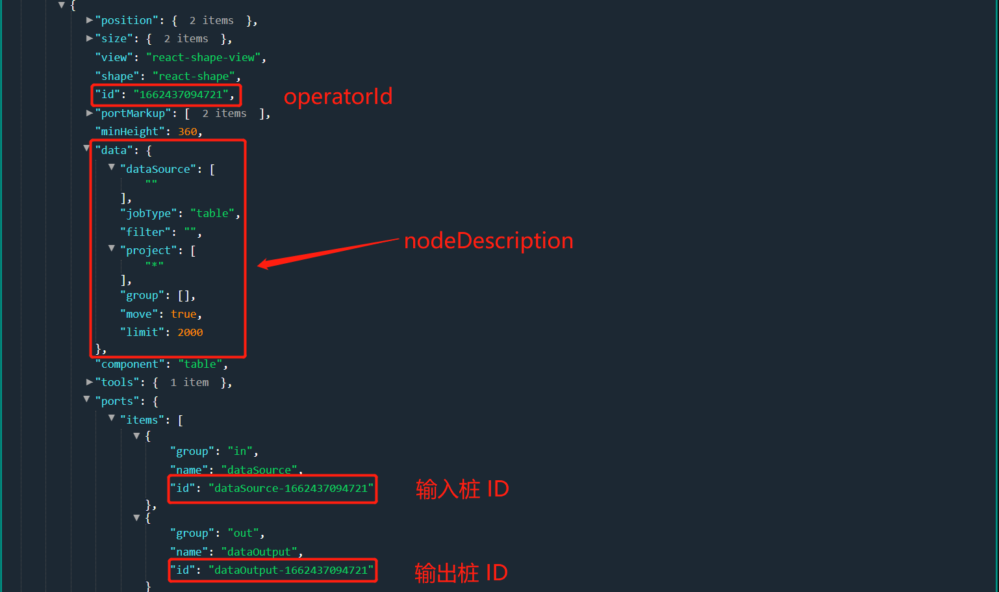
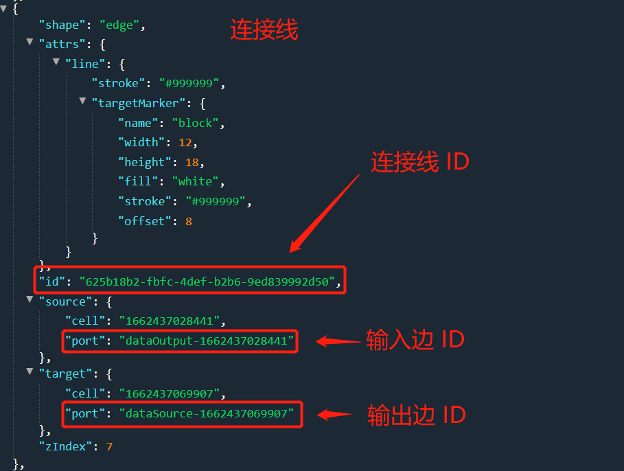
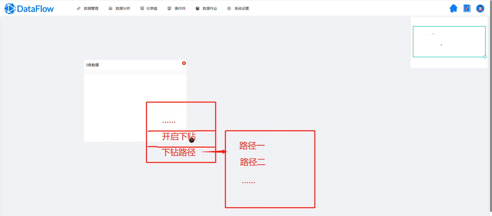
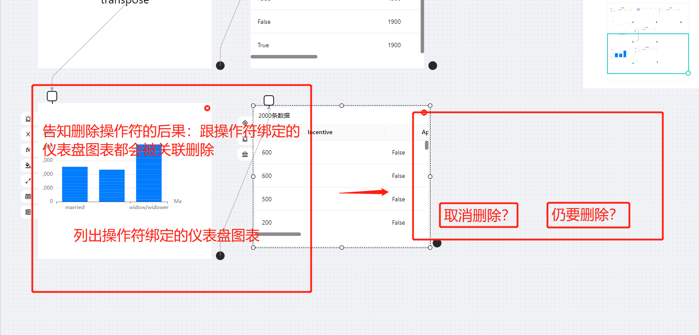
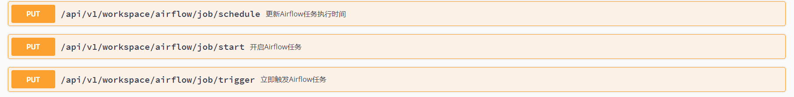
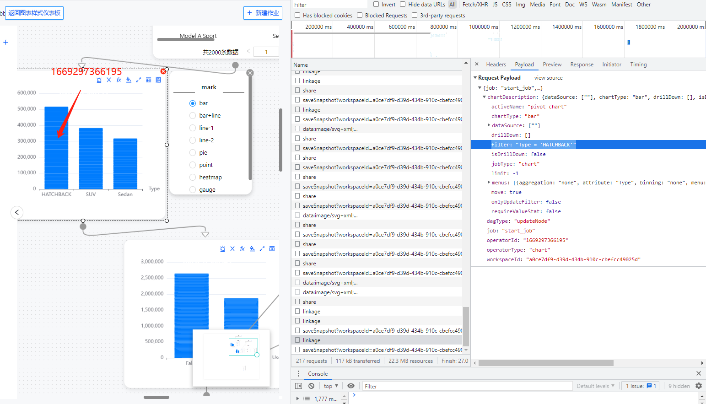
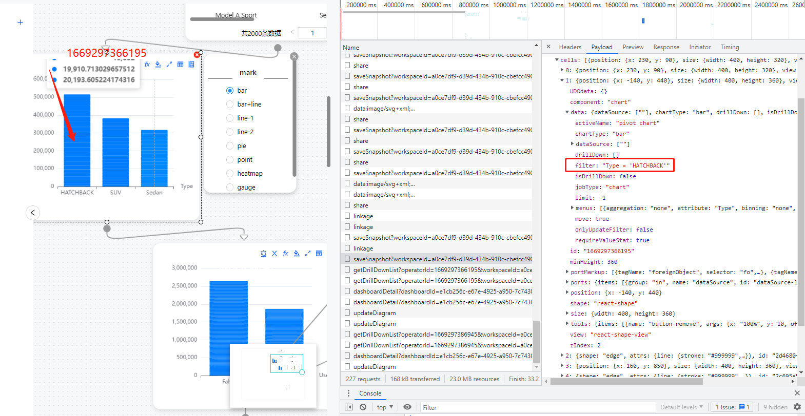
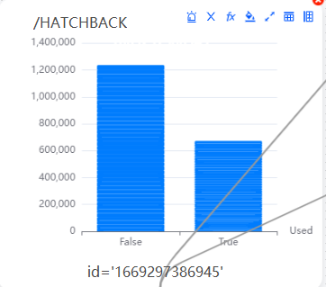
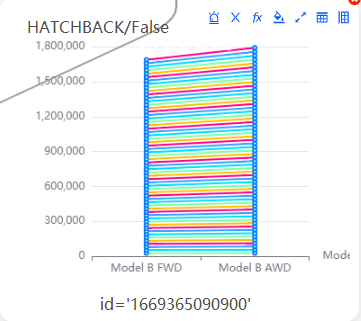

# 相关产品

Einblick

[Einblick](https://bv214n.einblick.ai/)

FineBI

[数据可视化分析 - FineBI大数据分析工具](https://www.finebi.com/product/functions/analysis)

[FineBI安装与启动- FineBI帮助文档 FineBI帮助文档](https://help.fanruan.com/finebi/doc-view-260.html)

FineBI 旋转、钻取

[FineBI商业智能 旋转、钻取](http://localhost:37799/webroot/decision#dashboard)

QuickBI

[数据分析概述](https://help.aliyun.com/document_detail/170652.html)

[交互分析](https://help.aliyun.com/document_detail/184195.html)

[Story Builder](https://www.alibabacloud.com/help/zh/quick-bi/latest/story-builder)

# 总体设计

[20220803-操作符与仪表板 · 语雀](https://gng9vp.yuque.com/gng9vp/zdwgoc/dpl3nk)

[仪表盘 · 语雀](https://gng9vp.yuque.com/gng9vp/ntohgg/hneip1#132b2e28)

## 仪表盘设计思路

DataFlow专利布局：

1. 基于工作流的可视化数据分析方法，核心是DAG的解析和处理，刘攀和俞少超同学负责。
2. 异构操作符的集成、封装与运行。鲁弈彤和刘攀同学负责。
3. 基于图结构的仪表板上下钻和关联关系定义。郭雍强同学负责。

### 设计原则

- 一个仪表板包含多个0个或多个可视化组件；
- 一个可视化组件仅属于一个仪表板；
- 可视化组件可以进行复制，放入同一个仪表板或其他仪表板中；
- 每个可视化组件包含一个工作区，该工作区内部仅包含一个数据分析任务；
- 每个工作区及其包含的数据分析任务仅属于一个可视化组件；
- 可以通过查看可视化组件代码的方式打开该可视化组件所关联的工作区和对应的数据分析任务，并支持对数据分析任务进行修改；

注意：每个工作区可以包含多个数据分析任务，但可视化组件关联的工作区中仅包含一个数据分析任务。





### 操作流程

1）创建仪表盘，作为承载各种可视化组件的容器。

2）在工作区中以拖拽的方式进行数据分析任务，并通过各种可视化组件展示中间分析结果，遇到合适的、需要特别展示的可视化组件，通过右键菜单的方式放置到已经创建的仪表盘中，也可以选择新建一个仪表盘；

3）一个仪表盘可以包含来自多个工作区中的可视化组件；

4）一个工作区中的数据分析任务可能会生成多个仪表盘中的组件；

这部分的设计具有原创性，我觉得可以写一个专利。

## "引用复制" 方案

>

1.仪表盘下钻过程中会修改工作区的内容

现在的实现思路是，仪表盘复用工作区的组件。之前的仪表盘只能有拖拽功能，不涉及到数据的变更，所以不存在问题。

但是联动和下钻涉及到组件数据的变化。所以仪表盘和工区应该是不一样的，各自维护一份数据。工区和仪表盘，仪表盘和仪表盘互不干扰，

那么，后端给ws=a&component=1 的数据和dashboard=2&component=1 的数据是不一样的

待确定部分：

这个思路会不会和后端有冲突？

2.组件下钻思路

开会确定了下钻分为两个部分，配置下钻和触发下钻。

为什么要配置下钻？

因为dag结构的不确定性，可能一个结果用户绘制两个图，一个表格和一个柱状图。这样整个dag就成为一个多叉树。下钻并不能确定钻取哪条路径。

配置下钻的两个思路：

一、自定义下钻操作符。在操作符里面配置下钻路径。缺点：破环dag结构，独立的节点。

二、组件侧边配置，配置需要下钻的路径。缺点：是否为所有节点都提供下钻配置，成本高。

待讨论部分：

触发下钻的方式，前后端如何配合，如何交互？

在现有的设计下（-202207），仪表盘和工作区强绑定。仪表盘保存的组件只是工作区中操作符的一个引用。

操作符被保存到仪表盘的时候只是把 operatorId 相关的 dagNode 信息复制到仪表盘，这部分信息属于引用复制，整个DataFlow 系统只在 Redis 保存了一份每个工作区中 Dag 结构的信息。

# 重新实现仪表盘

## 仪表盘和工作区解耦

一个仪表板包含多个0个或多个可视化组件，一个可视化组件仅属于一个仪表板。每个可视化组件包含一个工作区，该工作区内部仅包含一个数据分析任务，每个工作区及其包含的数据分析任务仅属于一个可视化组件。可以通过查看可视化组件代码的方式打开该可视化组件所关联的工作区和对应的数据分析任务，并支持对数据分析任务进行修改。

用户工作区中的操作符被添加到仪表盘上，就成为一个可视化组件。操作符被添加到仪表盘时，给仪表盘的每个可视化组件绑定一个“数据分析任务”，把原本工作区Dag的“子树”复制一份，绑定到新创建的数据分析任务上。数据分析任务和工作区的区别是，数据分析任务只有一个头节点。

具体实现方法是创建一个新的工作区，以要添加的操作符为头结点从原本的Dag结构中提取子树，构建新的Dag，把新的Dag绑定的新创建的工作区上。

如果可视化组件之间存在关联，两个组件必须共享一个Dag，需要考虑合适的处理方式。

原本工作区可能加载了数据集、设置了更新策略，需要把这部分数据也同步复制。

## 仪表盘数据

需要重新实现获取仪表盘数据的接口。

### 概念和业务规则

仪表盘的使用分两种场景：一是预览工作区设计态的图表、一般使用固定数据源，二是渲染数据任务实时生成的数据、类似于实时大屏系统。暂时把两种仪表盘叫做普通仪表盘和发布态仪表盘。区分两种场景的标志是工作区是否建立了数据作业，如果工作区没有建立数据作业，那么仪表盘数据和工作区绑定，否则仪表盘需要获取数据作业的数据。

建议的业务规则：

- 对不同类型的仪表盘做不同的限制，比如为了发布态仪表盘功能正常，就不允许把没有固化成数据作业的工作区中的操作符添加到发布态仪表盘中。
- 发布态仪表盘只能由普通仪表盘“升级”而来，不允许直接创建。
- 等……

### 实现细节

针对两种业务场景，仪表盘就要加入一个字段，判断属于哪种仪表盘。

**普通仪表盘**

有了这两种仪表盘类型，原有的仪表盘数据接口也不能满足需求，需要重新实现。

对于普通仪表盘，从 Redis 查找 operatorId 对应的 DagNode 最新的数据源，并取出 NodeDescription，执行一次单个节点任务，和联动接口有所区别。

**发布态仪表盘**

如果是发布态仪表盘，就需要数据作业的配合。数据作业每运行结束以后应该记录下来新数据保存的位置（比如 ClickHouse 表名），每次渲染发布态仪表盘时就找到对应的数据作业最新的数据源。

这里有不少细节：

- 数据作业只执行数据分析逻辑、不应该运行绘制图表这类操作。所以 Chart 操作符在 Dag 中应该被作为终端节点，构建数据任务时一旦遇到 Chart 操作符就应该把它所有的子树全部“砍掉”。
- 同时创建数据作业时最好把 当时工作区对应的 Dag 结构备份一下，作为数据作业的任务描述。
回到渲染仪表盘，拿到最新数据源以后还是根据 operatorId 和 数据源构建的 NodeDescription 执行一次临时单节点任务。为了能拿到最新数据源，发布态仪表盘必须保存一份 NodeDescription，从中查找 Chart 的上游操作符 operatorId 是什么，根据上游 operatorId 才能从数据作业模块拿到 最新数据源。

## 下钻路径

目前后端有获取下钻路径的接口，但是前端没有实现。这部分需要修改仪表盘需求文档，让对方实现。

使用方式是在仪表盘界面对图表单独设置开启下钻、配置下钻路径。



## 删除操作符时同时删除关联的仪表盘图表

操作符导出到仪表盘之后如果操作符被删除，所有关联的仪表盘图表都会变成空白（因为仪表盘组件数据丢失）。所以在工作区删除操作符时，需要警告用户一旦删除这个操作符也会同步删除所有关联的仪表盘图表，列出和这个操作符关联的所有图表。让用户选择"取消删除"还是“仍要删除”。



如果出现仪表盘和工作区数据不一致的情况，比如指向的操作符丢失导致仪表盘变成空白，需要用户手动修复仪表盘指向的 operatorId，其实相当于把这个异常仪表盘删除重新添加。两种方式采取一种。

这个功能也需要补充到需求文档。

## 仪表盘的权限

一是把仪表盘分享权限设为只读。

二是重新实现获取仪表盘数据的接口。详细描述见【获取仪表盘数据】。

# 存在的问题

~~### 仪表盘改变工作区数据的问题

~~如果操作符的 dagNode 信息发生改变，那么与他关联的所有仪表盘组件展示的结果都会发生改变。比如在仪表盘修改了chart 柱状图组件选中的柱，相应工作区的chart 操作符状态、其他关联仪表盘的状态都会发生改变。或者修改了下钻路径，其他关联仪表盘中 chart 组件的下钻路径也被改变。

~~下钻路径实际上是每个仪表盘组件都会保存一份，之前确定了二阶段设置下钻路径的方案。目前后端有获取下钻路径的接口，但是前端没有实现。这部分需要修改仪表盘需求文档，让对方实现。~~

## 仪表盘组件数据丢失的问题

也是由于引用复制的问题，如果在工作区删除一个操作符然后拖出来一个一模一样的操作符，虽然工作区展示效果一样，但是仪表盘中组件对应的 operatorId 已经不存在了，这时仪表盘就只能显示一个空白的组件。所以要想仪表盘正常显示，在导出操作符到仪表盘之后，工作区就不能再修改！

## 仪表盘渲染数据时的权限问题

共享用户访问仪表盘可能拿不到数据。

因为即使是查看仪表盘也可能改变工作区数据，所以分享仪表盘时的权限设置只能是只读（只能查看不能编辑）。

# 获取仪表盘数据

渲染仪表盘所需的数据实际上要靠计算一次 Dag 来返回，所以获取仪表盘数据要经过下面几个步骤：

- 首先拿到 每个仪表盘组件对应的 operatorId 和 工作区 ID
- 用 operatorId 和 工作区 ID 调用联动接口，让 DataFlow 计算 相应的 Dag
- 连接 websocket 接收数据

上面获取数据的过程涉及到了 仪表盘和工作区两个功能模块，接入权限拦截后仪表盘分享就无法正常工作。

## 所有者访问仪表盘

如果访问仪表盘的用户就是创建仪表盘的用户（仪表盘的所有者），那么按照上面的三个步骤可以正常拿到数据。

## 共享用户访问仪表盘

如果是共享用户，获取数据时虽然有查看仪表盘的权限，但没有调用工作区联动接口 和连接工作区 websocket的权限，就无法拿到数据。（现在工作区的联动和 websocket 没有设置权限拦截，但不代表以后不会有）

仪表盘数据应该写专门的接口去给前端返回数据，不直接调用工作区的接口，而是把调用联动的代码下沉到 service 层。（这样其实也不合理，因为用户一旦有了仪表盘的共享权限就可以用 operatorId和 workspaceId 去使用 工作区的功能。权限混乱，但是可以保证功能可用）。

## 实现方式

后端代码中支持联动接口的 WebsocketServer 类调用了 WebsocketResolveService 和 NewTestScheduleServiceImpl 两个类，向 Websocket 客户端发送数据的部分包含在 NewTestScheduleServiceImpl 类的 executeTask 方法中。

# 联动接口

## Linkage

Uniform Controller

POST

[/api/v1/gluttony/executor](http://47.104.202.153:8080/swagger-ui.html#/operations/Linkage/executeNodeTaskUsingPOST)

执行单个节点任务

POST

[/api/v1/gluttony/executorRandomTable](http://47.104.202.153:8080/swagger-ui.html#/operations/Linkage/executeTailNodeTaskUsingPOST)

执行单个节点任务，并更改随机表名（For Airflow）

POST

[/api/v1/gluttony/linkage](http://47.104.202.153:8080/swagger-ui.html#/operations/Linkage/linkageUsingPOST)

联动接口

POST

[/api/v1/gluttony/share](http://47.104.202.153:8080/swagger-ui.html#/operations/Linkage/testUsingPOST)

协同共享当前session的信息给同一个工作区下其他所有session

GET

[/api/v1/gluttony/webSocket/getPassCode](http://47.104.202.153:8080/swagger-ui.html#/operations/Linkage/getPassCodeUsingGET)

为后面建立webSocket获取通行码

## Other Api

GET

[/function/get](http://47.104.202.153:8080/swagger-ui.html#/operations/other-apis/getFunctionUsingGET)

获取已登录用户的功能权限目录结构

GET

[/noauth/user/list](http://47.104.202.153:8080/swagger-ui.html#/operations/other-apis/getUsersUsingGET)

获取所有用户列表，用于分享

GET

[/token/refresh](http://47.104.202.153:8080/swagger-ui.html#/operations/other-apis/refreshTokenUsingGET)

刷新token，获得新的accessToken

## Websocket 接口

/webSocket/workspace-PASSCODE

/webSocket/dashboard-PASSCODE

# Airflow Api

```JSON
{
  "catchup": false,
  "concurrency": 16,
  "dag_id": "1572148151007510529",
  "default_view": "tree",
  "description": "description info",
  "doc_md": " 1572148151007510529 DAG. ",
  "file_token": "Ii9yb290L2FpcmZsb3cvZGFncy8xNTcyMTQ4MTUxMDA3NTEwNTI5LnB5Ig.MCoV3hVYFR2Eahwp_LQUDEfodzk",
  "fileloc": "/root/airflow/dags/1572148151007510529.py",
  "is_active": true,
  "is_paused": false,
  "is_subdag": false,
  "max_active_tasks": 16,
  "orientation": "LR",
  "owners": [
    "airflow"
  ],
  "params": {},
  "schedule_interval": {
    "__type": "TimeDelta",
    "days": 7,
    "microseconds": 0,
    "seconds": 0
  },
  "start_date": "2022-09-20T00:06:00+00:00",
  "tags": [
    {
      "name": "tag"
    }
  ],
  "timezone": "Timezone(\u0027UTC\u0027)",
  "runs": {
    "dag_runs": [
      {
        "conf": {},
        "dag_id": "1572148151007510529",
        "dag_run_id": "scheduled__2022-10-10T15:00:39.340234+00:00",
        "end_date": "2022-10-17T23:00:40.545741+00:00",
        "execution_date": "2022-10-10T15:00:39.340234+00:00",
        "external_trigger": false,
        "logical_date": "2022-10-10T15:00:39.340234+00:00",
        "start_date": "2022-10-17T23:00:40.501906+00:00",
        "state": "success"
      }
    ],
    "total_entries": 1
  }
}
```

# 仪表板 API 注意事项

仪表板所有 API 位于 DashboardV2 这一组，swagger 链接：[Swagger UI - DashboardV2](http://47.104.202.153:8080/swagger-ui.html#/DashboardV2)

## 流程界面调用的 API

### 从流程添加组件

这个接口调用在【流程界面】

从流程添加组件时需要获取用户的所有仪表板，需要调用 DashboardV2 的接口。

接口地址：<http://47.104.202.153:8080/swagger-ui.html#/DashboardV2/getUserDashboardsUsingGET>

获取流程操作符和仪表板之间的添加关系

### 复用可视化组件

调用复用组件接口成功，将会返回新创建的组件信息。示例数据：

```Json
{
  "code": 200,
  "message": "操作成功",
  "successful": true,
  "data": {
    "id": "8cd3e9e5-6d27-455b-adac-74954e5a7901",
    "dashboardId": "e77d1ffb-26ef-8d9a-4299-28a8e80d908e",
    "sourceWorkspaceId": "d30c0982-6d5c-4f97-a96e-251ea597dc97",
    "workspaceId": "167cec5b-4984-4b22-8cf3-3109fe1f24f3",
    "sourceOperatorId": "1664186229889",
    "operatorId": "f0e07dc9-c9ef-40ab-b171-34230bf65614",
    "name": "DASHBOARD_DAG_DEBUG_2 组件",
    "title": "DASHBOARD_DAG_DEBUG_2",
    "drillEnabled": true,
    "drillPath": [
      "1664186229889",
      "1664186275225",
      "1664186308007"
    ],
    "snapshot": "dolore Excepteur adipisicing",
    "createTime": "2022-10-17T21:25:51.869",
    "updateTime": "2022-10-17T21:25:51.869",
    "createdBy": "f7c040ef-8c2c-4e6b-984e-caaa3711e27c",
    "updatedBy": "f7c040ef-8c2c-4e6b-984e-caaa3711e27c",
    "deleted": false
  }
}
```

## 定时任务

### 仪表板定时任务列表

获取仪表板定时任务列表的接口：<http://47.104.202.153:8080/swagger-ui.html#/DashboardV2/getScheduledJobListUsingGET>

获取定时任务状态的接口：<http://47.104.202.153:8080/swagger-ui.html#/DashboardV2/getScheduledJobStatusUsingGET>

- 返回的 timeDeltaUnit 时间间隔单位是整数类型，对应关系是0：周 1：日 2：时 3：分 4：秒。前端根据间隔单位在界面上显示合适的时间单位。
- 因为性能原因接口没有返回定时任务的状态，需要前端对每个任务单独调用一次获取定时任务状态的接口。

### 启动或暂停仪表板定时任务

PUT[/api/v1/workspace/airflow/job/pause](http://47.104.202.153:8080/swagger-ui.html#/operations/airflow/pauseAirflowJobUsingPUT)

暂停Airflow任务

PUT[/api/v1/workspace/airflow/job/start](http://47.104.202.153:8080/swagger-ui.html#/operations/airflow/startAirflowJobUsingPUT)

开启Airflow任务

PUT[/api/v1/workspace/airflow/job/trigger](http://47.104.202.153:8080/swagger-ui.html#/operations/airflow/triggerAirflowJobUsingPUT)

立即触发Airflow任务



### 其他注意点

这部分大概率不需要改动，可以需要的时候再看。

### Websocket

获取仪表板组件数据需要连接 websocket。具体方法是：

```
step 1: 通过 getPassCode 接口获取 websocket 通行码（passCode）
getPassCode 接口文档地址：http://47.104.202.153:8080/swagger-ui.html#/Linkage/getPassCodeUsingGET
step 2: 使用通行码连接 websocket
step 3: 调用联动接口或通过 websocket 发送 updateNode 消息，从 websocket 提取 元数据 和 JOB_FINISH/JOB_FAILED 消息
linkage （联动接口）文档地址：http://47.104.202.153:8080/swagger-ui.html#/Linkage/linkageUsingPOST
```

# 仪表板联动下钻

## 请求过程

用户点击图中的点以后：

1. 更新组件快照。调用 `saveSnapshot` 接口，`workspaceId` 值是组件的 `workspaceId` 字段，在 `data` 字段设置 `filter: '<Axis>=<Value>'` 。
2. 发送联动请求。调用 linkage 接口，请求体比普通请求多了 filter 字段。
3. 从 `websocket` 接收数据，如果消息的 `operatorId` 和组件的 `operatorId` 匹配，就重绘相应组件展示的图。





重绘过程：

- 联动时：重绘所有 `operatorId` 匹配的组件图
- 下钻时：布局中组件所在网格里的图切换到下钻路径上下一节点的图。下钻路径是一个字符串数组，例如 `["1669297366195", "1669297386945", "1669365090900"]` ，如果一个复合组件（ `drillEnabled=true` ）对应的 `operatorId` 是 1669297366195，点击“HATCHBACK”下钻到第一层，则渲染 `1669297386945` 的图、左上角 breadcrumb 显示为 `/HATCHBACK` 。点击 `HATCHBACK` 能够切回顶层，也就是下钻层级减一，取消下钻。
下钻层级减一的操作：
1. 更新组件快照。调用 `saveSnapshot` 接口，`workspaceId` 值是组件的 `workspaceId` 字段。在 `cells` 列表中找到上一级节点 `operatorId` 对应的元素，data 字段**删除** ` filter: '<Axis>=<Value>'` 。
2. 发送联动请求。调用 linkage 接口，请求体中**不包含** `filter` 字段。
3. Breadcrumb 中路径减少一级，渲染上一级操作符的数据。

## 前端实现下钻的详细过程

补充

切换了下钻层级之后发送联动请求的 operatorId 需要相应的切换。配合一个小例子来说明：

比如 `["9502af79-57d1-4d98-af84-d5bfde14be20", "1671285927901", "1671285947422"]` 这个下钻路径，第一层下钻 `9502af[Type=Sedan]` 之后比如再选择了 `Used=False`，下一个联动请求的 `operatorId` 就应该是 `1671285927901`。所以第二层下钻发送联动请求之前需要先取一下 `chartDescription`，用 `operatorId = 1671285927901` 发送这样一个联动请求：

```javascript
{
  dagType: "updateNode",
  job: "start_job",
  operatorId: "1671285927901",
  operatorType: "chart",
  workspaceId: "ce8061a3-97b2-48d2-8e5d-8385a2040da3",
  // 1671285927901 结点的 nodeDescription 中，filter 字段设置为 "Used = 'False'"
  chartDescription: ${nodeDescription_1671285927901}
}
```

如果联动请求的 `operatorId` 不匹配就有可能导致返回数据为空。

获取结点 `nodeDescription` 的新方式：执行一次联动请求之后，服务端会通过 `websocket` 返回一个 `JOB_START` 消息，其中包含了操作符当前的 `nodeDescription`。

还是以下钻组件 `["9502af79-57d1-4d98-af84-d5bfde14be20", "1671285927901", "1671285947422"]` 为例。如果 `9502af[Type=Sedan]` 的联动请求正确执行，就会通过 `websocket` 收到三条 `JOB_START` / `JOB_FINISH` 消息： `["9502af79-57d1-4d98-af84-d5bfde14be20", "1671285927901", "1671285947422"]` 。从 `1671285927901` 的 `JOB_START` 消息中取出 `nodeDescription`，然后设置 `filter = "Used = 'False'"`，就构成了 `1671285927901 [Used=False]` 的联动请求。

总结

**维护组件状态**

每个下钻组件维护三个变量：下钻层级变量 `i`，下钻层级增量 `di`，以及下钻路径上每个 `operatorId` 对应的最新 `nodeDescription` ( 例如用一个 JavaScript 对象 `descriptions` 来保存 )。初始下钻层级 `i` = 0，`di` = 0。每当 `websocket` 接收到 `JOB_START` 事件时，取出 `nodeDescription` 更新 `descriptions` 。组件的下钻路径 `drillPath`，是否开启下钻 (`drillEnabled`) 等信息都是持久化的，已经通过接口拿到。

**监听组件数据**

如果组件开启下钻 ( `drillEnabled == true` )，直接设置 `websocket` 的监听动作：监听 `websocket` 推送的 JOB_FINISH 消息，如果 `event.operatorId == drillPath[i+di]` 就渲染新数据重绘组件样式。无论下钻层级增加还是下钻层级减小，或者没有下钻动作（下钻层级 i=0），渲染时都是从 `websocket` 匹配 `event.operatorId == drillPath[i+di]` 的 `JOB_FINISH` 消息。

**下钻层级增加的过程**

用户点击触发下钻事件后，取出 ``operatorId = drillPath[i]`` 的节点所对应的 `nodeDescription = descriptions[i]`，设置好 filter 字段的过滤条件，按照代码块 `1671285927901[Used=False]` 示意的格式拼接联动请求，调用联动接口。更新下钻层级 `i=i+di`，把 `i`, `di`, `drillPath` 的改动反映到 `websocket` 监听器的回调函数中。

请求拼接过程：

```javascript
operatorId = drillPath[i];
nodeDescription = descriptions[operatorId];
// 例如过滤条件是 "Used='False'", 注意 value 如果是字符串要带引号
nodeDescription.filter = '${column}=${value}';
request = {
  dagType: "updateNode",
  job: "start_job",
  operatorId: operatorId,
  operatorType: "chart",
  workspaceId: workspaceId,
  chartDescription: nodeDescription
};
// 更新组件的下钻状态
di = 1;
i += di;
// 把 i, di, drillPath 的改动反映到 websocket 监听器的回调函数中
// 下面就可以发送联动请求

```

**下钻层级减小的过程**

下钻层级减一的过程：更新下钻层级 `i=i+di`。取出 `operatorId = drillPath[i]` 的节点所对应的 `nodeDescription = descriptions[i]`，取消 `filter` 字段的过滤条件（`filter: ''`），按照代码块 `1671285927901[Used=False]` 示意的格式拼接联动请求，调用联动接口。

```javascript
// 更新组件的下钻状态
di = -1;
i += di;
// 把 i, di, drillPath 的改动反映到 websocket 监听器的回调函数中

operatorId = drillPath[i];
nodeDescription = descriptions[operatorId];
nodeDescription.filter = '';	// 重置 operatorId 对应操作符的过滤条件
request = {
  dagType: "updateNode",
  job: "start_job",
  operatorId: operatorId,
  operatorType: "chart",
  workspaceId: workspaceId,
  // 1671285927901 结点的 nodeDescription 中，filter 字段设置为 "Used = 'False'"
  chartDescription: nodeDescription
};
// 下面就发送联动请求

```

## 下钻组件样式

只比普通组件多了代表下钻层级的 breadcrumb，每一层可点击。（底部的 id 只是示意，不在前端展示）。

一层下钻的样式：



两层下钻的样式：



# 仪表板用户手册

## 流程绘图

// 10 种图表

Bar: 堆积柱状图

Bar+line: 柱状图+折线图

Line-1: 堆积折线图

Line-2: 折线图

Pie: 饼图

Point: 散点图

Heatmap: 热力图

Gauge: 仪表盘

3DData: 三维数据体

三维切片图通过在三维数据体里点击模型呈现

## 联动、下钻

## 添加组件

### 一些规则

- 一个操作符从流程添加（右击操作符菜单选择【添加到仪表板】）后，首先出现在仪表板左侧的【组件库】列表。
- 从组件库拖动到仪表板网格布局中，才能被展示出来。
- 一个 chart 操作符被添加到仪表板后，再次添加到同一个仪表板不会增加一个组件。这种情况被视为更新一个组件。

### 从流程添加

### 从组件库加入布局

1、支持动态图表设计，通过配置的方式实现图表的设计，包括但不限于柱状图、堆积柱状图、折线图、堆积折线图、饼图、散点图、热力图、仪表盘、三维数据体、三维切片图等丰富的图表分析组件。

2、支持数值、字符串、时间日期等过滤控件。支持复合查询控件，可进行复杂且或组合逻辑过滤，更加灵活地满足用户的数据过滤分析需求。

3、支持数据联动分析。多个图表可以接入同一个数据集可视化展示数据集的不同维度，图表之间可以通过用户点选数据构成过滤条件来支持灵活的多维数据集探索和可视化需求。

4、支持多维数据集的维度钻取。支持将数据集的多个维度构成钻取路径，利用图表的钻取功能支撑用户探索数据集多个维度的数据分布。图表便捷的跳转功能支持在不同的数据分布之间跳转。

5、支持图表的组件化管理。已有图表自动保存为可复用的组件。组件复用功能支持用户将复杂的图标设计方案一键保存，并可以随时复制出图表实例，在此基础上进一步设计或修改。

~~3、支持 web 组件，可进行网页 url 嵌入分析；支持图片组件，可嵌入图片进行分析展现；支持富文本组件，可输入文字和动态字段进行复合信息展现，支持 word 级别的字体大小、颜色、对齐等属性调节。~~

~~4、支持图表、文本、图片以及外部 Web 内容等自由组合展示。~~

~~5、支持快速对组件进行标题、标题栏、图例、轴线、网格线、背景等设置。~~

6、支持用户对图表进行局部放大查看，支持在查看图表时进行图表的局部缩放以及单个组件进行放大查看，方便用户对特定区域的数据进行详细观察。(流程里面可以放大，但是仪表板的组件不行)

~~7、支持表格动态数值预警功能和图形设置动态警戒线，以实现数据预警分析。~~

~~8、支持 WebGIS 模块，可以在后台读取 DWG 文件，把 CAD 图形渲染成 GIS 的栅格或矢量数据，然后前端利用 GIS 框架加载进行渲染，也可作为其它图件的底图进行叠合显示。~~
