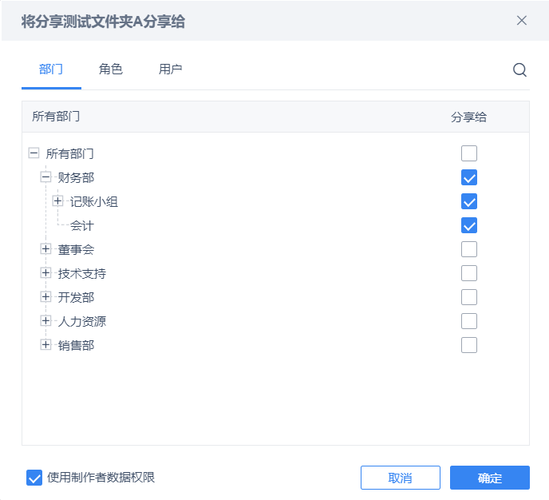
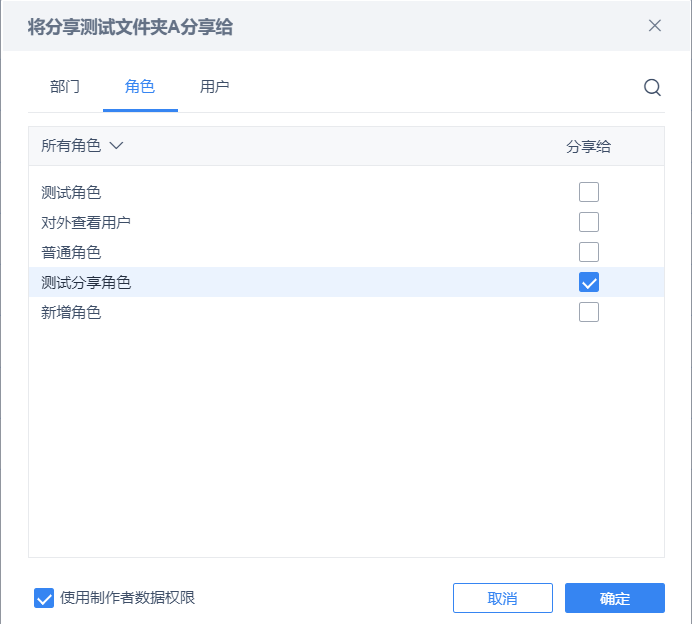
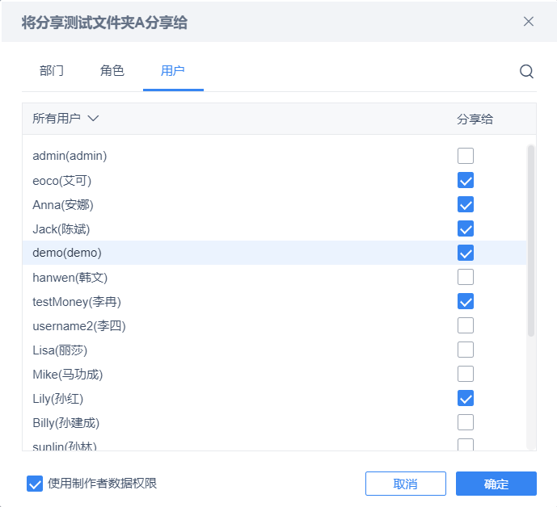
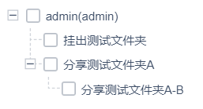
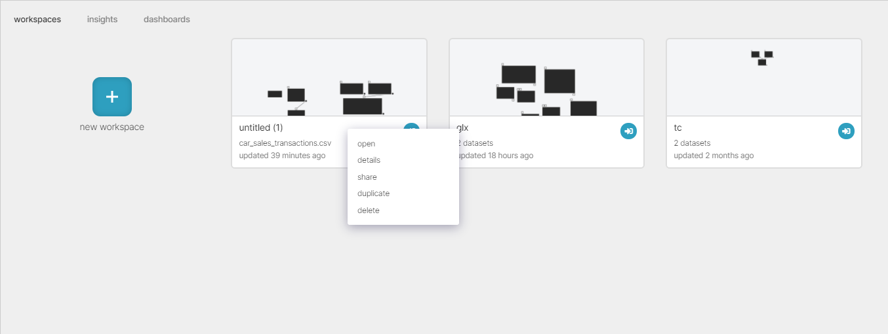
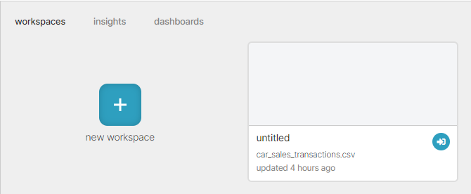
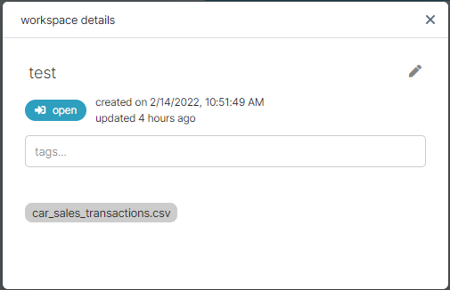

# 0. 使用DataFlow权限要点
## 0.1 登录与登出
登录与登出功能是利用SpringSecurity提供的支持完成，没有手写Controller接口，因此在swagger中无法看到这两个接口，需要利用postman等测试软件发起请求。
登录成功后，会返回accessToken与refreshToken，之后访问系统需要header中携带参数`Authorization=accessToken`。当accessToken过期，使用refreshToken访问后端的刷新令牌接口，换取新的accessToken使用。
具体接口详细信息访问《功能梳理》文档：
[功能梳理 · 语雀](https://www.yuque.com/docs/share/3bb35c08-c142-4e0a-b9cf-856d5b00374c?#PuBh)


## 0.2 权限代码模块介绍
### 1、系统管理
系统管理是权限体系自洽实现的功能，具有Controller层接口，可以直接使用。
系统管理包括`数据连接`、`用户管理`、`权限管理`三个功能模块。

- 数据连接管理数据源连接，具备相应权限的用户在此可以添加新的数据连接实例或者修改已有实例，后续数据准备便可使用对应的数据连接实例。
- 用户管理中包含用户管理、部门职务管理、角色管理。
- 权限管理主要功能是为权限受体分配各种类型的权限。 
   - 权限受体：用户角色、部门角色、自定义角色
   - 权限项类型：人员管理权限、系统功能权限、数据权限、数据连接权限
   - 权限类型：查看、使用、修改、授权等权限

系统管理对应代码的Controller路径：
`com.bdilab.dataflow.authority.controller.sysmanage`

### 2、服务模块
所谓服务模块是指，权限体系为支持目录结构管理，以及对目录节点的权限管理，对系统其它部分暴露出的服务模块。
系统用户的资源有两种：公共资源、个人资源。
与此对应，服务模块主要包含公共服务模块与个人服务模块。
服务模块主要提供了针对目录的各种操作，并且已经在内部完成了对应的权限检测，调用者只需调用对应的方法，构造自己的逻辑即可。

使用公共服务举例：

- 管理员新建根目录 
   - 前端传入目录名称，后端开发成员在实现时直接调用公共服务模块的`新建根目录`方法，传入前端的参数即可。
- 用户新建文件夹 
   - 前端传入父级文件夹id、文件夹名称，后端开发成员在实现时直接调用公共服务模块的`新建文件夹`方法，传入前端的参数即可。
- 用户新建数据集 
   - 前端传入父级文件夹id、数据集名称、数据集具体类型，后端开发成员在实现时调用公共服务模块的`添加数据集`方法，传入前端的参数，并且传入**数据集id**；此时，便在公共目录中添加了该数据集节点；在调用`添加数据集`方法后（后面的逻辑与目录权限不再有关系），完成自己的数据集数据导入任务，在自己的数据集表中添加对应的记录，主键id与上面构造的目录节点的**数据集id**相同。

> 说明：目录结构是系统中所有资源的包装视图，用户在界面能够看到的就是此目录结构，目录中的数据集节点并不关心数据集的实际内容，如何存储。其本质功能就是为了可视化展示和作为权限可控制的实体。因此当需要通过目录中的某个数据集节点具体去访问该数据集的数据时，需要找到该数据集节点对应的数据集表中的记录，因此一个简单且有效的实现方式就是将目录节点的主键id和数据集的主键id设置为一个相同的uuid，这也正是上面的举例中所描述的。

个人服务模块与公共服务模块的逻辑类似，不再赘述。
**强调**：目录表是目录表，资源表是资源表（数据集表、数据连接表等等），目录表中的数据集记录仅仅与数据集表中的记录存在一个关联关系，以便于在实际访问数据的时候能够找到。
服务模块暴露以下入口类，需要使用的时候，注入对应的入口类即可：

- 公共目录服务：

`com.bdilab.dataflow.authority.service.permission.external.support.resource.central.entrance.PublicResourceServiceEntrance`

- 个人目录服务：

`com.bdilab.dataflow.authority.service.permission.external.support.resource.central.entrance.PrivateResourceServiceEntrance`

- 数据连接服务：

`com.bdilab.dataflow.authority.service.permission.external.support.resource.central.entrance.ConnectionServiceEntrance`

- 共享目录服务：

`com.bdilab.dataflow.authority.service.permission.external.support.resource.central.entrance.ShareResourceServiceEntrance`

- 共享服务：

`com.bdilab.dataflow.authority.service.permission.external.support.resource.central.entrance.ShareToOtherServiceEntrance`

- 工作区服务：

`com.bdilab.dataflow.authority.service.permission.external.support.resource.central.entrance.WorkspaceServiceEntrance`

- 仪表盘服务：

`com.bdilab.dataflow.authority.service.permission.external.support.resource.central.entrance.DashboardServiceEntrance`

## 0.3 自定义异常与返回码说明
自定义异常：`com.bdilab.dataflow.common.exception.BusinessException`
全局异常捕获：`com.bdilab.dataflow.common.exception.handler.RestExceptionHandler`
返回码封装：`com.bdilab.dataflow.common.response.HttpCode`
Http响应封装：`com.bdilab.dataflow.common.response.HttpResponse`
### 1、HttpResponse与HttpCode
所有的请求返回类型都使用HttpResponse，具体属性见下。
```java
@ApiModelProperty(value = "状态码", required = true)
private int code;
@ApiModelProperty(value = "状态信息", required = true)
private String message;
@ApiModelProperty(value = "请求是否成功", required = true)
private boolean successful;
@ApiModelProperty(value = "展示数据", required = true)
private Object data;
```
构造函数中既可以使用HttpCode来进行方便构造，如果HttpCode中的信息不满足要求（需自定义code或message），也可以使用全字段的构造函数。

### 2、BusinessException
自定义异常的使用思路：

- 在Service层处理业务时，如果遇到传入参数不符合要求或者其它业务上的逻辑错误，可以直接throw该自定义异常；
- 在Service层处理业务时，捕获了其它不可处理的异常，可以throw该自定义异常，将原异常设为cause。

自定义异常类的属性如下所示。

```java
public class BusinessException extends RuntimeException{
    //错误码
    private final int messageCode;
    //返回给用户的错误信息
    private final String responseMessage;
    //系统内部要展示的错误信息
    private final String causeMessage;
    //在RestExceptionHandler中处理该异常时采用的日志级别
    private LogLevel logLevel = LogLevel.INFO;
}
```
在抛出自定义异常后，如果没有被其它业务catch，则会被全局异常处理catch到，根据该异常中的具体内容，构造HttpResponse返回前端。
`messageCode`对应HttpResponse的code属性。
`responseMessage`对应HttpResponse的message属性。
`causeMessage`是打印日志时的提示信息。
`loglevel`是打印日志时的日志级别，LogLevel.NONE不打印日志。
## 0.4 注册需权限检测的接口
### 1、说明
对于系统中各种资源实体，用户在访问（查看、修改）它们时需要进行权限检测，从而拒绝非法访问，导致数据泄露或产生异常。同时，又由于权限模块要尽量减少对其它模块的代码侵入，所以不采用为其它模块提供服务类的方式完成，而采用过滤器统一拦截检测的方式（当然，对于新增和删除这些与目录相关的方法，还是要使用权限模块提供的服务类完成，这些服务类内部已经完成了权限检测）。采用过滤器的方式，需要其它模块使用配置的方式提前告知权限模块，需要检测什么接口，以及检测的参数、实体类型和要检测的权限类型，称之为**url-pattern注册机制**。目前支持检测的实体类型包括：**数据集、仪表盘、工作区、自定义操作符、数据连接实例**
下面详细介绍使用方式。
### 2、实操
首先，注册机制支持嵌套，每个模块首先设置自己的前缀url，然后可以在此url前缀下再设置属于此url前缀的子url前缀，或者也可以在url前缀下开启检测参数的配置，支持表单参数和body参数的配置。
整个过程可以看做一个树状结构的构造过程，可以称url前缀为非叶子结点，称参数配置为叶子节点。使用者在config模块的com.bdilab.dataflow.config.UrlFilterConfig中进行配置，可以参考下面的配置样例进行理解。
```java
@Configuration
public class UrlFilterConfig {
    /**
    * 注册需要拦截的url-pattern，可以进行层级注册【配置url前缀】
    */
    @Bean
    public UrlCheckContainer getUrlCheckContainer(){
        UrlCheckContainer urlCheckContainer = new UrlCheckContainer();
        /*
        =====================================
        样   例
        =====================================
        */
        //----------子模块A设置----------
        //工区id获取器
        CheckIdGetter workspaceIdGetter_A = body -> {
            JSONObject jsonObject = JSONObject.parseObject(body);
            String workspaceId = (String)jsonObject.get("workspaceId");
            return Collections.singletonList(workspaceId);
        };
        urlCheckContainer
            //开启一个前缀设置，第一层
            .prefixPartition("/mark1")
            //在上一个前缀下开启新前缀设置，第二层
            .prefixPartition("/mark1/mark1-1")
            //在上一个前缀下开启新前缀设置，第三层
            .prefixPartition("/mark1/mark1-1/mark1-1-1")
            //在开启的第三层的前缀【/mark1/mark1-1/mark1-1-1】下开启url-pattern配置1
            .pattern("/mark1/mark1-1/mark1-1-1/**/operation1/*")
            //添加body校验参数
            .addBodyParam(workspaceIdGetter_A, PermissionEntityType.WORKSPACE, PermissionType.VIEW)
            //添加form表单校验参数
            .addFormParam("datasetIds",true,PermissionEntityType.DATASET,PermissionType.VIEW)
            //参数添加完成
            .finish()
            //在开启的第三层的前缀【/mark1/mark1-1/mark1-1-1】下开启url-pattern配置2
            .pattern("/mark1/mark1-1/mark1-1-1/**/operation2/*")
            .addFormParam("workspaceIds",true, PermissionEntityType.WORKSPACE, PermissionType.MODIFY)
            .finish()
            //pattern配置完毕
            .buildPattern()
            //在第三层的第一个前缀设置完成后，开启第二个前缀设置(相当于兄弟节点)
            .prefixPartition("/mark1/mark1-1/mark1-1-2")
            .pattern("/mark1/mark1-1/mark1-1-2/**/operation1/*")
            .addFormParam("xxx",false,PermissionEntityType.WORKSPACE,PermissionType.VIEW)
            .finish()
            .buildPattern()
            //第三层所有前缀配置完成，跳至第二层
            .jumpToLastPartition()
            //配置第二层的第二个前缀设置
            .prefixPartition("/mark1/mark1-2")
            .pattern("/mark1/mark1-2/**/operation1/*")
            .addFormParam("yyy",false,PermissionEntityType.WORKSPACE,PermissionType.VIEW)
            .finish()
            .buildPattern()
            //第二层前缀设置完成，跳至第一层
            .jumpToLastPartition()
            //第一层前缀设置完成，跳出前缀设置
            .jumpToLastPartition()
            //辅助校验方法，防止跳出层级没有设置正确
            .check();
        
        //子模块B设置
        urlCheckContainer
            .prefixPartition("/mark2")
            .prefixPartition("/mark2/mark2-1")
            .prefixPartition("/mark2/mark2-1/mark2-1-1")
            .pattern("/mark2/mark2-1/mark2-1-1/**/operation1/*")
            .addFormParam("dashboardId",false, PermissionEntityType.DASHBOARD, PermissionType.VIEW)
            .addFormParam("datasetIds",true,PermissionEntityType.DATASET,PermissionType.VIEW)
            .finish()
            .pattern("/mark2/mark2-1/mark2-1-1/**/operation2/*")
            .addFormParam("dashboardIds",true, PermissionEntityType.DASHBOARD, PermissionType.MODIFY)
            .finish()
            .buildPattern()
            .prefixPartition("/mark2/mark2-1/mark2-1-2")
            .pattern("/mark2/mark2-1/mark2-1-2/**/operation1/*")
            .addFormParam("xxx",false,PermissionEntityType.DASHBOARD,PermissionType.VIEW)
            .finish()
            .buildPattern()
            .jumpToLastPartition()
            .prefixPartition("/mark2/mark2-2")
            .pattern("/mark2/mark2-2/**/operation1/*")
            .addFormParam("yyy",false,PermissionEntityType.DASHBOARD,PermissionType.VIEW)
            .finish()
            .buildPattern()
            .jumpToLastPartition()
            .jumpToLastPartition()
            .check();
        
        //实操样例：com.bdilab.dataflow.authority.controller.sysmanage.user.TestController
        //数据集id获取器
        CheckIdGetter datasetIdGetter_Test = body -> {
            JSONObject jsonObject = JSONObject.parseObject(body);
            JSONArray datasetIds = jsonObject.getJSONArray("datasetIds");
            List<String> res = new ArrayList<>(datasetIds.size());
            for (Object datasetId : datasetIds) {
                res.add((String)datasetId);
            }
            return res;
        };
        urlCheckContainer
            .prefixPartition("/test")
            .pattern("/test/permission/**")
            .addFormParam("workspaceId",false,PermissionEntityType.WORKSPACE,PermissionType.VIEW)
            .addBodyParam(datasetIdGetter_Test,PermissionEntityType.DATASET,PermissionType.VIEW)
            .finish()
            .buildPattern()
            .jumpToLastPartition()
            .check();
        
        return urlCheckContainer;
    }
}

```
之所以采用url前缀的配置方式，是基于性能考虑，如果每个模块都在此注册了许多接口，那么在权限检测时对每一次请求都要对配置的所有接口扫描匹配一遍，比较浪费时间。采用url前缀的方式，可以减少最外层的节点数量，假设每个模块都配置了自己的url前缀，那么当一个不需要权限检测的请求到来，最多匹配的次数=模块数。当然，如果一个模块下面的接口也非常多，使用者需要具体分析自己的情况，可以在自己的url前缀下开启新的url前缀，以进一步减少匹配次数，这里是支持多层的url前缀的。
> 注意事项：
> 1、多利用url-pattern的方式，不要将每一个接口都原封不动的注册进来，尽量利用一个url-pattern匹配多个接口。
> 2、如果你的一些接口采用request body参数进行接收，那么就使用addBodyParam添加参数，这里需要自己传入一个id获取器，即权限模块拿到body内容后，如果通过body内容获取需要检测的实体id（列表）。
> 3、如果一个url-pattern配置，你同时使用addFormParam和addBodyParam，那么对于FormParam你只能使用url参数了，无法使用表单参数，这是http请求决定的，表单参数和body参数本质上都是放在http请求的body体里。
> 4、在url前缀下开启新的url前缀同样要从根路径开始写。例如url前缀为 '/test' ，那么子url前缀为 '/test/other'
> 5、当你在一个子url前缀U1下完成参数配置后，可以接着开启url前缀配置U2，此时U2是U1的兄弟节点，如果不想再配置兄弟节点，去往上一层，请使用jumpToLastPartition()方法。因此对于一个模块的配置，开启的层数与跳出的次数是一致的，在模块的url全部配置完成后，使用check方法（辅助校验方法，防止跳出层级错误）。
> 6、**目前不支持restful风格的接口进行权限检测！！！**

## 0.5 建立工作区webSocket流程
### 描述
发送建立webSocket请求之前，先访问一个权限校验接口，验证该用户是否对该工作区有查看权限，如果校验通过则返回一个通行码，如果校验失败，则返回权限不足。
### 接口详情
**1、获取通行码**
接口地址：`/api/v1/workspace/webSocket/getPassCode`
请求方式：`GET`
请求参数：

| 参数名称 | 参数类型 | 是否必须 | 说明 |
| --- | --- | --- | --- |
| workspaceId | 字符串 | 是 | 工作区id |

返回示例：

```json
{
  "code": 200,
  "message": "请求成功",
  "successful": true,
  "data": "workspace-5344433ea8ac48e4b571aa57c188a0c5"
}
```

**2、建立webSocket连接**
请求地址：`/webSocket/{passCode}`
将之前获取到的通行码替换接口中的{passCode}参数
# 1. DataFlow权限设计
## 1.1 数据库设计
### 1.1.1 用户管理子模块
#### 1.1.1.1 用户表（user）
| **字段** | **类型** | **主键** | **约束条件** | **字段说明** |
| --- | --- | --- | --- | --- |
| id | varchar(128) | Primary Key | NOT NULL | 用户id |
| remark | varchar(1000) | 
 | 
 | 备注信息 |
| email | varchar(128) | 
 | 
 | 电子邮箱 |
| is_enabled | TINYINT | 
 | NOT NULL | 用户是否可用
0：禁用
1：启用 |
| mobile | varchar(128) | 
 | 
 | 联系电话 |
| password | varchar(128) | 
 | NOT NULL | 用户密码 |
| realname | varchar(128) | 
 | NOT NULL | 用户姓名 |
| username | varchar(128) | 
 | NOT NULL
UNIQUE | 用户名 |
| create_time | datetime | 
 | NOT NULL | 用户创建时间 |

#### 1.1.1.2 部门表（department）
| **字段** | **类型** | **主键** | **约束条件** | **字段说明** |
| --- | --- | --- | --- | --- |
| id | varchar(128) | Primary Key | NOT NULL | 部门id |
| name | varchar(128) | 
 | NOT NULL | 部门名称 |
| address | varchar(256) | 
 | 
 | 部门地址 |
| remark | varchar(1000) | 
 | 
 | 备注信息 |
| create_time | datetime | 
 | NOT NULL | 部门创建时间 |
| full_path | varchar(3000) | 
 | 
 | 从顶级部门到该部门的id全路径(不包括该部门)，示例：
did1_did2_did3 |
| parent_id | varchar(128) | 
 | 
 | 父级部门id
为该字段加索引 |

#### 1.1.1.3 职务表（position）
注：每个部门就对应一个角色，部门下的每个职务也对应一个角色

| **字段** | **类型** | **主键** | **约束条件** | **字段说明** |
| --- | --- | --- | --- | --- |
| id | varchar(128) | Primary Key | NOT NULL | 职务id |
| remark | varchar(1000) | 
 | 
 | 备注信息 |
| create_time | datetime | 
 | NOT NULL | 职务创建时间 |
| name | varchar(128) | 
 | NOT NULL | 职务名称 |

#### 1.1.1.4 部门角色表（department_role）
注：每个部门就对应一个角色，部门下的每个职务也对应一个角色

| **字段** | **类型** | **主键** | **约束条件** | **字段说明** |
| --- | --- | --- | --- | --- |
| id | varchar(128) | Primary Key | NOT NULL | 部门角色id |
| fk_department_id | varchar(128) | 
 | NOT NULL | 部门id |
| fk_position_id | varchar(128) | 
 | NOT NULL | 职务id，没有则置空字符串，department_id与post_id创建联合唯一约束 |
| full_path | varchar(3000) | 
 | 
 | 从顶级部门到该部门或职务的上一级部门id全路径(不包括当前部门或职务) |
| parent_id | varchar(128) |  | 
 | 父级部门角色id |

#### 1.1.1.5 自定义角色表（customized_role）
| **字段** | **类型** | **主键** | **约束条件** | **字段说明** |
| --- | --- | --- | --- | --- |
| id | varchar(128) | Primary Key | NOT NULL | 自定义角色id |
| remark | varchar(1000) | 
 | 
 | 备注信息 |
| name | varchar(128) | 
 | NOT NULL
UNIQUE | 角色名称 |
| create_time | datetime | 
 | NOT NULL | 角色创建时间 |

#### 1.1.1.6 用户-角色关系表（user_role）
| **字段** | **类型** | **主键** | **约束条件** | **字段说明** |
| --- | --- | --- | --- | --- |
| id | varchar(128) | Primary Key | NOT NULL | 用户-角色关系id |
| fk_user_id | varchar(128) | 
 | NOT NULL | 用户id |
| fk_role_id | varchar(128) | 
 | NOT NULL | 角色id |
| role_type | tinyint unsigned | 
 | NOT NULL | 角色类型
1：部门角色
2：自定义角色 |

### 1.1.2 权限管理子模块                                         
#### 1.1.1.1 个人资源目录表（private_directory）
注：每个人的根目录的parent_id为NULL

| **字段** | **类型** | **主键** | **约束条件** | **字段说明** |
| --- | --- | --- | --- | --- |
| id | varchar(128) | Primary Key | NOT NULL | 节点id |
| type | tinyint unsigned | 
 | NOT NULL | 资源类型
1：文件夹
2：数据集
3：仪表盘
4：普通文件
12：工作区 |
| type_specific | tinyint unsigned |  |  | 如果资源类型为数据集类型，则定义：
0-数据库数据集
1-SQL数据集
2-Execl数据集
3-自定义数据集
如果资源类型为其它，暂定义：
NULL |
| display_name | varchar(128) | 
 | NOT NULL | 展示名称 |
| fk_user_id | varchar(128) | 
 | NOT NULL | 所属用户id |
| full_path | varchar(3000) | 
 | 
 | 从顶级节点到该节点的id全路径(不包括该节点)，示例：
dir1_dir2_dir3 |
| parent_id | varchar(128) | 
 | 
 | 父节点id |

#### 1.1.2.2 共享表（private_share_relation）
| **字段** | **类型** | **主键** | **约束条件** | **字段说明** |
| --- | --- | --- | --- | --- |
| id | varchar(128) | Primary Key | NOT NULL | 主键id |
| fk_private_directory_id | varchar(128) | 
 | NOT NULL | 分享的节点id |
| share_permission | tinyint unsigned | 
 | NOT NULL | 权限大小
0：无效 
1：关闭 
2：开启 |
| private_directory_type | tinyint unsigned |  | NOT NULL | 资源类型 
1：文件夹  
2：数据集  
3：仪表盘 
4：普通文件
12：工作区 |
| share_permission_type | tinyint unsigned |  | NOT NULL | 权限类型
1：查看
2：仪表盘数据权限
3：修改 |
| fk_share_to | varchar(128) | 
 | NOT NULL | 分享受体的id，可以是department_role_id、role_id、user_id |
| share_role_type | tinyint unsigned | 
 | NOT NULL | 分享受体角色类型
1：部门角色；
2：自定义角色；
3：用户
~~3：角色；4：用户~~ |
| fk_user_id_share_from | varchar(128) | 
 | NOT NULL | 分享者用户id |

#### 1.1.2.3 权限实体表（permission_entity）
| **字段** | **类型** | **主键** | **约束条件** | **字段说明** |
| --- | --- | --- | --- | --- |
| id | varchar(128) | Primary Key | NOT NULL | 权限实体id |
| entity_type | tinyint unsigned | 
 | NOT NULL | 权限实体类型
1：文件夹
2：数据集
3：仪表盘
4：普通文件
101：功能权限 |
| type_specific | tinyint unsigned |  |  | 如果资源类型为数据集类型，则定义：
0-数据库数据集
1-SQL数据集
2-Execl数据集
3-自定义数据集
如果资源类型为其它，暂定义：
NULL |
| full_path | varchar(3000) | 
 | 
 | 从顶级节点到该节点的id全路径(不包括该节点)，示例：
dir1_dir2_dir3 |
| parent_id | varchar(128) | 
 | 
 | 父节点id |
| display_name | varchar(128) | 
 | NOT NULL | 展示名称 |

#### 1.1.2.4 角色-权限关系表（role_permission）
| **字段** | **类型** | **主键** | **约束条件** | **字段说明** |
| --- | --- | --- | --- | --- |
| id | varchar(128) | Primary Key | NOT NULL | 角色-权限关系id |
| fk_permission_entity_id | varchar(128) | 
 | NOT NULL | 权限实体id |
| permission | tinyint unsigned | 
 | NOT NULL | 权限大小
0：无效 
1：关闭 
2：开启 |
| permission_entity_type | tinyint unsigned | 
 | NOT NULL | 权限实体类型
1：文件夹
2：数据集
3：仪表盘
4：普通文件
11：数据连接
101：功能权限
201：部门角色
202：自定义角色
该字段会产生冗余，但是有必要性 |
| permission_type | tinyint unsigned |  | NOT NULL | 权限类型
1：查看
3：修改

11：使用（功能权限、数据连接）

21：授权 |
| fk_role_id | varchar(128) | 
 | NOT NULL | 角色id |
| role_type | tinyint unsigned | 
 | NOT NULL | 角色类型
1：部门角色
2：自定义角色
3：用户id |

#### 1.1.2.5 资源映射表（resource_relation）【已废弃】
注：该表是记录`private_directory的type`和`permission_entity的entity_type`为数据集或仪表盘的节点id实际对应的数据集或仪表盘的主键id。

| **字段** | **类型** | **主键** | **约束条件** | **字段说明** |
| --- | --- | --- | --- | --- |
| id | varchar(128) | Primary Key | NOT NULL | 目录-资源关系id |
| fk_node_id | varchar(128) | 
 | NOT NULL
UNIQUE | 目录节点id，取值可以是private_directory表的id或者permission_entity的id |
| fk_resource_id | varchar(128) |  | NOT NULL
UNIQUE | 实际资源的id，取值可以是数据集的id或者仪表盘的id |
| from | tinyint unsigned |  | NOT NULL | 记录是来自个人资源还是公共资源
1：private_directory
2：permission_entity |
| type | tinyint unsigned |  | NOT NULL | 资源类型
2：数据集
3：仪表盘 |

#### 1.1.2.6 功能权限地址表（permission_function_url）
注：该表是记录permission_entity表中为叶子节点的功能权限的后端接口URL的前缀地址模式

| **字段** | **类型** | **主键** | **约束条件** | **字段说明** |
| --- | --- | --- | --- | --- |
| id | varchar(128) | Primary Key | NOT NULL | 主键id |
| fk_permission_entity_id | varchar(128) | 
 | NOT NULL
UNIQUE | 功能权限节点id |
| url | varchar(128) |  | NOT NULL
 | 前缀地址模式 |

### 1.1.3 数据连接子模块
数据连接模块管理对用户可见的所有数据连接，主要功能包括数据连接的增、删、改、查等操作。
数据连接可以细分为数据连接类型和数据连接实例两个层次，描述：
1）第一个层次是数据连接类型（data_connection_class），用于定义所有数据连接的元数据，包括数据连接的名称、类型（MySQL、Oracle、Kafka等）、id、url、界面上需要展示的logo、以及对应该类型连接的具体信息（比如是否有端口号，用户名，密码等）
2）第二个层次是数据连接实例（data_connection_instance），用于表达一个具体的数据连接，数据连接实例一定会关联一个数据连接类型，根据数据连接类型的connection_class_info字段内容生成用户需要填写的字段，然后这些数据作为新表的connection_info字段进行存储。
#### 1.1.3.1 数据连接类别表(data_connection_class)
| 字段名 | 类型 | 约束 | 说明 |
| --- | --- | --- | --- |
| id | VARCHAR(128) | PK | id用于唯一标识一条记录 |
| name | VARCHAR(128) | NOT NULL | 对应的数据连接类别名称（XXSQL） |
| connection_url | VARCHAR(128) | NOT NULL | 对应的数据连接基础url，需要填写。 |
| picture_dir | VARCHAR(128) | NOT NULL | 当前该类型数据连接图片的存放地址。 |
| is_deleted | TINYINT | NOT NULL | 该数据连接类别是否被删除：
0-正常使用；
1-已删除 |
| connection_class_info | VARCHAR(128) |  | 具体该类型连接需要的信息，比如id、port、usrname、password等。 |


#### 1.1.3.2 数据连接信息表(data_connection_instance)
| 字段名 | 类型 | 约束 | 说明 |
| --- | --- | --- | --- |
| id | VARCHAR(128) | PK | id用于唯一标识一条记录 |
| name | VARCHAR(128) | NOT NULL | 对应的数据连接名称，唯一标识一条记录。 |
| connection_url | VARCHAR(128) | NOT NULL | 对应的该数据连接的url，需要填写。 |
| is_deleted | TINYINT | NOT NULL | 该数据连接是否被删除：
0-未被删除，正常使用；
1-已删除 |
| connection_instance_info | VARCHAR(128) |  | 具体该连接的具体信息，比如id、port、usrname、password的具体内容，该字段data_connection_class表里面的connection_class_info字段内容完全对应。一个代表类别，一个代表具体值。 |
| fk_data_connection_class_id | VARCHAR(128) | NOT NULL | 所属数据连接类别id |

## 1.2 用户管理
### 1.2.1 用户管理
#### 1.2.1.1 获取所有用户列表
##### 1、功能需求
获取当前登录用户具有管理权限的所有用户列表。
##### 2、实现思路

1. 获取当前登录用户具有管理权限的角色集合
1. 获取角色集合中各角色下的用户集合，添加至结果集
1. 获取无角色用户，添加至结果集
1. 返回结果集

#### 1.2.1.2添加用户
##### 1、功能需求
点击添加用户按钮，可进行添加用户操作，弹出添加用户界面。操作者填写用户名，用户手机号，邮箱，密码，用户真实姓名和备注信息。点击确定按钮创建用户。新创建的用户默认为可用。
##### 2、实现思路

#### 1.2.1.3 导入用户
##### 1、功能需求
点击导入用户按钮，可通过上传Excel文件进行批量用户导入。
##### 2、实现思路

#### 1.2.1.4 查找用户
##### 1、功能需求
在左上方的搜索框中，可根据特定条件进行用户查找。目前支持通过用户姓名和用户手机号查找用户。
##### 2、实现思路

#### 1.2.1.5 编辑用户
##### 1、功能需求
点击用户名后面对应的编辑按钮，可对用户进行编辑操作。可编辑的信息包括用户名，用户手机号，邮箱，密码，用户真实姓名和备注信息。以及用户的部门角色和自定义角色。
##### 2、实现思路

#### 1.2.1.6 禁用用户
##### 1、功能需求
点击用户名后面对应的禁用按钮，可对用户进行禁用操作。被禁用的用户无法登录系统，在登录时，将提示用户名不可用。
##### 2、实现思路

#### 1.2.1.6 删除用户
##### 1、功能需求
点击用户名后面对应的删除按钮，可对用户进行删除操作。删除用户需要删除用户信息，用户与角色的关联信息，用户的个人资源，用户的资源分享信息与被分享信息，用户的权限信息
##### 2、实现思路

1. 检验当前登录用户是否具有要删除用户的授权权限
1. 从user表中删除该用户
1. 从user_role表中删除用户角色关联关系
1. 从private_directory表中删除用户个人资源目录
1. 从private_share_relation表中删除用户的资源分享信息与被分享信息
1. 从role_permission表中删除用户的权限信息

### 1.2.2 部门管理
在用户管理模块下的机构部门界面，可进行部门管理操作。部门管理是对公司的机构部门的管理，包括对机构部门，职务和部门人员的管理。
#### 1.2.2.1 获取所有部门列表
##### 1、功能需求
获取当前登录用户有权限的部门列表。
##### 2、实现思路

#### 1.2.2.2 添加部门
##### 1、功能需求
在「部门列表」中，选择一个部门，单击右上角的「添加按钮」，可添加一个次级部门，填写部门名称，部门地址和备注信息。传递给后端的信息为部门名称，部门地址，备注信息和上级部门id。
##### 2、实现思路

#### 1.2.2.3 编辑部门
##### 1、功能需求
点击部门后的编辑按钮，可进行对该部门的编辑操作。可编辑的信息为部门名称，部门地址和备注信息。
##### 2、实现思路

#### 1.2.2.4 删除部门
##### 1、功能需求
点击部门后的删除按钮，可进行对该部门的删除操作。删除操作将部门从数据库中删除。
##### 2、实现思路

#### 1.2.2.5 获取部门下职务
##### 1、功能需求
获取当下部门下具有的职务列表。
##### 2、实现思路

#### 1.2.2.6 获取所有职务列表
##### 1、功能需求
 	获取所有职务列表。
##### 2、实现思路

#### 1.2.2.7 编辑职务
##### 1、功能需求
在职务列表中选中一个职务，点击编辑按钮，可编辑职务信息。
##### 2、实现思路

#### 1.2.2.8 添加职务
##### 1、功能需求
点击创建职务按钮，新建一个职务
##### 2、实现思路

#### 1.2.2.9 为部门新增或删除职务
##### 1、功能需求
选择一个部门，单击「职务列表」右上角的「编辑按钮」，跳出「编辑职务」弹窗，可为该部门增删改职务。
##### 2、实现思路

#### 1.2.2.10 获取部门或职务下用户列表
##### 1、功能需求
在部门管理模块选择指定部门和部门下的职务，获取当前部门职务下的所有用户
##### 2、实现思路

#### 3.3.2.11 为部门或职务编辑用户
##### 1、功能需求
选中部门或部门下职务，点击用户展示窗口右上角「编辑用户」，弹出人员管理对话框，管理员可对部门或职务下的用户进行编辑操作。
##### 2、实现思路

### 1.2.3 角色管理
在用户管理模块下的角色界面，可查看角色信息并进行角色管理操作。
#### 1.2.3.1 获取所有角色列表
##### 1、功能需求

- 当次管点击角色选项卡时，首先加载他有权限看到的所有自定义角色。
##### 2、实现思路

#### 1.2.3.2 添加角色
点击添加按钮可新建角色。用户需填写角色名称和备注信息。
##### 1、功能需求

- 当次管添加角色时，首先添加到角色表，然后要在权限表将此角色的授权权限分配给该次管。
##### 2、实现思路

#### 1.2.3.3 编辑角色
点击角色后的编辑按钮可对角色进行编辑操作。可编辑信息为角色名称和备注信息。
##### 1、功能需求

- 当次管编辑角色时，首先验证其能否编辑此角色。
##### 2、实现思路

#### 1.2.3.4 删除角色
##### 1、功能需求
点击角色后的删除按钮可对角色进行删除操作。删除操作将角色从数据库中删除。
##### 2、实现思路

#### 1.2.3.5 获取角色下用户列表
##### 1、功能需求
选中一个角色，获取具有该角色的所有用户。
##### 2、实现思路
#### 1.2.3.6 编辑角色用户
##### 1、功能需求
管理员可为每个角色绑定具体用户。
选中一个角色，点击「用户列表」右上角的「编辑按钮」，弹出人员管理对话框， 在该界面可进行对属于指定角色的用户编辑操作。对话框的已选择用户区域显示属于该角色的用户名，未选择用户区域显示不属于此角色的所有用户。
##### 2、实现思路
## 
## 1.3 资源共享
资源共享是指将个人资源包括仪表盘、数据集和文件夹等资源分享至另一个部门、角色或用户的过程（共享至部门、角色最终影响的都是用户）。
个人资源的目录关系是由个人资源目录表（private_directory）所维护，共享表（private_share_relation）则记录了个人资源的分享情况。
可设置的共享权限细则如下表所示。

|  | 查看 | 仪表盘数据 | 修改 |
| --- | --- | --- | --- |
| 文件夹 | √ | √ | √ |
| 数据集 | √ | × | √ |
| 仪表盘 | √ | √ | √ |
| 普通文件 | √ | × | √ |

权限值状态只有两种：启动、关闭

### 1.3.1 共享资源至他人
#### 1.3.1.1 共享至部门
用户在个人目录下，点击某资源的共享按钮，则会弹出分享弹窗，选项卡有部门、角色和用户，默认显示部门。
##### 1、功能需求

-  规则1：
勾选某部门，则资源会共享至该部门和该部门的职务，以及其所有子部门和子部门下的职务。 
-  规则2：
如果已勾选某部门，再去单独勾选其子部门，则该子部门对于此资源的权限不受父部门权限的约束。 
-  规则3：
如果已勾选某部门，再去勾选其父部门，则该子部门对于此资源的权限会被父部门的权限覆盖。 

**注：此处的勾选指设置共享时的权限。**
##### 2、实现思路


#### 1.3.1.2 共享至角色
用户在个人目录下，点击某资源的共享按钮，则会弹出分享弹窗，在选项卡点击角色一栏，则会显示所有角色。

##### 1、功能需求
要把此资源分享给哪个角色，则在对应的角色右边勾选对应的权限即可。

##### 2、实现思路

#### 1.3.1.3 共享至用户
用户在个人目录下，点击某资源的共享按钮，则会弹出分享弹窗，在选项卡点击用户一栏，则会显示所有用户。

##### 1、功能需求
要把此资源共享给哪个用户，或者取消某个用户的共享，则在对应的用户右边勾选对应的权限即可。对此资源设置了某用户共享权限后，该用户不再受部门或角色共享权限的影响。

##### 2、实现思路

### 1.3.2 查看资源共享情况
#### 1.3.2.1 查看部门共享情况
用户在个人目录下，点击某资源的共享按钮，则会弹出分享弹窗，选项卡有部门、角色和用户，默认显示部门。

##### 1、功能需求
在部门列表右侧展示之前已经设置过的共享权限，示意图如下。

##### 2、实现思路

#### 1.3.2.2 查看角色共享情况
用户在个人目录下，点击某资源的共享按钮，则会弹出分享弹窗，在选项卡点击角色一栏，则会显示所有角色。

##### 1、功能需求
在角色列表右侧展示之前已经设置过的共享权限，示意图如下。

##### 2、实现思路

#### 1.3.2.3 查看用户共享情况
用户在个人目录下，点击某资源的共享按钮，则会弹出分享弹窗，在选项卡点击用户一栏，则会显示所有用户。

##### 1、功能需求
在用户列表右侧展示之前已经设置过的共享权限，示意图如下。


##### 2、实现思路

## 1.4 权限管理
权限管理模块的主要功能是为部门、角色或用户分配功能权限和资源权限。
功能权限和资源权限的目录关系是由权限实体表（permission_entity）所维护，角色-权限关系表（role_permission）则记录了权限的分配情况。
可设置的权限细则如下表所示。

|  | **查看** | **使用** | **修改** | **授权** |
| --- | --- | --- | --- | --- |
| **文件夹** | √ |  | √ | √ |
| **数据集** | √ |  | √ | √ |
| **仪表盘** | √ |  | √ | √ |
| **普通文件** | √ |  | √ | √ |
| **数据连接** |  | √ | √ | √ |
| **功能权限** |  | √ |  | √ |
| **部门角色** |  |  |  | √ |
| **自定义角色** |  |  |  | √ |


### 1.4.0 获取管理员可见的权限受体
管理员进入权限管理页面，前端就要向后端请求该管理员所属的自定义角色与部门职务，方便后面做提醒功能
后端的返回结果示例：
```json
{
    "data":{
        "customRoles":[
            "4c4834ad-2806-4c1d-ba02-813560c29453"
        ],
        "depRoles":[
            {
                "id":"4ef3d5ec-d00c-4c02-a6ca-b02b0612b873@@@56019548-bfd7-4be5-84e8-85be1839f5ec",
                "departmentId":"4ef3d5ec-d00c-4c02-a6ca-b02b0612b873",
                "postId":"56019548-bfd7-4be5-84e8-85be1839f5ec",
                "departmentName":null,
                "postName":null,
                "parentIds":[
                    "4ef3d5ec-d00c-4c02-a6ca-b02b0612b873"
                ]
            }
        ]
    }
}
```
#### 1.4.0.1 获取权限受体-部门职务
##### 1、功能需求
管理员在权限管理页面下，点击权限配置下的部门选项卡，会显示出自己可见的部门列表。
##### 2、实现思路

#### 1.4.0.2 获取权限受体-角色
##### 1、功能需求
管理员在权限管理页面下，点击权限配置下的角色选项卡，会显示出自己可见的角色列表。
##### 2、实现思路

#### 1.4.0.3 获取权限受体-用户
##### 1、功能需求
管理员在权限管理页面下，点击权限配置下的用户选项卡，会显示出自己可见的用户列表。
这里所能看到的用户列表是由能看到的[部门]列表以及[角色]列表共同决定的。
##### 2、实现思路

### 1.4.1 功能权限-获取管理员可授权的权限项
#### 1.4.1.1 功能需求
管理员在权限管理页面下，点击右侧的功能权限选项卡，下方会展示当前管理员具有授权权限的所有功能权限的目录结构。
#### 1.4.1.2 实现思路

### 1.4.2 功能权限-查看分配情况

#### 1.4.2.1 功能需求
管理员在权限管理页面下，左侧选项卡有部门、角色和用户，右侧选项卡选中功能权限。点击某部门、某角色或者某用户，在右侧就可以看到该权限载体对应的功能权限分配情况。

#### 1.4.2.2 实现思路
##### 1、查看部门职务的功能权限

##### 2、查看角色的功能权限

##### 3、查看用户的功能权限

### 1.4.3 功能权限-分配功能权限
功能权限是粒度较大的权限，一旦为某用户开启某个功能权限，则该用户即可操作该功能模块下的所有内容。
#### 1.4.3.1 为部门分配功能权限
##### 1、功能需求
管理员在权限管理页面下，点击权限配置下的部门选项卡，会展示出部门列表，在右侧点击功能权限选项卡，会展示管理员具有授权权限的功能权限。点击某部门，可以为该部门分配对应的功能权限。

-  规则1：
为子部门D2设置功能权限FP1后，再为父级部门D1设置功能权限FP1或者FP1的父级功能权限，都会覆盖D2对FP1的权限设置。 
-  规则2：
为子部门D2设置功能权限FP1后，再为父级部门D1设置功能权限FP1的子级功能权限，都不会影响D2对FP1的权限设置。 
-  规则3：
对任意部门，设置子级功能权限FP1后，再设置FP1的父级功能权限，会覆盖子级功能权限FP1的设置。 

**注：此处的设置是指开启或关闭功能权限。**

##### 2、实现思路

1. 查询数据库，获取该部门权限受体的实体对象
1. 检查当前管理员是否拥有此部门的授权权限
1. 查询数据库，获取要分配的功能权限权限项的实体对象
1. 检测当前管理员能否分配此权限项的指定权限
1. 删除之前的权限分配关系，具体逻辑见下面规则实现
1. 将新的权限分配关系写入数据库

规则1+规则2+规则3在系统内部可以一同实现。
当管理员为部门D1设置功能权限FP1时，执行下面两个步骤

1. 在role_permission表中添加相关记录如下（如果已有D1和FP1的记录，则更新）。
| id | permission | permission_entity_id | permission_entity_type | role_id | role_type |
| --- | --- | --- | --- | --- | --- |
| xxx | 1 | FP1 | 101 | 部门D1的角色id | 1 |

2. 删除role_permission表中符合以下条件的记录 
   - role_id为部门D1的角色id，permission_entity_id为FP1的所有子孙功能权限。
   - role_id为部门D1的所有下级部门的角色id，permission_entity_id为FP1以及FP1的所有下级功能权限。

#### 1.4.3.2 为角色分配功能权限
##### 1、功能需求
管理员在权限管理页面下，点击权限配置下的角色选项卡，会展示出角色列表，在右侧点击功能权限选项卡，会展示管理员具有授权权限的功能权限。点击某角色，可以为该角色分配对应的功能权限。

- 规则：

对任意角色，设置子级功能权限FP1后，再设置FP1的父级功能权限，会覆盖子级功能权限FP1的设置。

##### 2、实现思路
待写入
规则实现如下：
当管理员为角色Role1设置功能权限FP1，执行下面两个步骤

1. 在role_permission表中添加相关记录如下（如果已有Role1和FP1的记录，则更新）。
| id | permission | permission_entity_id | permission_entity_type | role_id | role_type |
| --- | --- | --- | --- | --- | --- |
| xxx | 1 | FP1 | 101 | role1 | 2 |

2. 删除role_permission表中符合以下条件的记录 
   - role_id为Role1，permission_entity_id为FP1的所有下级功能权限。

 
#### 1.4.3.3 为用户分配功能权限
##### 1、功能需求
管理员在权限管理页面下，点击权限配置下的用户选项卡，会展示出用户列表，在右侧点击功能权限选项卡，会展示管理员具有授权权限的功能权限。点击某用户，可以为该用户分配对应的功能权限。为用户单独设置的功能权限不再受部门或角色影响。

- 规则：

对任意用户，设置子级功能权限FP1后，再设置FP1的父级功能权限，会覆盖子级功能权限FP1的设置。

##### 2、实现思路
待写入

规则实现如下：
当管理员为用户User1设置功能权限FP1，执行下面两个步骤

1. 在role_permission表中添加相关记录如下（如果已有User1和FP1的记录，则更新）。
| id | permission | permission_entity_id | permission_entity_type | role_id | role_type |
| --- | --- | --- | --- | --- | --- |
| xxx | 1 | FP1 | 101 | User1 | 3 |

2. 删除role_permission表中符合以下条件的记录 
   - role_id为User1，permission_entity_id为FP1的所有下级功能权限。

 
### 1.4.4 资源权限-获取管理员可授权的权限项
#### 1.4.4.1 功能需求
管理员在权限管理页面下，点击右侧的资源权限选项卡，下方会展示当前管理员具有授权权限的所有资源的目录结构。
#### 1.4.4.2 实现思路

### 1.4.5 资源权限-查看分配情况
#### 1.4.5.1 功能需求
管理员在权限管理页面下，左侧选项卡有部门、角色和用户，右侧选项卡选中资源权限。点击某部门、某角色或者某用户，在右侧就可以看到该权限载体对应的资源权限分配情况。
#### 1.4.5.2 实现思路
##### 1、查看部门职务的资源权限

##### 2、查看角色的资源权限

##### 3、查看用户的资源权限
### 1.4.6 资源权限-分配资源权限
分配资源权限的操作方式与系统内部逻辑基本与分配功能权限相同。
#### 1.4.6.1 为部门分配资源权限
##### 1、功能需求
管理员在权限管理页面下，点击权限配置下的部门选项卡，会展示出部门列表，在右侧点击资源权限选项卡，会展示管理员具有授权权限的所有资源的目录结构。点击某部门，可以为该部门分配对应的资源权限。

-  规则1：
为子部门D2分配资源RP1的权限后，再为父级部门D1分配资源RP1或者RP1的父级目录的权限，都会覆盖D2对RP1的权限设置。 
-  规则2：
为子部门D2分配资源RP1的权限后，再为父级部门D1分配资源RP1的子级资源的权限，都不会影响D2对RP1的权限设置。 
-  规则3：
对任意部门，分配子级资源RP1的权限后，再分配RP1的父级权限，会覆盖子级资源RP1的权限设置。 

**注：此处的设置是指开启或关闭。**

##### 2、实现思路

#### 1.2.6.2 为角色分配资源权限
##### 1、功能需求
用户在权限管理页面下，点击权限配置下的角色选项卡，会展示出角色列表，在右侧点击资源权限选项卡，会展示管理员具有授权权限的所有资源的目录结构。点击某角色，可以为该角色分配对应的资源权限。

- 规则：

对任意角色，分配子级资源RP1的权限后，再分配RP1的父级目录权限，会覆盖子级资源RP1的权限设置。

##### 2、实现思路
 
#### 1.2.6.3 为用户分配资源权限
##### 1、功能需求
用户在权限管理页面下，点击权限配置下的用户选项卡，会展示出用户列表，在右侧点击资源权限选项卡，会展示管理员具有授权权限的所有资源的目录结构。点击某用户，可以为该用户分配对应的资源权限。为用户单独设置的资源权限不再受部门或角色影响。

- 规则：

对任意用户，分配子级资源RP1的权限后，再分配RP1的父级目录权限，会覆盖子级资源RP1的权限设置。

##### 2、实现思路 
### 
### 1.4.7 人员管理-获取管理员可授权的权限项
#### 1.4.7.1 功能需求
管理员在权限管理页面下，点击右侧的人员管理选项卡，下方会展示当前管理员具有授权权限的所有部门的目录结构以及具有授权权限的所有自定义角色列表。
#### 1.4.7.2 实现思路
##### 1、获得具有授权权限的部门权限项目录

##### 2、获得具有授权权限的自定义角色权限项列表

### 1.4.8 人员管理-查看分配情况
人员管理的查看分配情况与功能权限和资源权限的逻辑一致（包括分配规则），不再对部门、角色、用户的查看分别赘述，而将其一起叙述。
#### 1.4.8.1 功能需求
管理员在权限管理页面下，左侧选项卡有部门、角色和用户，右侧选项卡选中人员管理。点击某部门、某角色或者某用户，在右侧就可以看到该权限载体对应的人员管理权限分配情况。
#### 1.4.8.2 实现思路
##### 1、部门权限项分配情况

##### 2、角色权限项分配情况

### 1.4.9 人员管理-分配人员管理权限
人员管理的分配逻辑与功能权限和资源权限的逻辑一致（包括分配规则），不再对部门、角色、用户的分配分别赘述，而将其一起叙述。
##### 1、功能需求
管理员在权限管理页面下，在右侧点击人员管理选项卡，会展示管理员具有授权权限的所有部门的目录结构以及具有授权权限的所有自定义角色列表。点击某权限受体（部门、角色、用户），可以为该权限受体分配对应的人员管理权限（部门项、角色项）。
**注：此处的设置是指开启或关闭。**

##### 2、实现思路

### 1.4.10 数据连接-获取管理员可授权的权限项
#### 1.4.10.1 功能需求
管理员在权限管理页面下，点击右侧的数据连接选项卡，下方会展示当前管理员具有授权权限的所有数据连接。

#### 1.4.10.2 实现思路

### 1.4.11 数据连接-查看分配情况
#### 1.4.11.1 功能需求
管理员在权限管理页面下，左侧选项卡有部门、角色和用户，右侧选项卡选中数据连接。点击某部门、某角色或者某用户，在右侧就可以看到该权限载体对应的数据连接权限分配情况。

#### 1.4.11.2 实现思路

### 1.4.12 数据连接-分配数据连接权限
#### 1.4.12.1 为部门分配数据连接权限
管理员在权限管理页面下，点击权限配置下的部门选项卡，会显示出部门列表，在右侧点击数据连接选项卡，会展示当前管理员可分配的所有数据连接列表，点击左侧某部门，可以为该部门分配对应的数据连接权限项。
##### 1、功能需求

- 规则：
为子部门D2设置数据连接权限DCP1后，再为父级部门D1设置数据连接权限DCP1会覆盖子部门D2对DCP1的权限设置。
##### 2、实现思路

1. 权限校验
   1. 检验该管理员对于数据连接权限DCP1是否有授权权限
2. 实现规则

当管理员为部门D1设置数据连接权限DCP1时，执行下面两个步骤

   1. 在role_permission表中添加相关记录如下（如果已有D1和DCP1的记录，则更新）。
| id | fk_permission_entity_id | permission | permission_entity_type | permission_type | fk_role_id | role_type |
| --- | --- | --- | --- | --- | --- | --- |
| xxx | DCP1 | 2 | 11 | 1 | 部门D1的角色id | 1 |

   2. 删除role_permission表中符合以下条件的记录  
      - role_id为部门D1的所有下级部门的角色id，fk_permission_entity_id为DCP1的所有下级数据连接权限。

#### 1.4.12.2 为角色分配数据连接权限
管理员在权限管理页面下，点击权限配置下的角色选项卡，会展示出自己可见的角色列表。在右侧点击数据连接选项卡，会展示当前管理员可分配的所有数据连接列表，点击左侧某部门，可以为该部门分配对应的数据连接权限项。
##### 1、功能需求
##### 2、实现思路

1. 权限校验
   1. 检验该管理员对于数据连接权限DCP1是否有授权权限
2. 实现规则

当管理员为角色Role1分配数据连接权限DCP1时，在role_permission表中添加相关记录如下（如果已有Role1和DCP1的记录，则更新）。

| id | fk_permission_entity_id | permission | permission_entity_type | permission_type | fk_role_id | role_type |
| --- | --- | --- | --- | --- | --- | --- |
| xxx | DCP1 | 2 | 11 | 1 | Role1 | 2 |


#### 1.4.12.3 为用户分配数据连接权限
管理员在权限管理页面下，点击权限配置下的用户选项卡，会展示出自己可见的用户列表。在右侧点击数据连接选项卡，会展示当前管理员可分配的所有数据连接列表。点击左侧某用户，可以为该用户分配对应的数据连接权限项。
##### 1、功能需求
##### 2、实现思路

1. 权限校验
   1. 检验该管理员对于数据连接权限DCP1是否有授权权限
2. 实现规则

当管理员为用户User1分配数据连接权限DCP1时，在role_permission表中添加相关记录如下（如果已有User1和DCP1的记录，则更新）。

| id | fk_permission_entity_id | permission | permission_entity_type | permission_type | fk_role_id | role_type |
| --- | --- | --- | --- | --- | --- | --- |
| xxx | DCP1 | 2 | 11 | 1 | User1 | 3 |


### 
## 1.5 服务模块
### 1.5.1 数据准备-获取共享给自己的资源目录结构
#### 1.5.1.1 功能需求
用户在资源页面中点开`共享给我的`选项卡**（这里具体在什么页面点开以及怎么点开由负责数据的人定义，这里主要定义在共享目录下的操作）**，每个给我共享的人都是一个顶级目录，目录下是他们给我共享的资源。如图所示。

#### 1.5.1.2 实现思路

### 1.5.2 数据准备-获得公共资源目录结构
#### 1.5.2.1 功能需求
用户在资源页面中可以看到自己拥有访问权限的公共资源目录**（这里具体在什么能够看到公共资源由负责数据的人定义）**，如图所示。

#### 1.5.2.2 实现思路

### 1.5.3 系统管理-获得功能权限目录结构
#### 1.5.3.1 功能需求
用户在系统管理页面中，可以看到各个功能模块的导航栏。能看到哪些模块是由分配给自己的功能权限决定的。
#### 1.5.3.2 实现思路

## 1.6 拦截器模块
### 1.6.1 登录拦截器
#### 1.6.1.1 功能需求
用户在登录界面输入用户名和密码，准备登录系统，登录成功后，后端给前端返回token。
#### 1.6.1.2 实现思路
利用SpringSecurity提供的UsernamePasswordAuthenticationFilter过滤器便可以方便实现登录的逻辑，只需要提供用户查询的接口和重写验证成功时和失败时的逻辑Handler即可。
登录成功时，利用jwt工具类，生成accessToken和refreshToken返回至前端。
登录失败时，返回错误信息。
### 1.6.2 token拦截器
#### 1.6.2.1 功能需求
用户登录后便会携带token，访问系统其它功能接口，需要检测用户是否登录，以及获得用户的相关信息。
#### 1.6.2.2 实现思路
实现一个拦截器，通过request请求获取header中的token参数并校验，如果不存在或非法，则拒绝访问。
解析token获得用户信息，然后获取一些redis中的该用户的状态：用户是否被删除、是否被禁用、是否退出登录。
全部通过检测后，将用户信息保存在springsecurity提供的线程缓存中，以供后续流程使用。
### 1.6.3 功能权限拦截器
#### 1.6.3.1 功能需求
检测用户是否具有访问对应模块的权限
#### 1.6.3.2 实现思路
实现一个拦截器，在系统启动之初，就将需要检测权限的模块信息初始化好。当请求到来，首先判断访问的模块需不需要权限检测，不需要则放行，需要则查询该用户对访问模块的权限信息，进行比对后决定是否放行。
### 1.6.4 资源权限拦截器
#### 1.6.4.1 功能需求
检测用户是否具有访问对应资源的权限
#### 1.6.4.2 实现思路
##### 1、需检测资源权限的url-pattern注册机制
##### 2、实现各种实体类型的检测器，利用单例工厂+策略模式
##### 3、实现资源过滤器
## 1.7 分级授权
管理员说明，上一级管理员，在`权限管理-功能权限`为用户A分配功能权限中的用户管理与权限管理，在`权限管理-人员管理`将某些部门分配给用户A（代表将这些部门的人员交给用户A管理），在`权限管理-资源权限`将某些资源分配给用户A，则可以认为用户A是下一级管理员，如果在为用户A分配以上权限项的时候同时开启了权限项对应的`授权`，则用户A可以再分配权限范围在他的权限范围之内的次级管理员。
## 1.8 缓存存储用户状态信息
利用redis或自实现缓存类来存储管理用户的状态信息。
其中状态的更新机制如下：

- 刷新token接口需要判断refreshToken是否在黑名单
- 更新密码后需要存储该用户的密码更新时间（访问系统时，如果token创建时间早于该时间，则拒绝访问），清除用户缓存
- 用户退出后需要将accessToken和refreshToken加入黑名单
- 用户被禁用后，要标记；用户被取消禁用后，要删除标记
- 用户被删除后，要标记用户被删除，清除用户缓存

# 2.权限移植问题记录
### 问题

- 用户进入共享的工作区，是使用自己的数据集吗？
   - 是使用自己的数据集，但是已经被加入工作区的数据集都可以直接操作。
- dataflow通过什么方式导入数据，有数据源管理概念吗？
   - 没有数据源管理功能。
- 类似于仪表盘的问题，如果公共数据集被加入工作区，这时应该怎么处理权限问题？（工作区中的操作是否会改变原数据集的内容）
- dataflow还会有仪表盘的功能吗？
- 监测与dataflow都使用了redis，需要考虑redis缓存的整合。
### 设计方案
工作区类似于仪表盘，里面有数据集、操作符等等实体。
对于工作区本身的权限检测，使用之前的权限检测逻辑，但是在里面操作时，对于每次请求其实都是要检测用户对工作区的权限，这里可以考虑使用redis缓存。
用户在工作区首先在左侧能够看到自己所能使用的数据集，这里用户与用户是隔离的，但是一旦当数据集被拉进工作区，大家就都能看到并操作了。所以这里的权限检测分为两块：当用户把数据集拉进工作区的时候，检测对数据集的权限；而当用户操作工作区已有的数据集时，检测操作的数据集是否属于工作区；然后每次操作都要检测对工作区的权限。
### 可能的索引方案
```sql
#unique索引
CREATE UNIQUE INDEX uk_idx_pid_dname_type ON permission_entity(parent_id,display_name,entity_type);
```
```sql
#unique索引
CREATE UNIQUE INDEX uk_idx_uid_pid_dname_type ON private_directory(fk_user_id,parent_id,display_name,type);
```
### 待办事项

- [x] 代码中将监测平台中的工区概念移除
- [x] 提供工作区的服务类
- [x] 服务类根据实际需求添加事务注解
- [x] 检查ControllerService是否添加事务注解
- [x] 完成工作区的【分享|分享状态查看】
- [ ] 检测命名重复方法改进
# 3. Einblick权限调研
## 3.1 用户注册与登录

整个系统进入使用前需使用账号和密码进行登录操作，没有账号者需先进行注册进而登录。
## 3.2 工作区管理

每一个用户拥有自己的工作区，在工作区面板内可以完成新建工作区、删除工作区、打开工作区、查看工作区详情、分享工作区功能。

- 新建工作区

点击新建工作区按钮后，完成工作区的创建，工作区默认名称为untitled。


- 打开工作区

右键某个工作区点击打开之后，会进入该工作区的页面


- 查看工作区详情

可以看到该工作区的详细信息，包含名称、创建时间、更新时间、数据集等信息。此外可以在该页面打开工作区，编辑工作区名称。


- 分享工作区

对于某一个工作区，对其进行分享时，可通过搜索一个或多个用户的email进行分享，分享邀请后可生成对应的链接（链接分为两大类：1.被邀请的人才能进行访问 2.所有人可以进行访问）
**1.被邀请的人才能进行进行访问**
.png)(仅被邀请者可以进行访问同时赋予其只读权限)

.png)(仅被邀请者可以进行访问同时赋予其写权限)
**2.任何人可进行访问**
.png)（任何人可以访问同时赋予只读权限）
.png)（任何人可以访问同时赋予写权限）

对于已经邀请的人，可以修改其读写权限
.png)

- 拷贝工作区


- 删除工作区


