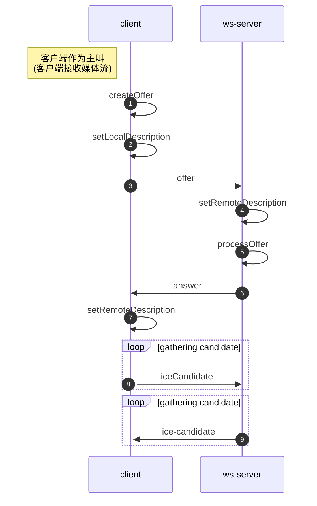
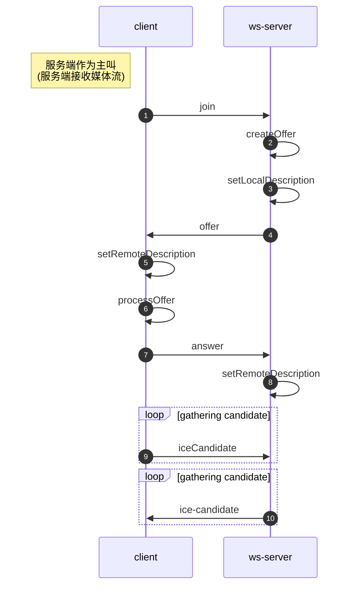

# openVidu 本地部署
documentation：<https://docs.openvidu.io/en/stable/deployment/ce/on-premises/>


# Kurento 容器化部署（CentOS 7，开发环境）
docker 镜像：kurento/kurento-media-server:6.16.0

镜像源码：https://github.com/Kurento/kurento-docker

kurento 配置文档：https://doc-kurento.readthedocs.io/en/latest/user/configuration.html

## 安装 docker/docker compose
[Ubuntu安装docker](https://docs.docker.com/engine/install/ubuntu/)。

**Set up the repository**

Install the `yum-utils` package (which provides the `yum-config-manager` utility) and set up the **stable** repository.

```
$ sudo yum install -y yum-utils

$ sudo yum-config-manager \
    --add-repo \
    https://download.docker.com/linux/centos/docker-ce.repo
```

安装最新版本：

```bash
sudo yum install docker-ce docker-ce-cli containerd.io
```

安装指定版本：

```bash
 yum list docker-ce --showduplicates | sort -r
```

此命令会显示软件仓库中可用的版本，版本号是冒号和连字符中间的部分。安装选定版本的docker：

```bash
sudo yum install docker-ce-<VERSION_STRING> docker-ce-cli-<VERSION_STRING> containerd.io
```


这里安装`docker 18.06`版本：

```bash
yum install docker-ce-18.06.3.ce docker-ce-cli-18.06.3.ce containerd.io
```


```bash
# 启动docker
sudo systemctl start docker
# 测试hello-world
sudo docker run hello-world
```

### 以非 root 用户管理 docker
[Manage Docker as a non-root user](https://docs.docker.com/engine/install/linux-postinstall/#manage-docker-as-a-non-root-user)

需要创建一个`docker`用户组。

To create the `docker` group and add your user:

1. Create the `docker` group.

   ```bash
   $ sudo groupadd docker
   ```

2. Add your user to the `docker` group.

   ```bash
   $ sudo usermod -aG docker $USER
   ```

3. 重新登陆用户刷新用户组身份。

   执行以下命令，使用户组生效：

   ```bash
   $ newgrp docker 
   ```

4. 测试一下：Verify that you can run `docker` commands without `sudo`.

   ```bash
   $ docker run hello-world
   ```

   这个命令会从`docker hub`下载测试镜像，并在容器中运行。

   如果在添加用户组之前已经运行过`docker run hello-world`，可能会出现下面的错误。这是因为由root用户运行之后导致的`~/.docker`路径的权限错误。

   ```bash
   WARNING: Error loading config file: /home/user/.docker/config.json -
   stat /home/user/.docker/config.json: permission denied
   ```

   使用下面的命令修改路径的权限即可：

   ```bash
   $ sudo chown "$USER":"$USER" /home/"$USER"/.docker -R
   $ sudo chmod g+rwx "$HOME/.docker" -R
   ```

### 设置docker镜像源
[设置docker镜像源](https://blog.csdn.net/qq_35606010/article/details/104750391)

编辑或新建`/etc/docker/daemon.json`:

```json
# cat /etc/docker/daemon.json
{
    "registry-mirrors": ["https://lwll293m.mirror.aliyuncs.com", "https://registry.docker-cn.com","http://hub-mirror.c.163.com","https://docker.mirrors.ustc.edu.cn", "https://pee6w651.mirror.aliyuncs.com"],
    "live-restore": true
}
```

然后重启`docker`：

```bash
sudo systemctl restart docker
```


### 安装 docker compose
https://docs.docker.com/compose/install/#install-compose-on-linux-systems
```bash
sudo curl -L "https://github.com/docker/compose/releases/download/1.29.2/docker-compose-$(uname -s)-$(uname -m)" -o /usr/local/bin/docker-compose


sudo chmod +x /usr/local/bin/docker-compose

```


## 安装 Coturn (Ubuntu)

### 容器化运行：

```bash

KURENTO=kurento/kurento-media-server:6.16.0
COTURN=coturn/coturn:4.5.2
docker images $KURENTO --format "true"
docker images $COTURN --format "true"

docker pull $COTURN


docker run -d --network=host \
		-v $COTURN_LOG_DIR \
		$COTURN \
		-n --log-file=$COTURN_LOG_FILE \
		--min-port=$COTURN_MIN_PORT --max-port=$COTURN_MAX_PORT \
		--lt-cred-mech --fingerprint \
		--no-cli \
		--realm=dataflow \ 
		--external-ip='${EXTERNAL_IP}' \
		--relay-ip='${EXTERNAL_IP}' \

docker pull $KURENTO

docker run -d --name kms --network host \
-e KMS_TURN_URL="dataflow:dataflow@49.233.111.168:3478?transport=udp" \
-e KMS_MIN_PORT=$KMS_MIN_PORT -e KMS_MAX_PORT=$KMS_MAX_PORT \
-e KMS_EXTERNAL_IPV4=$EXTERNAL_IP \
# By default, Kurento uses a different self-signed certificate for every WebRtcEndpoint (see [Media Plane security (DTLS)](https://doc-kurento.readthedocs.io/en/latest/features/security.html#features-security-kms-dtls)).
# -e KMS_PEM_CERTIFICATE_RSA= \
# -e KMS_PEM_CERTIFICATE_ECDSA= \
-e GST_DEBUG="2,KurentoWebSocket*:4,kmssdpsession:5,\
webrtcendpoint:5,kmswebrtcsession:5,kmsiceniceagent:5"
-e KMS_ICE_TCP=0 \
$KURENTO

```


https://doc-kurento.readthedocs.io/en/latest/user/faq.html#faq-coturn-install
```bash
sudo apt-get update && sudo apt-get install --no-install-recommends \
    coturn
```

修改 `/etc/turnserver.conf` 的配置：
```
# The external IP address of this server, if Coturn is behind a NAT.
# It must be an IP address, not a domain name.
#external-ip=<CoturnIp>

# STUN listener port for UDP and TCP.
# Default: 3478.
#listening-port=3478

# TURN lower and upper bounds of the UDP relay ports.
# Default: 49152, 65535.
#min-port=49152
#max-port=65535

# Uncomment to enable moderately verbose logs.
# Default: verbose mode OFF.
#verbose

# TURN fingerprints in messages.
fingerprint

# TURN long-term credential mechanism.
lt-cred-mech

# TURN static user account for long-term credential mechanism.
user=<TurnUser>:<TurnPassword>

# TURN realm used for the long-term credential mechanism.
realm=kurento.org

# Set the log file name.
# The log file can be reset sending a SIGHUP signal to the turnserver process.
log-file=/var/log/turn.log

# Disable log file rollover and use log file name as-is.
simple-log
```

创建 coturn 的日志文件，否则 coturn 没有权限自行创建日志文件：
```bash
sudo install -o turnserver -g turnserver -m 644 /dev/null /var/log/turn.log
```


在 `/etc/default/coturn` 文件中去掉下面这行的注释：
```
TURNSERVER_ENABLED=1
```

重启 coturn 服务：
```bash
sudo service coturn restart
```

### 测试 STUN/TURN

[Trickle ICE](https://webrtc.github.io/samples/src/content/peerconnection/trickle-ice/)


## 运行


### Kurento

日志：[Debug Logging — Kurento 6.16.1-dev documentation](https://doc-kurento.readthedocs.io/en/latest/features/logging.html)

```bash
docker pull kurento/kurento-media-server:latest
```

```bash
## kms
docker run -d --name kms --network host \
-e KMS_TURN_URL="dataflow:dataflow@49.233.111.168:3478?transport=udp" \
-e KMS_MIN_PORT=9216 -e KMS_MAX_PORT=49151 \
-e KMS_ICE_TCP=0 \
kurento/kurento-media-server:latest

## coturn-auth
docker run -d --rm --net=host -e LISTENING_PORT=3478 -e REALM=kurento.org -e USER=dataflow -e PASSWORD=dataflow --name kurento-coturn kurento/coturn-auth

## kurento-group-call demo
cd /opt/kurento/demos/java
java -jar -Dkms.url=ws://49.233.111.168:8888/kurento kurento-group-call-6.16.0-exec.jar

```


### openvidu
openvidu 是基于 kurento 的框架，针对会议室等最常见使用场景进行封装，简化使用。


执行下面的指令就把 openvidu 安装在 `/opt/openvidu` 目录：
```bash
sudo su
cd /opt
curl https://s3-eu-west-1.amazonaws.com/aws.openvidu.io/install_openvidu_latest.sh | bash
```

启动、停止和配置 openvidu：

```bash
## configuration
https://docs.openvidu.io/en/stable/deployment/ce/on-premises/#3-configuration

## start openvidu
cd openvidu
./openvidu start

## stop
./openvidu stop

```


### 应用部署

生成证书
Keystore：
- [16. Security](https://docs.spring.io/spring-cloud-dataflow/docs/1.1.0.M1/reference/html/getting-started-security.html#getting-started-security-self-signed-certificates)
- [Standard Algorithm Name Documentation](https://docs.oracle.com/javase/6/docs/technotes/guides/security/StandardNames.html#KeyStore)
- [(130条消息) Java Keystore 与Openssl Pem 的转换_lsweetyy的博客-CSDN博客_keystore转pem](https://blog.csdn.net/lsweetyy/article/details/51822496)


```bash

## openssl usage:
Usage: pkcs12 [options]
Valid options are:
 -help               Display this summary
 -nokeys             Don't output private keys
 -keyex              Set MS key exchange type
 -keysig             Set MS key signature type
 -nocerts            Don't output certificates
 -clcerts            Only output client certificates
 -cacerts            Only output CA certificates
 -noout              Don't output anything, just verify
 -info               Print info about PKCS#12 structure
 -chain              Add certificate chain
 -twopass            Separate MAC, encryption passwords
 -nomacver           Don't verify MAC
 -descert            Encrypt output with 3DES (default RC2-40)
 -certpbe val        Certificate PBE algorithm (default RC2-40)
 -export             Output PKCS12 file
 -noiter             Don't use encryption iteration
 -maciter            Use MAC iteration
 -nomaciter          Don't use MAC iteration
 -nomac              Don't generate MAC
 -LMK                Add local machine keyset attribute to private key
 -nodes              Don't encrypt private keys
 -macalg val         Digest algorithm used in MAC (default SHA1)
 -keypbe val         Private key PBE algorithm (default 3DES)
 -rand val           Load the file(s) into the random number generator
 -writerand outfile  Write random data to the specified file
 -inkey val          Private key if not infile
 -certfile infile    Load certs from file
 -name val           Use name as friendly name
 -CSP val            Microsoft CSP name
 -caname val         Use name as CA friendly name (can be repeated)
 -in infile          Input filename
 -out outfile        Output filename
 -passin val         Input file pass phrase source
 -passout val        Output file pass phrase source
 -password val       Set import/export password source
 -CApath dir         PEM-format directory of CA's
 -CAfile infile      PEM-format file of CA's
 -no-CAfile          Do not load the default certificates file
 -no-CApath          Do not load certificates from the default certificates directory
 -*                  Any supported cipher
 -engine val         Use engine, possibly a hardware device
 
keytool -genkey -alias dataflow -keyalg RSA -keystore dataflow.p12 \
          -validity 3650 -storetype PKCS12 \
          -dname "CN=localhost, OU=Spring, O=Pivotal, L=Kailua-Kona, ST=HI, C=US" \
          -keypass dataflow -storepass dataflow
openssl pkcs12 -nocerts -nodes -in dataflow.p12 -out dataflow.key -password pass:dataflow
openssl pkcs12 -nokeys -chain -in dataflow.p12 -out dataflow.crt -password pass:dataflow


```

## 端口占用

coturn:
- 3478/tcp
- 3478/udp
- 5349/tcp
- 5349/udp
- 20000-39999/udp


kurento:
- 8888/tcp
- 30000-49151/udp


# Kurento 容器化部署（CentOS 7，生产环境）

## kurento
```bash
## kms
docker run -d --name kms --network host \
-e KMS_TURN_URL="dataflow:dataflow@47.104.202.153:3478?transport=udp" \
-e KMS_MIN_PORT=40000 -e KMS_MAX_PORT=49151 \
-e KMS_ICE_TCP=0 \
-e KMS_EXTERNAL_IPV4=47.104.202.153 \
kurento/kurento-media-server:6.16.0

## coturn-auth
docker run -d --rm --net=host -e LISTENING_PORT=3478 -e REALM=kurento.org -e USER=dataflow -e PASSWORD=dataflow --name kurento-coturn kurento/coturn-auth

## kurento-group-call demo
cd /opt/kurento/demos/java
java -jar -Dkms.url=ws://49.233.111.168:8888/kurento kurento-group-call-6.16.0-exec.jar

```
## dataflow 后端

```bash
java -Dkms.url=ws://localhost:8888/kurento -Dserver.port=8081 -jar lib/config-1.0-SNAPSHOT.jar
```


# Kurento 握手协议

## 多人会议场景

### client
- Signaling
- Initialing peer connections
- ICE candidates
- Connection established


初始化 PeerConnection。
- 主叫创建 offer 并监听被叫发送 answer 的事件。
- 被叫一旦收到 offer 就生成相应的 answer，发送给主叫。
- 双方都要监听获取本地 ICE candidate 的事件，以及对方发来的远端 ICE candidate。
```js
    // The caller create offer and listen for remote answer
    async function makeCall() {
      const configuration = {'iceServers': [{'urls': 'stun:stun.l.google.com:19302'}]}
      const peerConnection = new RTCPeerConnection(configuration);
      signalingChannel.addEventListener('message', async message => {
        if (message.answer) {
          const remoteDesc = new RTCSessionDescription(message.answer);
          await peerConnection.setRemoteDescription(remoteDesc);
        }
      });
      const offer = await peerConnection.createOffer();
      await peerConnection.setLocalDescription(offer);
      signalingChannel.send({'offer': offer});
    }

    // The callee create answer once receiving offer
    const peerConnection = new RTCPeerConnection(configuration);
    signalingChannel.addEventListener('message', async message => {
      if (message.offer) {
        peerConnection.setRemoteDescription(new RTCSessionDescription(message.offer));
        const answer = await peerConnection.createAnswer();
        await peerConnection.setLocalDescription(answer);
        signalingChannel.send({'answer': answer});
      }
    });


    // Listen for local ICE candidates on the local RTCPeerConnection
    peerConnection.addEventListener('icecandidate', event => {
      if (event.candidate) {
        signalingChannel.send({'new-ice-candidate': event.candidate});
      }
    });

    // Listen for remote ICE candidates and add them to the local RTCPeerConnection
    signalingChannel.addEventListener('message', async message => {
      if (message.iceCandidate) {
        try {
          await peerConnection.addIceCandidate(message.iceCandidate);
        } catch (e) {
          console.error('Error adding received ice candidate', e);
        }
      }
    });

    // Listen for connectionstatechange on the local RTCPeerConnection
    peerConnection.addEventListener('connectionstatechange', event => {
      if (peerConnection.connectionState === 'connected') {
        // Peers connected!
      }
    });

```


获取数据流：

```js

  const localStream = await getUserMedia({vide: true, audio: true});
  const peerConnection = new RTCPeerConnection(iceConfig);
  localStream.getTracks().forEach(track => {
    peerConnection.addTrack(track, localStream);
  });


  const remoteVideo = document.querySelector('#remoteVideo');

  peerConnection.addEventListener('track', async (event) => {
      const [remoteStream] = event.streams;
      remoteVideo.srcObject = remoteStream;
  });


```

### ws-server


- client通过 WebSocket 连接请求加入会议。ws-server创建新的 RTCEndpoint，并告知client所有在线用户（session），并把新用户加入会议的事件广播给其他用户。
- client请求所有在线客户端的媒体流（requestStream），ws-server会用每个客户端对应的 RTCEndpoint 创建 offer 返回给client，新客户端就建立起拉取其他成员媒体流的信道。
- 同时新加入的客户端也生成 offer 发送给ws-server，ws-server生成相应的 answer 发送给client，前ws-server建立 WebRTC 连接。
- 其他客户端也请求新加入客户端的媒体流（requestStream），ws-server使用新客户端的 RTCEndpoint 创建 offer 返回给client。client生成相应的 answer，建立推送自己媒体流的信道。
- 默认前ws-server都绑定了交换 iceCandidate 的事件处理函数。


[WebRtcEndpoint (Kurento Client API)](https://doc-kurento.readthedocs.io/en/latest/_static/client-javadoc/index.html)

#### SDP negotiation process

In order to establish a WebRTC communication, peers engage in an SDP negotiation process, where one of the peers (the offerer) sends an offer, while the other peer (the offeree) responds with an answer. This endpoint can function in both situations

- As offerer: The negotiation process is initiated by the media server
  - KMS generates the SDP offer through the `generateOffer` method. This *offer* must then be sent to the remote peer (the offeree) through the signaling channel, for processing.
  - The remote peer processes the *offer*, and generates an *answer*. The *answer* is sent back to the media server.
  - Upon receiving the *answer*, the endpoint must invoke the `processAnswer` method.
- As offeree: The negotiation process is initiated by the remote peer
  - The remote peer, acting as offerer, generates an SDP *offer* and sends it to the WebRTC endpoint in Kurento.
  - The endpoint will process the *offer* invoking the `processOffer` method. The result of this method will be a string, containing an SDP *answer*.
  - The SDP *answer* must be sent back to the offerer, so it can be processed.


SDPs are sent without ICE candidates, following the Trickle ICE optimization. Once the SDP negotiation is completed, both peers proceed with the ICE discovery process, intended to set up a bidirectional media connection. During this process, each peer

- Discovers ICE candidates for itself, containing pairs of IPs and ports.
- ICE candidates are sent via the signaling channel as they are discovered, to the remote peer for probing.
- ICE connectivity checks are run as soon as the new candidate description, from the remote peer, is available.

Once a suitable pair of candidates (one for each peer) is discovered, the media session can start. The harvesting process in Kurento, begins with the invocation of the `gatherCandidates` method. Since the whole Trickle ICE purpose is to speed-up connectivity, candidates are generated asynchronously. Therefore, in order to capture the candidates, the user must subscribe to the event `IceCandidateFound`. It is important that the event listener is bound before invoking `gatherCandidates`, otherwise a suitable candidate might be lost, and connection might not be established.

It's important to keep in mind that WebRTC connection is an asynchronous process, when designing interactions between different MediaElements. For example, it would be pointless to start recording before media is flowing. In order to be notified of state changes, the application can subscribe to events generated by the WebRtcEndpoint. Following is a full list of events generated by WebRtcEndpoint:

- `IceComponentStateChange`: This event informs only about changes in the ICE connection state. Possible values are:

  - `DISCONNECTED`: No activity scheduled
  - `GATHERING`: Gathering local candidates
  - `CONNECTING`: Establishing connectivity
  - `CONNECTED`: At least one working candidate pair
  - `READY`: ICE concluded, candidate pair selection is now final
  - `FAILED`: Connectivity checks have been completed, but media connection was not established

  The transitions between states are covered in RFC5245. It could be said that it's network-only, as it only takes into account the state of the network connection, ignoring other higher level stuff, like DTLS handshake, RTCP flow, etc. This implies that, while the component state is `CONNECTED`, there might be no media flowing between the peers. This makes this event useful only to receive low-level information about the connection between peers. Even more, while other events might leave a graceful period of time before firing, this event fires immediately after the state change is detected.

- `IceCandidateFound`: Raised when a new candidate is discovered. ICE candidates must be sent to the remote peer of the connection. Failing to do so for some or all of the candidates might render the connection unusable.

- `IceGatheringDone`: Raised when the ICE harvesting process is completed. This means that all candidates have already been discovered.

- `NewCandidatePairSelected`: Raised when a new ICE candidate pair gets selected. The pair contains both local and remote candidates being used for a component. This event can be raised during a media session, if a new pair of candidates with higher priority in the link are found.

- `DataChannelOpen`: Raised when a data channel is open.

- `DataChannelClose`: Raised when a data channel is closed.

Registering to any of above events requires the application to provide a callback function. Each event provides different information, so it is recommended to consult the signature of the event listeners.

#### Flow control and congestion management

Flow control and congestion management is one of the most important features of WebRTC. WebRTC connections start with the lowest bandwidth configured and slowly ramps up to the maximum available bandwidth, or to the higher limit of the exploration range in case no bandwidth limitation is detected. Notice that WebRtcEndpoints in Kurento are designed in a way that multiple WebRTC connections fed by the same stream share quality. When a new connection is added, as it requires to start with low bandwidth, it will cause the rest of connections to experience a transient period of degraded quality, until it stabilizes its bitrate. This doesn't apply when transcoding is involved. Transcoders will adjust their output bitrate based in bandwidth requirements, but it won't affect the original stream. If an incoming WebRTC stream needs to be transcoded, for whatever reason, all WebRtcEndpoints fed from transcoder output will share a separate quality than the ones connected directly to the original stream.

Note that the default **VideoSendBandwidth** range of the endpoint is a VERY conservative one, and leads to a low maximum video quality. Most applications will probably want to increase this to higher values such as 2000 kbps (2 mbps).

**Check the extended documentation of these parameters in `SdpEndpoint`, `BaseRtpEndpoint`, and `RembParams`.**

- Input bandwidth: Values used to inform remote peers about the bitrate that can be sent to this endpoint.

  - **MinVideoRecvBandwidth**: Minimum input bitrate, requested from WebRTC senders with REMB (Default: 30 Kbps).
  - **MaxAudioRecvBandwidth** and **MaxVideoRecvBandwidth**: Maximum input bitrate, signaled in SDP Offers to WebRTC and RTP senders (Default: unlimited).

- Output bandwidth: Values used to control bitrate of the video streams sent to remote peers. It is important to keep in mind that pushed bitrate depends on network and remote peer capabilities. Remote peers can also announce bandwidth limitation in their SDPs (through the

   

  ```
  b={modifier}:{value}
  ```

   

  attribute). Kurento will always enforce bitrate limitations specified by the remote peer over internal configurations.

  - **MinVideoSendBandwidth**: REMB override of minimum bitrate sent to WebRTC receivers (Default: 100 Kbps).
  - **MaxVideoSendBandwidth**: REMB override of maximum bitrate sent to WebRTC receivers (Default: 500 Kbps).
  - **RembParams.rembOnConnect**: Initial local REMB bandwidth estimation that gets propagated when a new endpoint is connected.

**All bandwidth control parameters must be changed before the SDP negotiation takes place, and can't be changed afterwards.**

DataChannels allow other media elements that make use of the DataPad, to send arbitrary data. For instance, if there is a filter that publishes event information, it'll be sent to the remote peer through the channel. There is no API available for programmers to make use of this feature in the WebRtcElement. DataChannels can be configured to provide the following:

- Reliable or partially reliable delivery of sent messages
- In-order or out-of-order delivery of sent messages

Unreliable, out-of-order delivery is equivalent to raw UDP semantics. The message may make it, or it may not, and order is not important. However, the channel can be configured to be *partially reliable* by specifying the maximum number of retransmissions or setting a time limit for retransmissions: the WebRTC stack will handle the acknowledgments and timeouts.

The possibility to create DataChannels in a WebRtcEndpoint must be explicitly enabled when creating the endpoint, as this feature is disabled by default. If this is the case, they can be created invoking the createDataChannel method. The arguments for this method, all of them optional, provide the necessary configuration:

- `label`: assigns a label to the DataChannel. This can help identify each possible channel separately.
- `ordered`: specifies if the DataChannel guarantees order, which is the default mode. If maxPacketLifetime and maxRetransmits have not been set, this enables reliable mode.
- `maxPacketLifeTime`: The time window in milliseconds, during which transmissions and retransmissions may take place in unreliable mode. This forces unreliable mode, even if `ordered` has been activated.
- `maxRetransmits`: maximum number of retransmissions that are attempted in unreliable mode. This forces unreliable mode, even if `ordered` has been activated.
- `Protocol`: Name of the subprotocol used for data communication.


| client        | ws-server     |
| ------------- | ------------- |
| join          | participants  |
| requestStream | offer[]       |
| iceCandidate  | ice-candidate |
| offer         | answer        |
| answer        | -             |
| leave         | -             |


## WebRTC API

### HTMLMediaElement.readyState
[HTMLMediaElement.readyState - Web APIs | MDN](https://developer.mozilla.org/en-US/docs/Web/API/HTMLMediaElement/readyState) 

The **`HTMLMediaElement.readyState`** property indicates the readiness state of the media.


[HTMLMediaElement.readyState](https://developer.mozilla.org/en-US/docs/Web/API/HTMLMediaElement/readyState#value)

An `unsigned short`. Possible values are:

| Constant            | Value | Description                                                  |
| :------------------ | :---- | :----------------------------------------------------------- |
| `HAVE_NOTHING`      | 0     | No information is available about the media resource.        |
| `HAVE_METADATA`     | 1     | Enough of the media resource has been retrieved that the metadata attributes are initialized. Seeking will no longer raise an exception. |
| `HAVE_CURRENT_DATA` | 2     | Data is available for the current playback position, but not enough to actually play more than one frame. |
| `HAVE_FUTURE_DATA`  | 3     | Data for the current playback position as well as for at least a little bit of time into the future is available (in other words, at least two frames of video, for example). |
| `HAVE_ENOUGH_DATA`  | 4     | Enough data is available—and the download rate is high enough—that the media can be played through to the end without interruption. |

### HTMLMediaElement.networkState
[HTMLMediaElement.networkState](https://developer.mozilla.org/en-US/docs/Web/API/HTMLMediaElement/readyState#value)

An `unsigned short`. Possible values are:

| Constant            | Value | Description                                                  |
| :------------------ | :---- | :----------------------------------------------------------- |
| `NETWORK_EMPTY`     | 0     | There is no data yet. Also, `readyState` is `HAVE_NOTHING`.  |
| `NETWORK_IDLE`      | 1     | HTMLMediaElement is active and has selected a resource, but is not using the network. |
| `NETWORK_LOADING`   | 2     | The browser is downloading HTMLMediaElement data.            |
| `NETWORK_NO_SOURCE` | 3     | No HTMLMediaElement src found.                               |


## Kurento API


- [Kurento Client JavaDoc](https://doc-kurento.readthedocs.io/en/latest/_static/client-javadoc/index.html)
- [Kurento Client JsDoc](https://doc-kurento.readthedocs.io/en/latest/_static/client-jsdoc/index.html)
- [kurento-utils-js JsDoc](https://doc-kurento.readthedocs.io/en/latest/_static/utils-jsdoc/index.html)


## 握手流程 (连接建立)






## 连接拆除


连接拆除需要包装成一个回调函数，websocket连接断开或者用户关闭页面时执行。

- 如果当前用户(conference.user)加入了会议，需要发送 leave 消息 (Participant.leave)、释放WebRTC连接对象(Participant.rtcPeer)。
- 然后断开websocket

## 鼠标同步

- 前端需要监听鼠标移动事件，向后端发送鼠标当前位置的消息，消息体需要包含 `id` 和 `user` 字段其余字段可以自定义：
```json
{
  "id": "mouseMove",
  "user": {
	"name": name,
	"session"：session
  },
  "position": {
	"x": x,
	"y": y
  }
}
```

- 在 websocket 消息处理部分增加对 `id=mouse-move` 的处理逻辑。根据 `user.session` 字段匹配到相应的视频组件，然后设置视频组件的位置。示例代码如下：
```javascript
syncMouse = (message) => {  
 const session = message.user.session;  
 const user = this.participants[session];  
 // TODO synchronize mouse position for target user.  
}
```


# 在线会议模块

## 功能特性

- WebRTC 连接建立与拆除
- 采集 Endpoint/Pipeline 监控数据
- client封装 在线会议功能，动态显示成员视频
