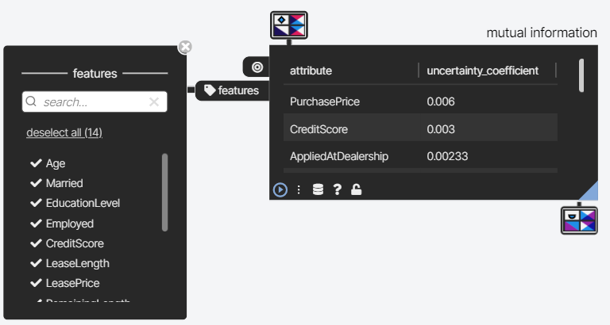

# Mutual Information 操作文档

# 1. 操作说明

选取一个目标属性（*target*）和若干其他属性（*features*），Einblick Mutual Information 计算 `MI(target, features[i])`。

对于 `target` 和 `features[i]` 都是离散的情况:
$$
\text{MI}=\frac{\text{H}(\text{target})+\text{H}(\text{features}_i)-\text{H}(\text{target},\text{features}_i)}{\text{H}(\text{target})}
$$




# 2. 调用方式

互信息调用用到 联动接口（`/api/v1/gluttony/linkage`）和 REST API（`/api/v1/gluttony/mutual-information/features`）。

## REST API

REST API 接收 GET 请求返回数据，可以接受任意数量的 `dataSource` 参数，返回每个数据源可以在 互信息操作符中被选择的离散属性。

示例请求<a id="example-case" name="example-case">：

```bash
## URL:
http://localhost:8080/api/v1/gluttony/mutual-information/features?dataSource=operator_mi.car_sales&dataSource=operator_mi.promotion&dataSource=operator_mi.pointwise_mutual_information

## Curl:
curl -X GET "http://localhost:8080/api/v1/gluttony/mutual-information/features?dataSource=operator_mi.car_sales&dataSource=operator_mi.promotion&dataSource=operator_mi.pointwise_mutual_information" -\text{H} "accept: */*"
```

响应数据：

```json
[
  {
    "operator_mi.car_sales": [
      "Model",
      "Type",
      "ExteriorColor",
      "InteriorColor",
      "CarYear",
      "Used",
      "Lease",
      "DealerId"
    ],
    "operator_mi.promotion": [
      "Married",
      "EducationalLevel",
      "Employed",
      "CreditScore",
      "LeaseLength",
      "PurchasePrice",
      "Incentive",
      "Accepted",
      "DealerId",
      "AppliedOnline",
      "AppliedAtDealership"
    ],
    "operator_mi.pointwise_mutual_information": [
      "x",
      "y"
    ]
  }
]
```


## 联动接口


# 3. 测试

## 3.1 REST API （MutualInformationController）测试

### 获取实体表的离散属性

测试正常，示例请求（[example-case](#example-case)）即测试结果。

### 获取视图的离散属性

测试请求：

```json
// GET: http://localhost:8080/api/v1/gluttony/mutual-information/ features?dataSource=dataflow.temp_mutual_information_test_001

{
    "dataSource": ["dataflow.temp_mutual_information_test_001"]
}
```


测试响应：

```json
[
  {
    "dataflow.temp_mutual_information_test_001": [
      "x",
      "y"
    ]
  }
]
```


## 3.2 离散互信息测试

### Service 测试

|      | 数据集     | target             | feature            | ClickHouse            | Einblick                     |
| ---- | ---------- | ------------------ | ------------------ | --------------------- | ---------------------------- |
| 1    | car_sales  | `Type`             | `Model`            | 1                     | 1                            |
| 2    |            | `Model`            | `Type`             | 0.6246330731458857    | 0.624                        |
| 3    |            | `ExteriorColor`    | `InteriorColor`    | 0                     | 0                            |
| 4    |            | `InteriorColor`    | `ExteriorColor`    |                       | 目标属性只有一种值，job fail |
| 5    | promotion  | `Married`          | `EducationalLevel` | 0.0012959671840588808 | 0.0013                       |
| 6    |            | `EducationalLevel` | `Married`          | 5.423402432565604E-4  | 0.000542                     |
| 7    | pmi_string | `x`                | `y`                | 0.29666520325828943   | 0.297                        |
| 8    |            | `y`                | `x`                | 0.2639920127889725    | 0.264                        |
|      |            |                    |                    |                       |                              |


### 联动测试

这是一个模拟 用户拖动操作符时 websocket 通信的测试用例，`>>>` 表示一条联动请求，`<<<` 表示一条 服务端给前端推送的响应数据。

- `table001`：用户拖出数据集，形成一个 table 操作符。服务端推送 `1`、`2` 元数据和 table 需要展示的数据。
- `mutual_information_002`: 拖出一个孤立的 互信息操作符。服务端不响应。
- `link: 001->002`: 把 table 输出连接到 互信息的输入。服务端推送 `3`、`4` 元数据和 互信息计算结果（还没有选择 target 和 features，所以 `JOB_FAILED`）。
- `execute mutual_information_002`: 选择正确的 target 和 features，运行操作符。服务端推送 `5`、`6` 元数据和响应计算结果（ `JOB_FINISH` ）。

```json
// >>> table001
{
  "job": "start_job",
  "tableDescription": {
    "jobType": "table",
    "dataSource": ["operator_mi.pointwise_mutual_information"],
    "filter": "",
    "group": [""],
    "limit": 2000,
    "project": ["*"]
  },
  "operatorType": "table",
  "dagType": "addNode",
  "operatorId": "mutual_information_test_001",
  "workspaceId": "mutual_information_test"
}

// <<< 1
{
    "inputs": [
        {
            "dataSource": "operator_mi.pointwise_mutual_information",
            "metadata": {
                "x": "UInt64",
                "y": "UInt64"
            }
        }
    ],
    "jobStatus": "JOB_START",
    "operatorId": "mutual_information_test_001",
    "operatorType": "table",
    "workspaceId": "mutual_information_test"
}
// <<< 2
{
    "jobStatus": "JOB_FINISH",
    "operatorId": "mutual_information_test_001",
    "operatorType": "table",
    "outputs": {
        "data": [
            {
                "x": 0,
                "y": 0
            },
           // ....
        ],
        "metadata": {
            "x": "UInt64",
            "y": "UInt64"
        }
    },
    "workspaceId": "mutual_information_test"
}

// >>> mutual_information_002
{
  "job": "start_job",
  "mutualInformationDescription": {
    "jobType": "mutualInformation",
    "dataSource": [""],
    "target": "",
    "features": [""]
  },
  "operatorType": "mutualInformation",
  "dagType": "addNode",
  "operatorId": "mutual_information_test_002",
  "workspaceId": "mutual_information_test"
}

// <<< 无响应数据

// >>> link: 001->002
{
  "job": "start_job",
  "dagDescription": {
    "jobType": "addEdge",
    "preNodeId": "mutual_information_test_001",
    "nextNodeId": "mutual_information_test_002",
    "slotIndex": "0"
  },
  "operatorType": "dag",
  "dagType": "addEdge",
  "workspaceId": "mutual_information_test"
}

// <<< 3 ( 元数据 )
{
    "inputs": [
        {
            "dataSource": "dataflow.temp_mutual_information_test_001",
            "metadata": {
                "x": "UInt64",
                "y": "UInt64"
            }
        }
    ],
    "jobStatus": "JOB_START",
    "operatorId": "mutual_information_test_002",
    "operatorType": "mutualInformation",
    "workspaceId": "mutual_information_test"
}

// <<< 4 ( 正常的 JOB_FAILED，没有提供 target 和 features )
{
    "jobStatus": "JOB_FAILED",
    "operatorId": "mutual_information_test_002",
    "operatorType": "mutualInformation",
    "outputs": {},
    "workspaceId": "mutual_information_test"
}

// >>> execute mutual_information_002
{
  "job": "start_job",
  "mutualInformationDescription": {
    "jobType": "mutualInformation",
    "dataSource": [" "],
    "target": "x",
    "features": ["y"]
  },
  "operatorType": "mutualInformation",
  "dagType": "updateNode",
  "operatorId": "mutual_information_test_002",
  "workspaceId": "mutual_information_test"
}

// <<< 5 ( 元数据 )
{
    "inputs": [
        {
            "dataSource": "dataflow.temp_mutual_information_test_001",
            "metadata": {
                "x": "UInt64",
                "y": "UInt64"
            }
        }
    ],
    "jobStatus": "JOB_START",
    "operatorId": "mutual_information_test_002",
    "operatorType": "mutualInformation",
    "workspaceId": "mutual_information_test"
}

// <<< 6 JOB_FINISH ( 返回 Mutual Information 计算结果 )
{
    "jobStatus": "JOB_FINISH",
    "operatorId": "mutual_information_test_002",
    "operatorType": "mutualInformation",
    "outputs": {
        "data": [
            {
                "x": 1.0
            },
            {
                "y": 0.29666520325828943
            }
        ]
    },
    "workspaceId": "mutual_information_test"
}
```


# DataFlow 联动接口

## 节点操作

### 2.1.10 Mutual Information

互信息的调用参数包括 *jobType*, *dataSource*, *target*, *features*，同时要注意要提供正确的操作符名称（`mutualInformation`），*operatorType*、*Description*、*jobType* 都是 `mutualInformation` 。

```json
{
  "job": "start_job",
  "mutualInformationDescription": {
    "jobType": "mutualInformation",
    "dataSource": [""],
    "target": "",
    "features": [""]
  },
  "operatorType": "mutualInformation",
  ...
}
```


如果 *target* 属性只有一种值会发生分母为零的错误，这种情况会返回 `JOB_FAILED` 和一个键值对 `"msg": // 相应的异常信息`。以及在没有提供 *target* 或 *features* 的情况下也会返回 `JOB_FAILED`，响应数据是 `null`。


#### 添加节点

设置 *dagType* 为 `addNode` 即可。

```json
// mutual_information_002
{
  "job": "start_job",
  "mutualInformationDescription": {
    "jobType": "mutualInformation",
    "dataSource": [""],
    "target": "",
    "features": [""]
  },
  "operatorType": "mutualInformation",
  "dagType": "addNode",
  "operatorId": "mutual_information_test_002",
  "workspaceId": "mutual_information_test"
}
```


#### 修改节点

```json
// execute mutual_information_002
{
  "job": "start_job",
  "mutualInformationDescription": {
    "jobType": "mutualInformation",
    "dataSource": [" "],
    "target": "x",
    "features": ["y"]
  },
  "operatorType": "mutualInformation",
  "dagType": "updateNode",
  "operatorId": "mutual_information_test_002",
  "workspaceId": "mutual_information_test"
}
```


#### 删除节点

删除节点调用 联动逻辑，设置 *dagType* 和 *jobType* 为 `removeNode`，*operatorType* 和 *Description* 相应地改为 `dag`：

```json
// delete mutual_information_002
{
  "job": "start_job",
  "dagDescription": {
    "jobType": "removeNode",
    "dataSource": [" "],
    "target": "x",
    "features": ["y"]
  },
  "operatorType": "dag",
  "dagType": "removeNode",
  "operatorId": "mutual_information_test_002",
  "workspaceId": "mutual_information_test"
}
```


