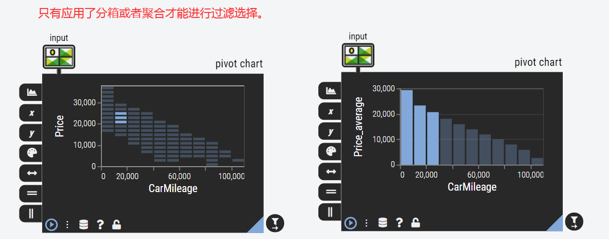
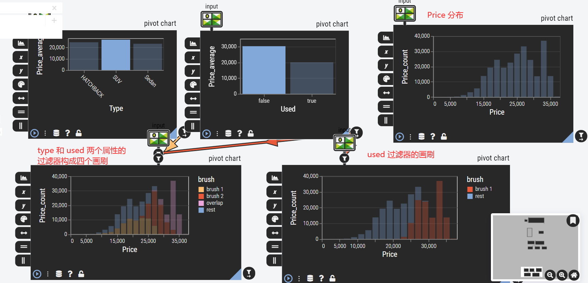

# Pivot Chart

（翻译、整理自 [einblick Pivot Chart 文档](https://gondola.einblick.ai/operators/descriptive-analytics/pivot-chart)）。

Pivot Chart 操作符左侧菜单除 Mark 之外，其余菜单都有 `attribute`, `binning`, `aggregation`, `sort`, `include zero`这些选项：

- attribute: 要选取的列。
- binning: 是否对所选 attribute 基于分箱策略进行分箱。可选策略包括`no binning`, `Equi-Width binning`, `Natrual binning`。等宽分箱采用相同大小的分箱间隔。自然分箱使用1维 K-means 聚类创建分箱。
- aggregation: 用来形成单个记号数值的聚合函数。
- sort: 数据点的排序顺序。
- include zero: 是否在数轴上包括 0 。

# 标记类型

标记是图表展示数据所用的记号，决定了图表的类型。可选的标记类型有 `bar`, `line`, `area`, `tick`, `point`。下图从左上开始按顺时针展示了这五种标记类型。

# x 轴， y 轴

使用两个数轴菜单可以指定在哪个轴上展示哪个属性列。必须至少指定 x 轴 y 轴之一，如果想得到一维图表可以只指定一个轴。

下图是一个二维图 的示例，x 轴采用了等宽分箱，y 轴采用了平均聚合。

# Color & Size

Color 和 Size 都是用来展示额外信息的，在二维图的基础上可以显示其他属性的信息。Color 和 size 都有`attribute`, `binning`, `aggregation`, `sort`, `include zero` 等属性，要和二维图纵轴有一定的匹配规则。

这里是一个同时对第三个属性 `Healthy life expectency` 应用 Color 和 Size 的场景。x 轴应用了等宽分箱，y 轴应用了平均聚合。所以 Color 和 Size 都应该选取某种聚合操作来和y 轴匹配，这里选取了平均聚合。

# Row & Column

row 和 column 选项让用户能够基于一组其他属性展示矩阵图，矩阵中的一个图表展示所选数据的一个子集。

下面的示例展示了基于 `Healthy life expectency` 属性构建的矩阵图，可以清楚地看到寿命提高，对应的是更高的GDP和评分。

# 数据透视表的功能与限制

## 数据点渲染限制

一个数据透视表可渲染的数据点限制在 100 个。因此如果想全量展示一个数据集，就要使用装箱或聚合来减少需要渲染的数据点数量。如果有没有渲染的数据点，在操作符旁边可以看到警告提示。

## 过滤

数据透视表可以作为其他操作符的过滤器。把数据透视表用作过滤器时，把数据透视表操作符的过滤图标连接到另一个操作符的输入上，然后选择想在过滤器中包含的数据点。而进行过滤选择的条件是必须采用分箱或者聚合，只有应用了分箱策略或者聚合函数才可以选择数据子集，下图左侧对价格进行等宽分箱，右侧对价格应用了平均值聚合。

下面的示例展示了如何在数据透视表中过滤表数据。

通过点击两次箭头可以取消过滤器。在下面的例子中，可以创建两种过滤器链接，在二手车和新车之间比较价格分布。

## 画刷

和过滤器相似，在数据透视表中点选数据除了可以起到过滤作用，还可以用来在可视化图表中高亮显示数据。点击一次箭头可以把过滤器链接切换到画刷链接，在数据透视表中被选中的数据子集将被高亮显示。

和过滤器一样，可以定义任意数量的画笔，每个画笔会被分配一种颜色。两种画刷重叠部分以额外的颜色标记（例如下面示例中出租的新车）。

下面是单独的价格分布以及单个过滤器与两种过滤器的对比图，方便理解。

