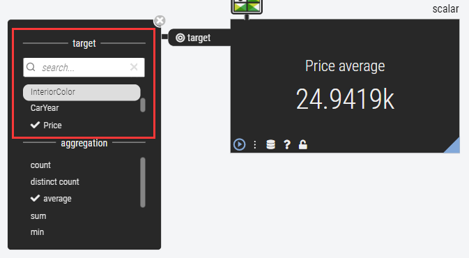
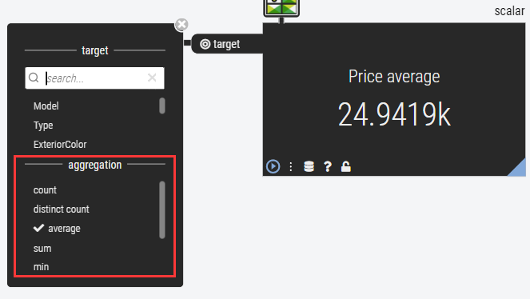
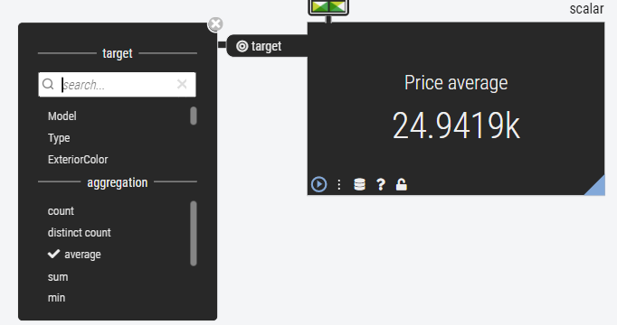

# Scalar 操作说明


Scalar 操作符对一列数据施加聚合操作，把一列数据聚合成一个标量值显示在操作符面板上。

# 使用流程

1.选择一个要聚合的目标列



2.指定聚合函数。根据第一步选择的数据类型会显示支持的聚合函数。



3.操作符面板显示结果：



# 数据类型支持的聚合操作

## Numeric

- count
- distinct count
- sum
- min
- max
- average
- standard dev.

## String

- count
- distinct count

## Date

- count
- distinct count

## Boolean

- count
- distinct count
- average

| 聚合函数       | Numeric | String | Boolean | Date |
| -------------- | ------- | ------ | ------- | ---- |
| count          |         |        |         |      |
| distinct count |         |        |         |      |
| sum            |         |        |         |      |
| min            |         |        |         |      |
| max            |         |        |         |      |
| average        |         |        |         |      |
| standard dev.  |         |        |         |      |


# Controller 接口

[Scalar swagger 接口地址](http://47.104.202.153:8080/swagger-ui.html#/Scalar%20Operator/scalarUsingPOST)

参数中target是目标列，aggregation是ClickHouse聚合函数。示例请求：
```json
{
  "job": "string",
  "operatorType": "string",
  "requestId": "string",
  "scalarDescription": {
    "aggregation": "count",
    "dataSource": "dataflow.airuuid",
    "jobType": "table",
    "limit": 2000,
    "target": "AQI"
  },
  "workspaceId": "string"
}
```
返回的数据：
```json
{
  "jobStatus": "JOB_FINISH",
  "requestId": "string",
  "workspaceId": "string",
  "value": "557424"
}
```

