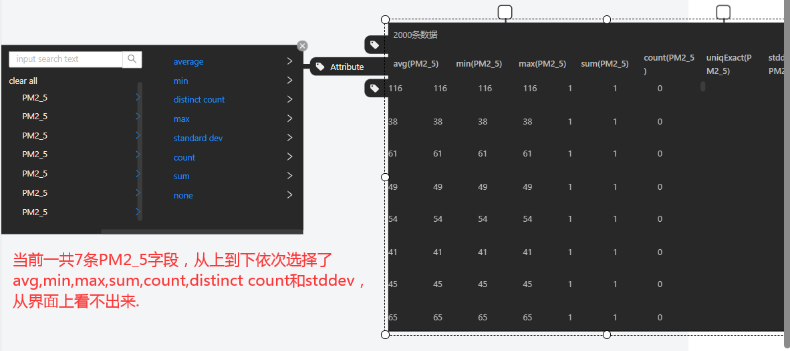
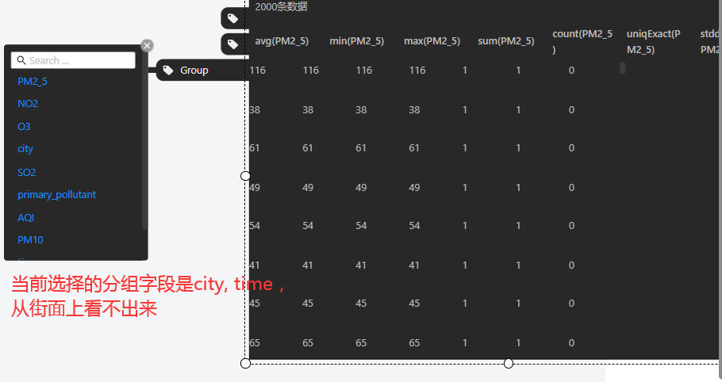
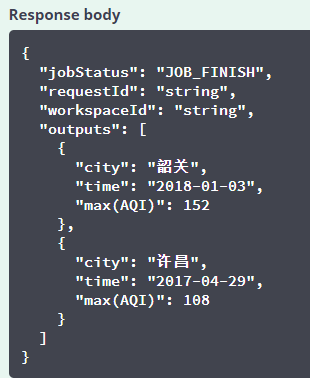
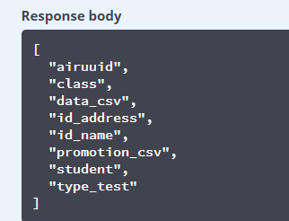
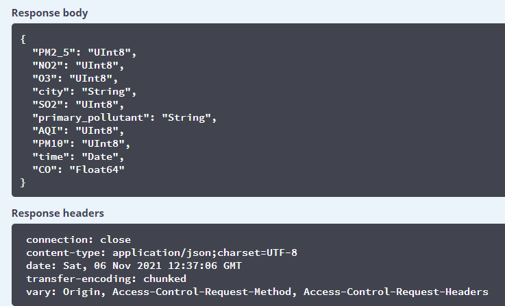
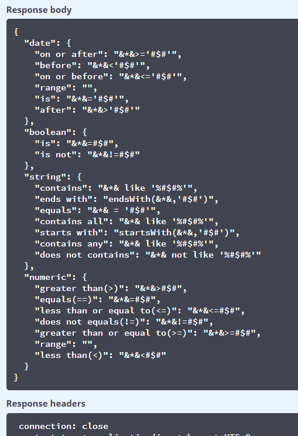
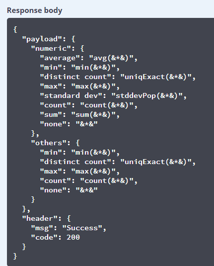

# Table Operator 展示方案


# 1. 任务功能点

## 完成情况

**前端**

- [x] 过滤操作
- [x] 属性选择与聚合
- [x] 分组操作
- [x] 展示数据
- [x] 分组和属性选择（聚合）协作
- [ ] 过滤和属性选择协作
- [ ] 过滤和分组协作

**后端**

- [x] 返回表数据 ( Table Operator )
- [x] 查询表元数据 ( MetaData Service )
- [x] SQL表达式模板 ( SQL Function )


## User Story

用户对载入数据集形成的数据帧，或者作为工作流计算结果的数据帧，有一些可视化和探索的需求：

- 预览数据
- 过滤
- 分组聚合
- 选择属性

针对这一类需求，用户可以使用table operator作为可视化和基本数据探索操作的工具。


# 2. 交互限制

## 前端

1. 过滤不能和属性选择、分组操作协作。过滤操作只能单独指定，即使同时选了属性或指定了分组字段也会被忽略，最终返回的是单独过滤的数据。

2. 过滤、属性选择和分组三种操作没有记忆性，关闭控件后当前状态会丢失。

3. 属性选择的attributes控件在对一个字段选择聚合函数时，没有反馈感，不能看到当前生效的是哪个聚合函数、也不能看到当前在操作哪个字段。clear all和use all目前不起作用。



4. 分组操作的group控件选中字段作为分组字段后也没有反馈感，看不出当前生效的分组字段有哪些




5. attributes控件添加属性后无法删除某一条属性，group控件同样，添加分组字段后也无法撤销。

## 后端

1. 列名与聚合操作不匹配。distinct count得到的列名叫做uniqExact(\*)，stddev得到的列名叫做stdDevPop(\*)。

# 3. 后端演示

## 表数据 API: Table Operator

### 获取表数据: [/gluttony/job/table](http://47.104.202.153:8080/swagger-ui.html#/operations/Table Operator/tableUsingPOST_1)

**Table operator 很多查询场景，详见前端展示部分。**

对dataflow.airuuid根据city、time分组，查询空气质量的最大值。

参数:

```json
{
  "job": "string",
  "operatorType": "string",
  "requestId": "string",
  "tableDescription": {
    "dataSource": "dataflow.airuuid",
    "filter": "",
    "group": ["city","time"],
    "jobType": "string",
    "limit": 2,
    "project": ["city","time","max(AQI)"]
  },
  "workspaceId": "string"
}
```

结果：



## 其他前端依赖的 API

### 表元数据 API: MetaData Service

#### 查询数据库中所有表: [/gluttony/metadata/getTables](http://47.104.202.153:8080/swagger-ui.html#/operations/MetaData Service/getTableNameUsingGET)

无参数，返回dataflow数据库下所有表，dataflow.*:



#### 查询表列的数据类型: [/gluttony/metadata/datasource](http://47.104.202.153:8080/swagger-ui.html#/operations/MetaData Service/filterUsingGET)

查询空气质量数据集dataflow.airuuid的列数据类型。

参数：

```json
{
    'datasource': 'dataflow.airuuid'
}
```


结果：




### SQL 表达式 API: SQL Function

#### 获取 filter SQL 表达式模板: [/operator/filter](http://47.104.202.153:8080/swagger-ui.html#/operations/SQL Function/filterOperatorUsingGET)

无参数。结果：



#### 获取 group SQL 表达式模板: [/operator/group](http://47.104.202.153:8080/swagger-ui.html#/operations/SQL Function/groupOperatorUsingGET)

无参数。

结果：




# 4. 前端演示

## 视频


## 所有 filter 操作验证 ( 2021-11-05 )

测试表为城市空气质量数据集dataflow.airuuid，重点测试String和Date类型，验证SQL表达式转换是否正确。列数据类型：

| 列名              | 数据类型 |
| ----------------- | -------- |
| time              | Date     |
| primary_pollutant | String   |
| PM10              | Numeric  |

用户输入和前端转换的 SQL 表达式：

| 通过 |       | 数据类型          |                          |                        | 生成的SQL表达式                       |
| ---- | ----- | ----------------- | ------------------------ | ---------------------- | ------------------------------------- |
|      | Where | time              | on or after              | 2018-04-01             | `time>='2018-04-01`                   |
|      | AND   | time              | on or before             | 2018-05-01             | `time<='2018-05-01'`                  |
|      | AND   | time              | is                       | 2018-05-01             | `time='2018-05-01'`                   |
| X    | AND   | time              | range                    | 2018-04-01, 2018-05-01 | /                                     |
|      | AND   | time              | after                    | 2018-04-01             | `time>'2018-04-01'`                   |
|      | AND   | time              | before                   | 2018-05-01             | `time<'2018-05-01'`                   |
|      | AND   | primary_pollutant | contains                 | NO2                    | `primary_pollutant like '%NO2%'`      |
|      | AND   | primary_pollutant | does not contains        | NO2                    | `primary_pollutant not like '%NO2%'`  |
| X    | AND   | primary_pollutant | contains all             | NO2, SO2               | `primary_pollutant like '%NO2, SO2%'` |
| X    | AND   | primary_pollutant | contains any             | NO2, SO2               | `primary_pollutant like '%NO2, SO2%'` |
|      | AND   | primary_pollutant | equals                   | NO2                    | `primary_pollutant = 'NO2'`           |
|      | AND   | primary_pollutant | starts with              | NO2                    | `startsWith(primary_pollutant,'NO2')` |
|      | AND   | primary_pollutant | ends with                | NO2                    | `endsWith(primary_pollutant,'NO2')`   |
|      | AND   | PM10              | greater than             | 0                      | `PM10>0`                              |
|      | AND   | PM10              | equals                   | 1                      | `PM10=1`                              |
|      | AND   | PM10              | less than                | 1                      | `PM10<1`                              |
|      | AND   | PM10              | greater than or equal to | 0                      | `PM10>=0`                             |
|      | AND   | PM10              | less than or equal to    | 1                      | `PM10<=1`                             |
|      | AND   | PM10              | dose not equals          | 0                      | `PM10!=0`                             |
| X    | AND   | PM10              | range                    | 0,100                  | /                                     |


测试结果：

- 前端`Date`和`Numeric`类型range操作的SQL转换没有实现，测试中没有输出转换后0的SQL表达式。
- 前端`String`类型contains all和contains any操作转换不正确，对于用户输入`NO2,SO2`，contains all应该输出的SQL表达式是`primary_pollutant like '%NO2%' AND primary_pollutant like '%SO2%'`，contains any应该输出的SQL表达式是`primary_pollutant like '%NO2%' OR primary_pollutant like '%SO2%'`。


