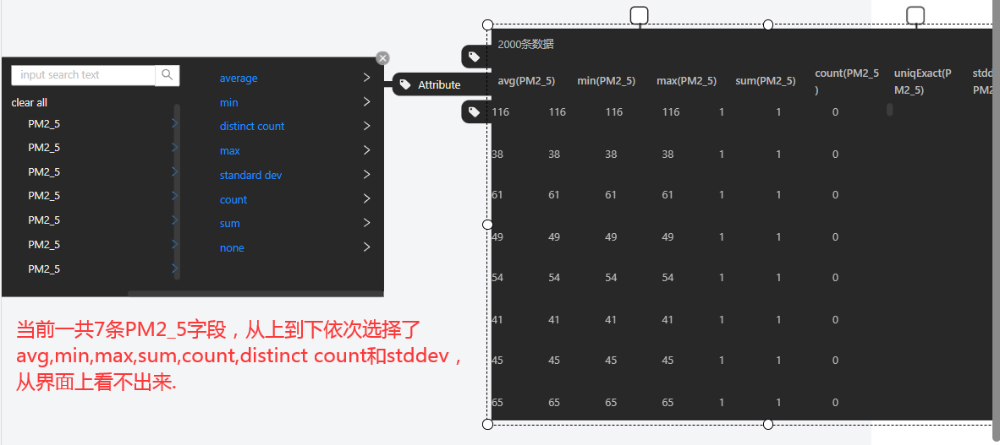
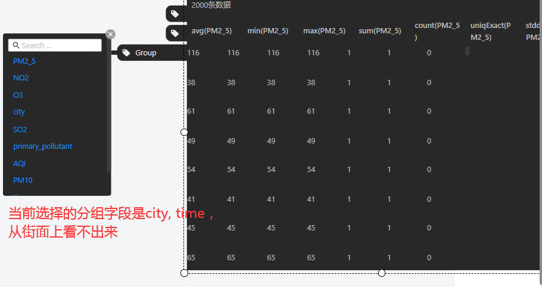
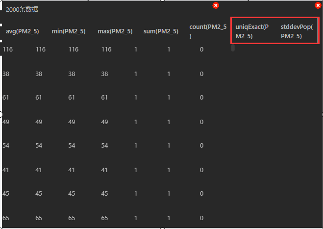

# Table Operator应用场景

目前实现了过滤、列选择、分组、聚合操作，但是过滤条件只能单独指定，不能和列选择、分组、聚合协作，即使指定了其他条件也只会返回单独过滤操作的数据。

# 1. 一些交互限制

个人感觉主要需要解决的是3和4，以及过滤操作case1的四个SQL表达式转换问题。

###### 1. 过滤操作只能单独指定，即使同时选了属性或指定了分组字段也会被忽略，最终返回的是单独过滤的数据

###### 2. 过滤、属性选择和分组三种操作没有记忆性，关闭控件后当前状态会丢失

###### 3. 属性选择的attributes控件在对一个字段选择聚合函数时，没有反馈感，不能看到当前生效的是哪个聚合函数、也不能看到当前在操作哪个字段。clear all和use all目前不起作用。

###### 4. 分组操作的group控件选中字段作为分组字段后也没有反馈感，看不出当前生效的分组字段有哪些

###### 5. attributes控件添加属性后无法删除某一条属性，group控件同样，添加分组字段后也无法撤销。

# 2. 发现的问题

过滤操作 - case1

# 3. 过滤操作

## case1: 过滤操作是否全部实现，重点测试String和Date类型

用户输入：

| 通过 |       |                   |                          |                        | 生成的SQL表达式                       |
| ---- | ----- | ----------------- | ------------------------ | ---------------------- | ------------------------------------- |
|      | Where | time              | on or after              | 2018-04-01             | `time>='2018-04-01`                   |
|      | AND   | time              | on or before             | 2018-05-01             | `time<='2018-05-01'`                  |
|      | AND   | time              | is                       | 2018-05-01             | `time='2018-05-01'`                   |
| X    | AND   | time              | range                    | 2018-04-01, 2018-05-01 | /                                     |
|      | AND   | time              | after                    | 2018-04-01             | `time>'2018-04-01'`                   |
|      | AND   | time              | before                   | 2018-05-01             | `time<'2018-05-01'`                   |
|      | AND   | primary_pollutant | contains                 | NO2                    | `primary_pollutant like '%NO2%'`      |
|      | AND   | primary_pollutant | does not contains        | NO2                    | `primary_pollutant not like '%NO2%'`  |
| X    | AND   | primary_pollutant | contains all             | NO2, SO2               | `primary_pollutant like '%NO2, SO2%'` |
| X    | AND   | primary_pollutant | contains any             | NO2, SO2               | `primary_pollutant like '%NO2, SO2%'` |
|      | AND   | primary_pollutant | equals                   | NO2                    | `primary_pollutant = 'NO2'`           |
|      | AND   | primary_pollutant | starts with              | NO2                    | `startsWith(primary_pollutant,'NO2')` |
|      | AND   | primary_pollutant | ends with                | NO2                    | `endsWith(primary_pollutant,'NO2')`   |
|      | AND   | PM10              | greater than             | 0                      | `PM10>0`                              |
|      | AND   | PM10              | equals                   | 1                      | `PM10=1`                              |
|      | AND   | PM10              | less than                | 1                      | `PM10<1`                              |
|      | AND   | PM10              | greater than or equal to | 0                      | `PM10>=0`                             |
|      | AND   | PM10              | less than or equal to    | 1                      | `PM10<=1`                             |
|      | AND   | PM10              | dose not equals          | 0                      | `PM10!=0`                             |
| X    | AND   | PM10              | range                    | 0,100                  | /                                     |

测试结果：

- 前端`Date`和`Numeric`类型range操作的SQL转换没有实现，测试中没有输出转换后的SQL表达式。
- 前端`String`类型contains all和contains any操作转换不正确，对于用户输入`NO2,SO2`，contains all应该输出的SQL表达式是`primary_pollutant like '%NO2%' AND primary_pollutant like '%SO2%'`，contains any应该输出的SQL表达式是`primary_pollutant like '%NO2%' OR primary_pollutant like '%SO2%'`。

# 4. 分组和聚合操作

## case1: 聚合操作

聚合操作全部可用，存在的问题是列名与聚合操作不匹配。`distinct count`得到的列名叫做`uniqExact(*)`，`stddev`得到的列名叫做`stdDevPop(*)`。

