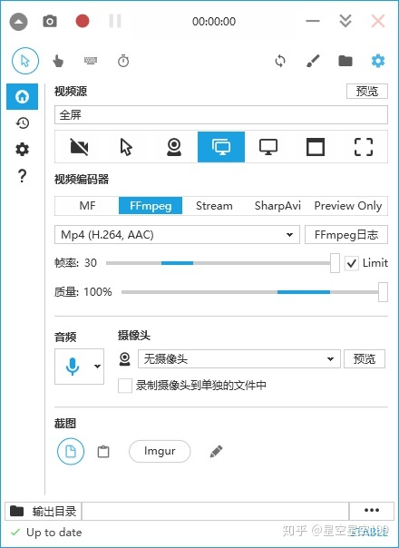
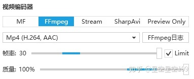
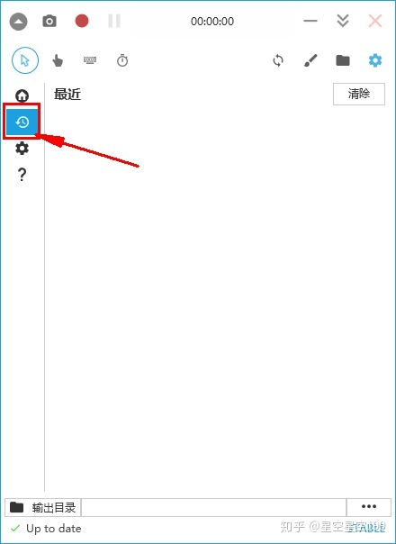

# Windows 命令行

-   [An A-Z Index of the Windows CMD command line](http://ss64.com/nt/) - An excellent reference for all things Windows cmd line related.
-   [enabledelayedexpansion](http://ss64.com/nt/delayedexpansion.html) - Delayed Expansion will cause variables to be expanded at execution time rather than at parse time.
-   [findstr](http://ss64.com/nt/findstr.html) - Search for strings in files.
-   [for /f](http://ss64.com/nt/for_cmd.html) - Loop command against the results of another command.
-   [NirCmd Command Reference - shortcut](http://nircmd.nirsoft.net/shortcut.html)
- [Application Registration - Win32 apps | Microsoft Docs](https://docs.microsoft.com/en-us/windows/win32/shell/app-registration)
- [Windows Shell - Win32 apps | Microsoft Docs](https://docs.microsoft.com/en-us/windows/win32/shell/shell-entry)
# WSL

[设置 WSL 开发环境 | Microsoft Learn](https://learn.microsoft.com/zh-cn/windows/wsl/setup/environment): <https://learn.microsoft.com/zh-cn/windows/wsl/setup/environment>

[开始在 WSL 上使用 Git | Microsoft Learn](https://learn.microsoft.com/zh-cn/windows/wsl/tutorials/wsl-git): <https://learn.microsoft.com/zh-cn/windows/wsl/tutorials/wsl-git>

[开始通过 WSL 使用 VS Code | Microsoft Learn](https://learn.microsoft.com/zh-cn/windows/wsl/tutorials/wsl-vscode): <https://learn.microsoft.com/zh-cn/windows/wsl/tutorials/wsl-vscode>

[使用 WSL 添加或连接数据库 | Microsoft Learn](https://learn.microsoft.com/zh-cn/windows/wsl/tutorials/wsl-database): <https://learn.microsoft.com/zh-cn/windows/wsl/tutorials/wsl-database>

[在 WSL 2 上设置 Node.js | Microsoft Learn](https://learn.microsoft.com/zh-cn/windows/dev-environment/javascript/nodejs-on-wsl): <https://learn.microsoft.com/zh-cn/windows/dev-environment/javascript/nodejs-on-wsl>

[导入要与 WSL 一起使用的任何 Linux 发行版 | Microsoft Learn](https://learn.microsoft.com/zh-cn/windows/wsl/use-custom-distro): <https://learn.microsoft.com/zh-cn/windows/wsl/use-custom-distro>


# 效率工具

[uTools](https://u.tools/) - 你的生产力工具集
[uTools官网 - 新一代效率工具平台](https://u.tools/)

社群维护
[社群](CMS%20内容管理/社群.md)

# 工具

[GitHub - eastlakeside/awesome-productivity-cn: 绝妙的个人生产力（Awesome Productivity - Chinese version）](https://github.com/eastlakeside/awesome-productivity-cn)

###### 二进制文件编辑
[HexEd.it — 基于浏览器的十六进制编辑器](https://hexed.it/)
###### 修复快捷方式路径
[LiNK Fixer for Windows. Batch fix (re-link) paths inside .lnk files, aka. Windows Shortcuts. Handy for moved files, folders and drives.](https://corz.org/windows/software/accessories/LiNKFixer.php)
[windows - Create shortcut using app path - Super User](https://superuser.com/questions/1182436/create-shortcut-using-app-path)
###### 批量重命名文件
Bulk Rename Utility
[文件批量重命名神器：Bulk Rename Utility_mob604756e8ada8的技术博客_51CTO博客](https://blog.51cto.com/u_15127519/3569881)
[windows批量修改文件、文件夹名工具：Bulk Rename Utility批量改名演示_小蓝枣的技术博客_51CTO博客](https://blog.51cto.com/lanzao/3238690)
###### 图片信息提取和操作
[ExifTool by Phil Harvey](https://exiftool.org/)
支持的文件类型：
[ExifTool by Phil Harvey | Supported](https://exiftool.org/#supported)
在线工具
[在线工具](小工具/在线工具.md)

# U盘修复

[flashboot](https://flashboot.ru/forum/index.php?board=12.0)

[爱国者（aigo）U310Pro 64GB U盘量产修复的一次经历 - 大海望洋](https://dahaiwangyang.com/2021-01/technical-note/windows/tip/1272.html)

[How To Fix RAW External Hard Drive Without Formatting in Windows 10?](https://www.diskgenius.com/how-to/how-to-fix-raw-external-hard-drive-without-formatting.php#causes_of_RAW_external_hard_drive)

- ChipGenius 识别U盘主控芯片
- [Flash ID - 如何确定闪存驱动器内存的 FID – [USBDev.ru]](https://www.usbdev.ru/articles/flashiddetect/)

[SiliconGo SG1581/SG1580 MPTools V1.8.6.3.200_170817 – [USBDev.ru]](https://www.usbdev.ru/files/silicongo/sg15811580mptools/)

[SiliconGo SG1581 MPTools v1.8.8.6.367_191111 – [USBDev.ru]](https://www.usbdev.ru/files/silicongo/sg1581mptools/)

[SiliconGo SG5081 MPTools v6.10.00.38.527_20210126 – [USBDev.ru]](https://www.usbdev.ru/files/silicongo/sg5081mptools/)

| 产品类型             | 产品型号                    | 产品功能描述          | 原厂链接                                                     |
| :------------------- | :-------------------------- | :-------------------- | :----------------------------------------------------------- |
| 崁入式储存控制晶片   | SG9081/SG9081 (XT)          | SSD控制芯片           | [](http://www.silicongo.com/products.php?proid=1) |
| SG8293/SG8283/SG8281 | eMMC控制芯片                |                       | [](http://www.silicongo.com/products.php?proid=2) |
| SG3011/SG3010        | UniNAND控制芯片             |                       | [](http://www.silicongo.com/products.php?proid=3) |
| 移动存储控制晶片     | SG1580/SG1581               | USB2.0 随身碟控制晶片 | [](http://www.silicongo.com/products.php?proid=4) |
| SG1581MFi            | USB2.0苹果随身碟控制晶片    |                       |                                                              |
| SG5081               | USB3.0 随身碟控制晶片       |                       | [](http://www.silicongo.com/products.php?proid=4) |
| SG7081               | USB3.0苹果随身碟控制晶片    |                       |                                                              |
| SG6283               | SD3.0接口协议标准的控制芯片 |                       | [](http://www.silicongo.com/products.php?proid=5) |
| SG6281               | SD2.0接口协议标准的控制芯片 |                       | [](http://www.silicongo.com/products.php?proid=5) |
| 安全SD控制芯片       | SG2283                      | 安全SD3.0控制芯片     | [](http://www.silicongo.com/products.php?proid=6) |
| SG2280               | 安全SD2.0控制芯片           |                       | [](http://www.silicongo.com/products.php?proid=6) |

[Appotech DM8235PM MPTool V017_150724 – [USBDev.ru]](https://www.usbdev.ru/files/appotech/dm8235pmmptool/)

[Appotech DM8233A MPTool V167_150720 – [USBDev.ru]](https://www.usbdev.ru/files/appotech/dm8233mptool/)

[Dowload and donate - CGSecurity](https://www.cgsecurity.org/Download_and_donate.php/testdisk-7.2-WIP.win64.zip)

[SALVAGNINI 8GB ремонт / Appotech DM8233PM (SiliconGo SG1580) + ECDE88BF 90C6 - AppoTech Chips [Пытаемся поднять зоопарк SiliconGo, KingStore, DM, YS процессоров] - USBDev.ru Forum](https://www.usbdev.ru/f/index.php?topic=551.0)

[[FlashInfo]闪存料号-ID-速度信息查询网站发布啦 - U盘存储技术 数码之家](https://www.mydigit.cn/thread-223599-1-1.html)

[Flash Extractor | Downloads](http://www.flash-extractor.com/downloads/)

需要采取哪些措施来恢复闪存驱动器

**[1]**如果您是第一次访问我的网站，那么首先，请务必阅读介绍信息，为此，请单击菜单中的第一项 - **[BEGINNER](https://www.usbdev.ru/articles/thestart/)**。它描述了在向人们提出愚蠢问题之前需要了解的基础知识。

**[2]**尝试使用其中描述的算法自行查找实用程序，方法是联系**GOOGLE**搜索引擎，请求包含控制器型号的名称和内存的**Flash ID值。**例如：**PS2251-68 98DE9493**。此外，最好从 6 字节**FID-memory**开始，而不是 4-ex，就像我在示例中给出的那样。

**[3]**联系项目论坛以获得有关闪存驱动器软件修复的合格帮助 - **[FORUM](https://www.usbdev.ru/f/index.php)**。为此，甚至不需要注册，但您可以写信给**客人**，白天我会审核并回复您的消息。


## aigo U371 [VJAU022942]

HG1933AGH2J2

SG7081_QFN64K0JQL

VID: 23A9
PID: EF18

Internal Tags: AC2F-AAA4
ContMeas ID: 779F-02-00

**SG1581 MPTools是一款使用****SiliconGo SG1581**芯片进行复苏和修改的量产工具。它们主要用于中国的垃圾和品牌闪存驱动器的经济部分。它们**通常是 Vid_Pid = 23A9 EF18**。

Flash Drive Information Extractor 9.4.0.645

```
Volume: None
Controller: Unknown
Possible Memory Chip(s): Not available
VID: 23A9
PID: EF18
Manufacturer: aigo
Product: aigo USB Drive
Query Vendor ID: aigo
Query Product ID: U371
Query Product Revision: 1.00
Physical Disk Capacity: 127821414400 Bytes
Windows Disk Capacity:  0 Bytes
Internal Tags: AC2F-AAA4
USB Version: 3.10
Declared Power: 400 mA
ContMeas ID: 779F-02-00
Microsoft Windows 10 x64 Build 19044
------------------------------------
http://www.antspec.com/usbflashinfo/
Program Version: 9.4.0.645

```

ChipGenius v4.20.1107

```
设备描述: USB 大容量存储设备(aigo U371)
　设备类型: 大容量存储设备

　协议版本: USB 2.10 <- 提醒：该设备支持USB3.0规范，将其连接到USB3.0接口可提高其性能
　当前速度: 高速(HighSpeed)
　电力消耗: 100mA

 USB设备ID: VID = 23A9 PID = EF18
设备序列号: 9958877B6FBA9D68

设备供应商: aigo
　设备名称: aigo USB Drive
设备修订版: 0100

产品制造商: aigo
　产品型号: U371
产品修订版: 1.00

　主控厂商: YEESTOR(得一) [原SiliconGo(硅格)/Kingstor(金存)]
　主控型号: 雟怑XFAT [96df601158464154]
闪存识别码:　　EB7690455846 - 4CE/单通道 [SLC] -> 总容量 = 256MB

　在线资料:　　http://dl.mydigit.net/search/?type=all&q=雟怑XFAT
```


## 金士顿 DataTraveler 3.0

Controller: SSS 6131

Flash Drive Information Extractor 9.4.0.645

```
Volume: F:
Controller: SSS 6131
Possible Memory Chip(s): Not available
VID: 0951
PID: 1666
Manufacturer: Kingston
Product: DataTraveler 3.0
Query Vendor ID: Kingston
Query Product ID: DataTraveler 3.0
Query Product Revision:     
Physical Disk Capacity: 61872793600 Bytes
Windows Disk Capacity:  61869391872 Bytes
Internal Tags: DU6F-LAE4
File System: EXFAT
Relative Offset: 31 KB
USB Version: 3.10
Declared Power: 296 mA
ContMeas ID: 779F-05-00
Microsoft Windows 10 x64 Build 19044
------------------------------------
http://www.antspec.com/usbflashinfo/
Program Version: 9.4.0.645
```


CHipGenius v4.20.1107

```
　设备描述: [F:]USB 大容量存储设备(Kingston DataTraveler 3.0)
　设备类型:　　大容量存储设备

　协议版本: USB 3.20
　当前速度: 高速(HighSpeed)
　电力消耗: 296mA

 USB设备ID: VID = 0951 PID = 1666
设备序列号: E0D55EA574ECF5401833084F

设备供应商: Kingston
　设备名称: DataTraveler 3.0
设备修订版: 0001

产品制造商: Kingston
　产品型号: DataTraveler 3.0

　主控型号: Unknown(未知)
```


# 问题排查案例


- [闲聊Windows系统日志 - 云+社区 - 腾讯云](https://cloud.tencent.com/developer/article/1170984)
- [一劳永逸解决WIN10所有睡眠问题 - 知乎](https://zhuanlan.zhihu.com/p/93306740)

## 修改 程序安装路径


修改注册表之前先安装 office 和 GFE（Geforce Experience）。

D:\install\x86_64

D:\install\x86

C:\Program Files

C:\Program Files (x86)

# CCleaner

https://www.ccleaner.com

[CCleaner（免费版）完全使用指南！ - 知乎](https://zhuanlan.zhihu.com/p/76032202)

# windows 破解软件

# VMWare Workstation Pro 16

[VMware Workstation Pro 16永久激活码激活秘钥 - 知乎](https://zhuanlan.zhihu.com/p/386892372)


ZF3R0-FHED2-M80TY-8QYGC-NPKYF
YF390-0HF8P-M81RQ-2DXQE-M2UT6
ZF71R-DMX85-08DQY-8YMNC-PPHV8

GLYYC-VHZUZ-T1X2K-6FZXY-NZ54T
FQUQT-PPNKX-A1Z1M-GGQEU-YQQWZ
ZA9ME-ZAWYZ-T1PMU-JVACT-KKNXZ
RJEP8-V06A9-31WNF-9TYZE-337XX
ZLQPV-VHYPE-V1XWP-DGQXV-UZX9X
LPZN9-62YPG-R1KRT-9EL3E-APGZV
GTUQF-TWGQN-Y1PFM-6DWZM-YP5DV
VKUXV-XMF1K-V1PRQ-DWV9Z-VPZWZ
5LKXT-V4ETY-H1M39-FWQ3R-YF5RX
VMYQA-XFAY7-C1Y8P-D7KEX-VYEDV
WXQWF-C07WD-H1KN9-KFQ9V-YG7TZ


# IDM

# Typora
[Typora 激活教程 | Jckling's Blog](https://jckling.github.io/2021/12/24/Other/Typora%20%E6%BF%80%E6%B4%BB%E6%95%99%E7%A8%8B/)
Pandoc
[PandocOverview](PandocOverview.md)
[PandocExample](PandocExample.md)
[WkHtmlToPdfUsage](小工具/WkHtmlToPdfUsage.md)

# Sublime Text 3

## sublime text 3-4126

[sublime_text_4126_x64 激活及安装_Despareter_Yong的博客-CSDN博客](https://blog.csdn.net/qq_35361859/article/details/125565305)

[聊聊Sublime中怎么关闭自动更新（图文介绍）-sublime-PHP中文网](https://www.php.cn/tool/sublime/489206.html#:~:text=Sublime%20Text%20%E5%85%B3%E9%97%AD%E8%87%AA%E5%8A%A8%E6%9B%B4%E6%96%B0%201%E3%80%81%E6%89%93%E5%BC%80Sublime%20Text%203,%E8%BD%AF%E4%BB%B6%E4%BC%9A%E5%BC%B9%E5%87%BA%E2%80%9CUpdate%20Available%E2%80%9D%E5%AF%B9%E8%AF%9D%E6%A1%86%EF%BC%8C%E7%82%B9%E5%87%BB%E2%80%9CCancel%E2%80%9D%E6%8C%89%E9%92%AE%E5%8F%96%E6%B6%88%EF%BC%9B%202%E3%80%81%E7%82%B9%E5%87%BB%E8%8F%9C%E5%8D%95%E6%A0%8F%E2%80%9CPreferences%E2%80%9D%3D%3E%20%22Settings-User%22%20%E8%BF%9B%E5%85%A5%E4%B8%AA%E4%BA%BA%E5%8F%82%E6%95%B0%E8%AE%BE%E7%BD%AE%E9%A1%B5%E9%9D%A2%EF%BC%9B%203%E3%80%81%E8%BF%9B%E5%85%A5%E5%8F%82%E6%95%B0%E8%AE%BE%E7%BD%AE%E7%95%8C%E9%9D%A2%E5%90%8E%EF%BC%8C%E6%89%BE%E5%88%B0%E5%A4%A7%E6%8B%AC%E5%8F%B7%E2%80%9C%EF%BD%9B%EF%BD%9D%E2%80%9D%E7%9A%84%E4%BD%8D%E7%BD%AE%EF%BC%9B)

# WinRAR


[如何破解winrar(可用)_大胖达的博客-CSDN博客](https://blog.csdn.net/qq_38996170/article/details/89258536)

# DiskGenius 数据恢复


[DiskGenius专业版吾爱破解版|DiskGenius专业版破解版 V5.4.3.1328 免费注册版 下载_当下软件园_软件下载](http://www.downxia.com/downinfo/242570.html)


[diskgenius完美破解版-diskgenius完美永久破解版下载 v5.1.0.653 - 多多软件站](http://www.ddooo.com/softdown/138805.htm)


# 数据库连接

## Navicat

[Navicat Premium 16 永久破解激活 - 酷酷的阿杰 - 博客园](https://www.cnblogs.com/kkdaj/p/16260681.html)

[Navicat Premium 16.0.x 破解激活（NavicatCracker） - 辰风沐阳 - 博客园](https://www.cnblogs.com/cfmy/p/16387661.html)

## Dbeaver

[DBeaver Enterprise 22.1 企业版激活方法 – 知了](https://zhile.io/2019/05/08/dbeaver-license-crack.html)

## Another Redis Client

[Releases · qishibo/AnotherRedisDesktopManager · GitHub](https://github.com/qishibo/AnotherRedisDesktopManager/releases)

# 视频录制
## OBS Studio
[OBS Studio](https://github.com/obsproject/obs-studio)(_跨平台_) - 口碑积淀最深厚（没有之一）的强大**开源**录屏工具。

## Captura

[Captura](https://mathewsachin.github.io/Captura/)
已停止维护：[Illegal rebrand · Issue #405 · MathewSachin/Captura · GitHub](https://github.com/MathewSachin/Captura/issues/405#issuecomment-657065501)



如图


这里选择是截图还是录制（一般截图不建议大动干戈用这个，用360截图足以，360截图本身就已经很好用了）


这里是录制方式和录制窗口大小的选择，自己多试几次就能知道啦！



这里选择编码方式，我个人觉得，选择FFmpeg最好，你可以直接使用，不用单独下载插件。

帧率和质量都可以调，不过我觉得对于如今的电脑来说，选择最高配置对电脑的性能影响不大。


注意音频有两个来源，电脑本身的声音，和你说话的声音，你自己按照自己的需要来勾选。




想看刚刚录制过的视频点这个

注意：

这个软件不适合录制声音画面同步的需求，我看了一下，当我们在录制高清画面的时候，回头我们自己查看的时候，声音会出现一些些的延迟，也许是我的电脑的延迟，你们可以自己试一试。

# McAfee


- [McAfee KB - 如何从 Windows PC 上删除迈克菲产品 (TS101331)](https://service.mcafee.com/?articleId=TS101331&page=shell&shell=article-view)
- [McAfee应用卸载 - 知乎](https://zhuanlan.zhihu.com/p/53229892)


# 休眠问题


```
日志名称:          System
来源:            Microsoft-Windows-Kernel-Power
日期:            2022/3/9 17:43:02
事件 ID:         172
任务类别:          (203)
级别:            信息
关键字:           (1024),(4)
用户:            SYSTEM
计算机:           LAPTOP-GUO
描述:
备用连接状态: Disconnected，原因: NIC compliance
事件 Xml:
<Event xmlns="http://schemas.microsoft.com/win/2004/08/events/event">
  <System>
    <Provider Name="Microsoft-Windows-Kernel-Power" Guid="{331c3b3a-2005-44c2-ac5e-77220c37d6b4}" />
    <EventID>172</EventID>
    <Version>0</Version>
    <Level>4</Level>
    <Task>203</Task>
    <Opcode>0</Opcode>
    <Keywords>0x8000000000000404</Keywords>
    <TimeCreated SystemTime="2022-03-09T09:43:02.1481976Z" />
    <EventRecordID>408598</EventRecordID>
    <Correlation />
    <Execution ProcessID="4" ThreadID="316" />
    <Channel>System</Channel>
    <Computer>LAPTOP-GUO</Computer>
    <Security UserID="S-1-5-18" />
  </System>
  <EventData>
    <Data Name="State">2</Data>
    <Data Name="Reason">6</Data>
  </EventData>
</Event>

日志名称:          System
来源:            Microsoft-Windows-Kernel-Power
日期:            2022/3/9 17:43:02
事件 ID:         41
任务类别:          (63)
级别:            关键
关键字:           (70368744177664),(2)
用户:            SYSTEM
计算机:           LAPTOP-GUO
描述:
系统已在未先正常关机的情况下重新启动。如果系统停止响应、发生崩溃或意外断电，则可能会导致此错误。
事件 Xml:
<Event xmlns="http://schemas.microsoft.com/win/2004/08/events/event">
  <System>
    <Provider Name="Microsoft-Windows-Kernel-Power" Guid="{331c3b3a-2005-44c2-ac5e-77220c37d6b4}" />
    <EventID>41</EventID>
    <Version>8</Version>
    <Level>1</Level>
    <Task>63</Task>
    <Opcode>0</Opcode>
    <Keywords>0x8000400000000002</Keywords>
    <TimeCreated SystemTime="2022-03-09T09:43:02.1477861Z" />
    <EventRecordID>408597</EventRecordID>
    <Correlation />
    <Execution ProcessID="4" ThreadID="8" />
    <Channel>System</Channel>
    <Computer>LAPTOP-GUO</Computer>
    <Security UserID="S-1-5-18" />
  </System>
  <EventData>
    <Data Name="BugcheckCode">0</Data>
    <Data Name="BugcheckParameter1">0x0</Data>
    <Data Name="BugcheckParameter2">0x0</Data>
    <Data Name="BugcheckParameter3">0x0</Data>
    <Data Name="BugcheckParameter4">0x0</Data>
    <Data Name="SleepInProgress">0</Data>
    <Data Name="PowerButtonTimestamp">0</Data>
    <Data Name="BootAppStatus">0</Data>
    <Data Name="Checkpoint">0</Data>
    <Data Name="ConnectedStandbyInProgress">false</Data>
    <Data Name="SystemSleepTransitionsToOn">0</Data>
    <Data Name="CsEntryScenarioInstanceId">0</Data>
    <Data Name="BugcheckInfoFromEFI">false</Data>
    <Data Name="CheckpointStatus">0</Data>
    <Data Name="CsEntryScenarioInstanceIdV2">0</Data>
    <Data Name="LongPowerButtonPressDetected">false</Data>
  </EventData>
</Event>


## 强制休眠
日志名称:          System
来源:            Microsoft-Windows-Kernel-Power
日期:            2022/3/10 20:09:13
事件 ID:         187
任务类别:          (243)
级别:            信息
关键字:           (70368744177664),(1024),(4)
用户:            SYSTEM
计算机:           LAPTOP-GUO
描述:
用户模式进程尝试通过调用 SetSuspendState 或 SetSystemPowerState API 更改系统状态。
事件 Xml:
<Event xmlns="http://schemas.microsoft.com/win/2004/08/events/event">
  <System>
    <Provider Name="Microsoft-Windows-Kernel-Power" Guid="{331c3b3a-2005-44c2-ac5e-77220c37d6b4}" />
    <EventID>187</EventID>
    <Version>0</Version>
    <Level>4</Level>
    <Task>243</Task>
    <Opcode>0</Opcode>
    <Keywords>0x8000400000000404</Keywords>
    <TimeCreated SystemTime="2022-03-10T12:09:13.5204880Z" />
    <EventRecordID>412441</EventRecordID>
    <Correlation />
    <Execution ProcessID="4232" ThreadID="19964" />
    <Channel>System</Channel>
    <Computer>LAPTOP-GUO</Computer>
    <Security UserID="S-1-5-18" />
  </System>
  <EventData>
    <Data Name="ApiCallerNameLength">122</Data>
    <Data Name="ApiCallerName">\Device\HarddiskVolume6\Windows\System32\DriverStore\FileRepository\atkwmiacpiio.inf_amd64_30ffacb41f78f352\AsLdrSrv64.exe</Data>
    <Data Name="SystemAction">3</Data>
    <Data Name="LightestSystemState">2</Data>
  </EventData>
</Event>
```


# 驱动程序


- https://dlsvr04.asus.com.cn/pub/ASUS/nb/DriversForWin10/VGA/VGA_Intel_Win10_64_VER26201007372_DriverOnly.zip
- https://dlsvr04.asus.com.cn/pub/ASUS/nb/DriversForWin10/Chipset/Chipset_Inte_kabylake_Win10_64_VER101145.zip
- https://dlsvr04.asus.com.cn/pub/ASUS/nb/Apps_for_Win10/Keyboard_Hotkeys/ASUS_Keyboard_Hotkeys_Driver_W10_64_VER2030.zip


Intel 显卡驱动 26.20.100.7372

https://dlsvr04.asus.com.cn/pub/ASUS/nb/DriversForWin10/VGA/VGA_Intel_Win10_64_VER26201007372_DriverOnly.zip

芯片组驱动 

https://dlsvr04.asus.com.cn/pub/ASUS/nb/DriversForWin10/Chipset/Chipset_Inte_kabylake_Win10_64_VER101145.zip

https://dlsvr04.asus.com.cn/pub/ASUS/nb/Apps_for_Win10/Keyboard_Hotkeys/ASUS_Keyboard_Hotkeys_Driver_W10_64_VER2030.zip

